# How to set webhook to Jenkins

## Jenkins configuration

### Credentials

1. Bitbucket HTTP token (username with password)
   The password is HTTP-access-token of **your Bitbucket Account**. (Not your repo!!)
   

2. Personal access token
   This token is specially used for bitbucket server instance. This token is retrieved from your repo HTTP-access-token.
   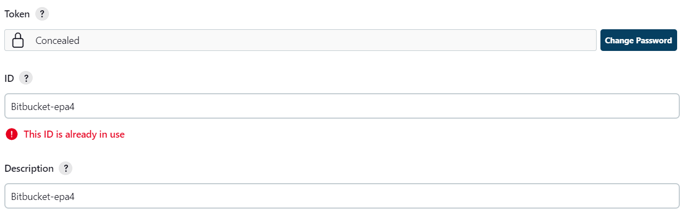

### Bitbucket server integration

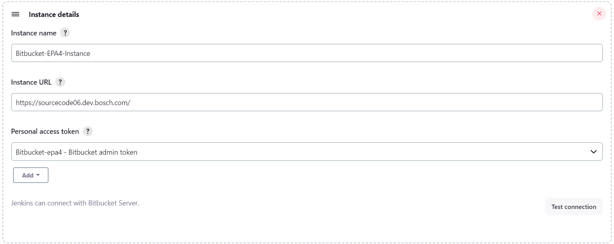

### Bitbucket server

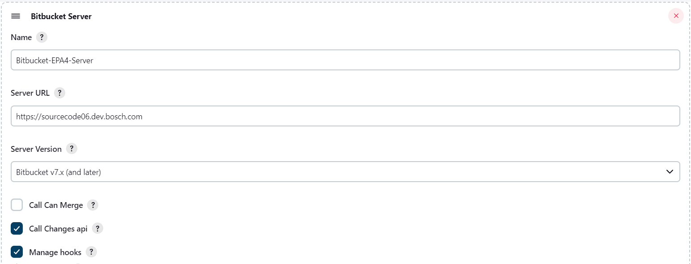
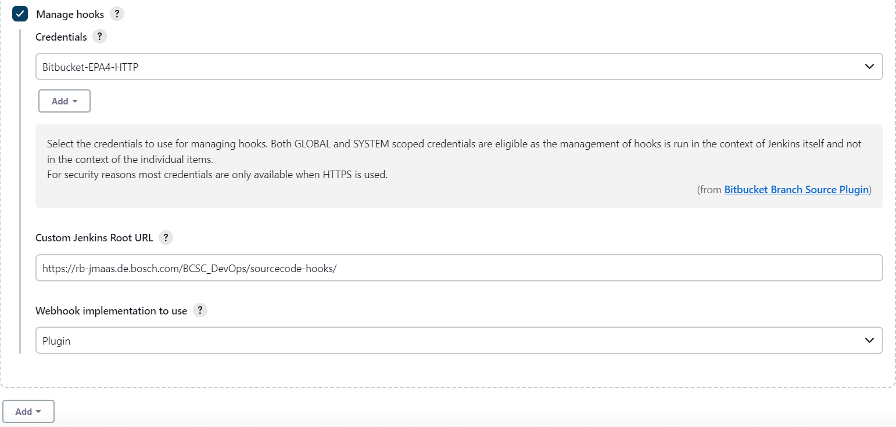

### Pipeline configuration

1. Pipeline script should come from scm
   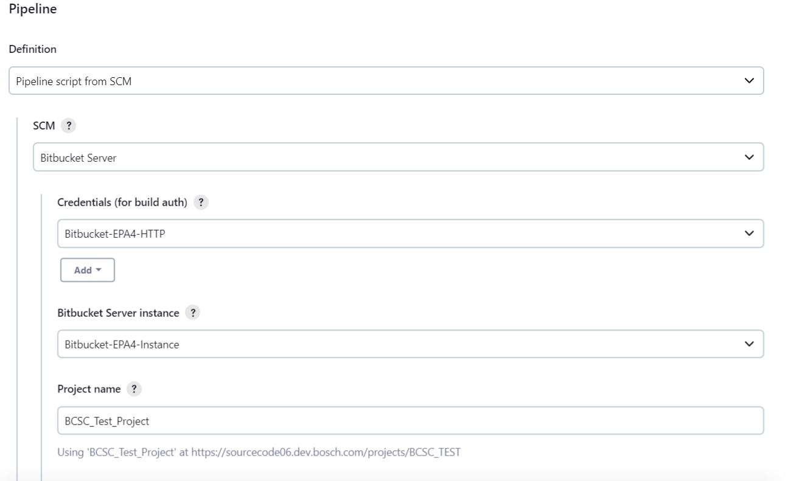
   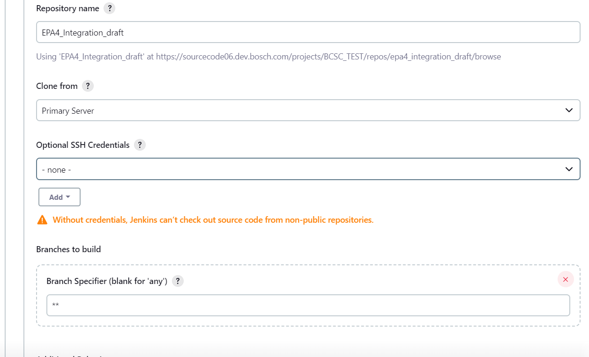
   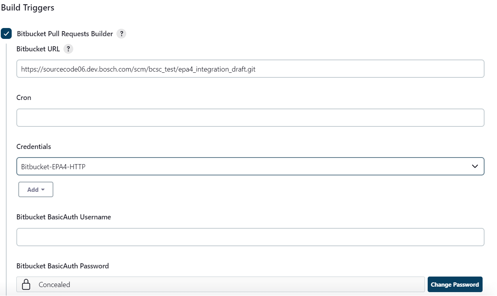

## Bitbucket configuration

### hooks

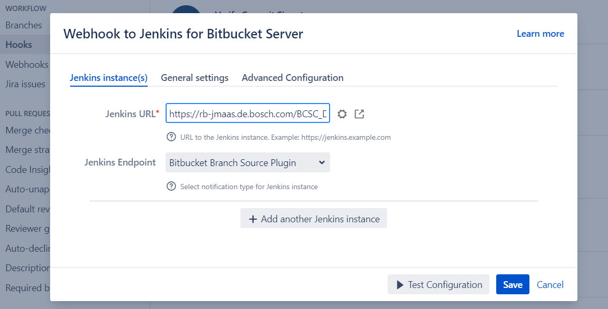
Turn on the builds wedget.
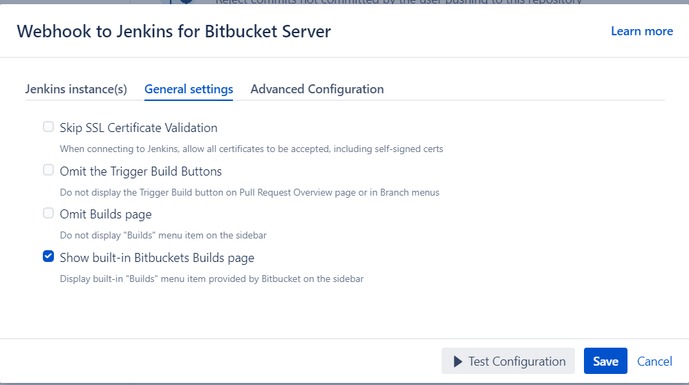

### webhooks

1. link webhook in add-on
   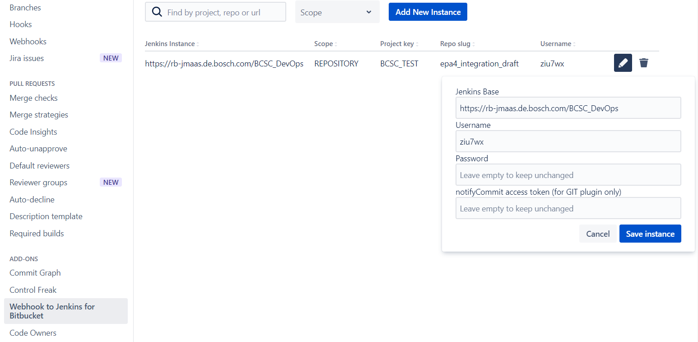

2. the webhook in workflow will be linked automatically
   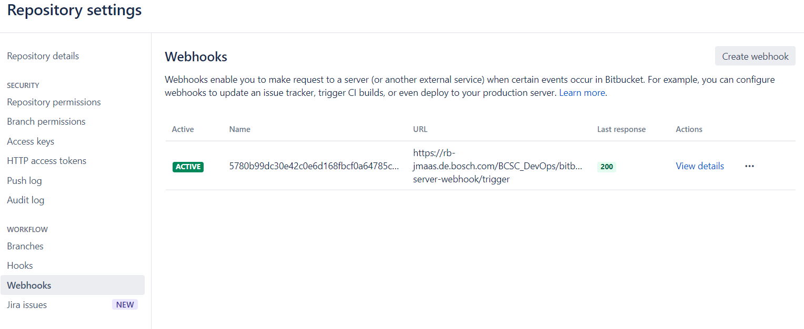

### builds

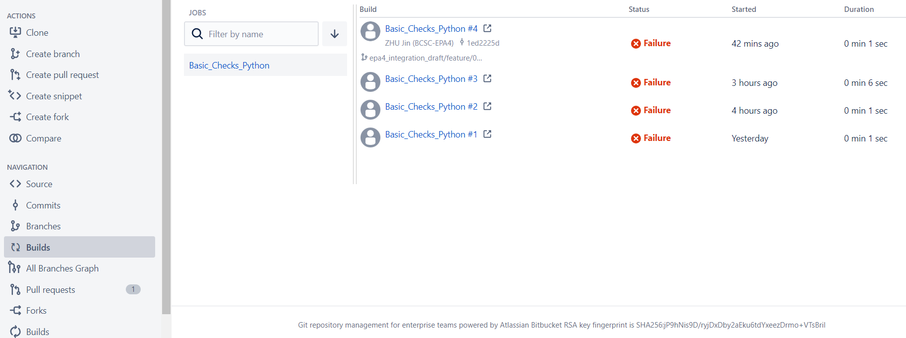
