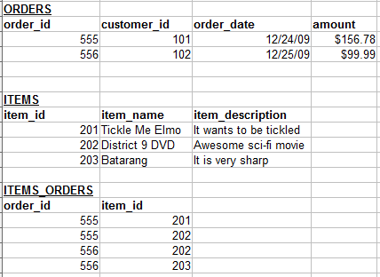
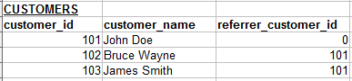

# Table of contents
- [Table of contents](#table-of-contents)
  - [reference](#reference)
  - [Django vs Django RestFramework](#django-vs-django-restframework)
  - [detail](#detail)
  - [database relationships](#database-relationships)
    - [one to one relationships](#one-to-one-relationships)
    - [one to many relationships](#one-to-many-relationships)
    - [many to many relationships](#many-to-many-relationships)
    - [self referencing relationships](#self-referencing-relationships)
  - [difference between ForeignKey and ManyTOManyField](#difference-between-foreignkey-and-manytomanyfield)
  - [download file](#download-file)
  - [serializer](#serializer)
  - [websocket channel](#websocket-channel)
  - [why channel](#why-channel)
    - [routing](#routing)
    - [ASGI](#asgi)
    - [client](#client)
    - [django consumer](#django-consumer)
  - [filter](#filter)
  - [LDAP](#ldap)
  - [general steps](#general-steps)
  - [html variable/condition](#html-variablecondition)
  - [html style](#html-style)
  - [migrate](#migrate)
  - [parser](#parser)
  - [shell](#shell)
  - [permission\&authentication](#permissionauthentication)
  - [manage tokens](#manage-tokens)
  - [Django admin](#django-admin)
  - [caching with django](#caching-with-django)
  - [glossary](#glossary)
  - [commands](#commands)
  - [examples](#examples)
  - [FQA](#fqa)

## reference
[django-channels-official](https://channels.readthedocs.io/en/stable/introduction.html#turtles-all-the-way-down)
[django-channels](https://arunrocks.com/understanding-django-channels/)
[User-model](https://www.geeksforgeeks.org/creating-custom-user-model-using-abstractuser-in-django_restframework/?ref=lbp)

## Django vs Django RestFramework
> You can use Django only to build a fully functional web app without using any frontend frameworks, such as React, Angular, etc. Doing so, you have used Django for both backend and frontend. Actually, doing like this, you do not have the concept of backend and frontend. Your web app is just your web app, and that is it.

> However, if you want your frontend to look fancy with complex CSS decoration, you may want to consider using frontend frameworks (React, Angular). Of course, you can use Django alone to make your frontend looks fancy too, but you have to write a lot of code to do so, and Django template is not popularly used comparing to frontend frameworks.

> Now, let’s say you want to use a frontend framework. If you do not have a REST API, and your frontend code try to request data from one of your URLs, you will get a string data or an HTML page like what you get from using curl, it is not useful to get that data for your frontend. However, if you have a REST API, your backend data will be serialized in the way that your frontend code can understand and deserialize the returned data into some data objects like dictionary which you can use right the way.

> You can use Django alone to make REST APIs, but you have to write more code and do more design like one of the comment above showing in the example. By using Django Rest Framework, you can write less code and reuse your code better.

> Also, I think you may want to look into the difference between API vs REST API. They are using interchangeably, but they are not the same. For example, when you are using Django, you are using the Django APIs. REST(ful) API which is just one type of API is used for client-server web developments.

## detail
```python
# if detail is set to be false, url: http://localhost:8000/api/v1/web/task/status
@action(methods=['GET'], detail=False)
def status(self, request, *args, **kwargs):
    pass

# if detail is set to be false, url: http://localhost:8000/api/v1/web/task/1/status
```

## database relationships
### one to one relationships


If each address can belong to only one customer, this relationship is "One to One".

Our initial table that included the address along with the customer could have worked fine in most cases.


We can visualize the relationship between the customer and address records like this:


### one to many relationships
This is the most commonly used type of relationship. Consider an e-commerce website, with the following:
- Customers can make many orders.
- Orders can contain many items.
- Items can have descriptions in many languages.


### many to many relationships
In some cases, you may need multiple instances on both sides of the relationship. For example, each order can contain multiple items. And each item can also be in multiple orders.




### self referencing relationships
This is used when a table needs to have a relationship with itself. For example, let's say you have a referral program. Customers can refer other customers to your shopping website. The table may look like this:



This actually can also be similar to "one to many" relationship since one customer can refer multiple customers. Also it can be visualized like a tree structure.


## difference between ForeignKey and ManyTOManyField
```python
class Author(models.Model):
    name = models.CharField(...)

class Paper(models.Model):
    title = models.CharField(...)

# a) Add an authors field in Paper and add authors to a Paper instance:
    authors = models.ManyToManyFields(Author)

# b) Or, I can create another model which contains the authors of a paper:
class PaperAuthor(models.Model):
    paper = models.ForeignKey(Paper)
    author = models.ForeignKey(Author)
```
Those are exactly equivalent. A ManyToManyField automatically creates that "through" table for you; the only difference is that it gives you the ability to access all authors for a paper, or all papers for an author, with a single expression.

## download file
> In a regular HTTP response, the **Content-Disposition** response header is a header indicating if the content is expected to be displayed inline in the browser, that is, as a Web page or as part of a Web page, or as an attachment, that is downloaded and saved locally.

> The first parameter in the HTTP context is either inline (default value, indicating it can be displayed inside the Web page, or as the Web page) or attachment (indicating it should be downloaded; most browsers presenting a 'Save as' dialog, prefilled with the value of the filename parameters if present).
```
Content-Disposition: inline
Content-Disposition: attachment
Content-Disposition: attachment; filename="filename.jpg"
```
```python
# in django views.py
def func():
    blob = util_get_task_log_file(id)
    file = FileResponse(blob)
    file['Content-Disposition'] = f"attachment; filename={id}.txt"
    file['content_type'] = 'text/plain'
    return file

# download zip file to device
full_zip_in_memory = generate_zip(images_tuple)
response = HttpResponse(full_zip_in_memory, content_type='application/force-download')
response['Content-Disposition'] = 'attachment; filename="{}"'.format('images.zip')
return response
```

## serializer


## websocket channel

> A channel layer is a kind of communication system. It allows multiple consumer instances to talk with each other, and with other parts of Django.
```python
## settings.py
# enable the channel layer, which allows multiple consumer instances to talk with each other.

# Note that you could the Redis as the backing store. To enable Redis, you could use Method 1 if you want Redis Cloud or Method 2 for local Redis. In this guide, I used Method 3 — In-memory channel layer — which is helpful for testing and for local development purposes.
CHANNEL_LAYERS = {
    'default': {
        ### Method 1: Via redis lab
        # 'BACKEND': 'channels_redis.core.RedisChannelLayer',
        # 'CONFIG': {
        #     "hosts": [
        #       'redis://h:<password>;@<redis Endpoint>:<port>' 
        #     ],
        # },

        ### Method 2: Via local Redis
        # 'BACKEND': 'channels_redis.core.RedisChannelLayer',
        # 'CONFIG': {
        #      "hosts": [('127.0.0.1', 6379)],
        # },

        ### Method 3: Via In-memory channel layer
        ## Using this method.
        "BACKEND": "channels.layers.InMemoryChannelLayer"
    },
}
```

## why channel
> However if you open a second browser tab to the same room page at http://127.0.0.1:8000/chat/lobby/ and type in a message, the message will not appear in the first tab. For that to work, we need to have multiple instances of the same ChatConsumer be able to talk to each other. Channels provides a channel layer abstraction that enables this kind of communication between consumers.

### routing 
> A Channels routing configuration is an ASGI application that is similar to a Django URLconf, in that it tells Channels what code to run when an HTTP request is received by the Channels server.
```python
# mysite/asgi.py
import os
from channels.routing import ProtocolTypeRouter
from django.core.asgi import get_asgi_application

os.environ.setdefault("DJANGO_SETTINGS_MODULE", "mysite.settings")

application = ProtocolTypeRouter(
    {
        "http": get_asgi_application(),
        # Just HTTP for now. (We can add other protocols later.)
    }
)
```
### ASGI
> add the channels library to the list of installed apps, in order to enable an **ASGI versions of the runserver command**.
```python
# mysite/settings.py
INSTALLED_APPS = [
    'channels',
    'chat',
    'django.contrib.admin',
    'django.contrib.auth',
    'django.contrib.contenttypes',
    'django.contrib.sessions',
    'django.contrib.messages',
    'django.contrib.staticfiles',
]
# mysite/settings.py
ASGI_APPLICATION = "mysite.asgi.application"
```
### client
```javascript
const roomName = JSON.parse(document.getElementById('room-name').textContent);

const chatSocket = new WebSocket(
    'ws://'
    + window.location.host
    + '/ws/chat/'
    + roomName
    + '/'
);

chatSocket.onmessage = function(e) {
    const data = JSON.parse(e.data);
    document.querySelector('#chat-log').value += (data.message + '\n');
};

chatSocket.onclose = function(e) {
    console.error('Chat socket closed unexpectedly');
};

document.querySelector('#chat-message-input').focus();
document.querySelector('#chat-message-input').onkeyup = function(e) {
    if (e.keyCode === 13) {  // enter, return
        document.querySelector('#chat-message-submit').click();
    }
};

document.querySelector('#chat-message-submit').onclick = function(e) {
    const messageInputDom = document.querySelector('#chat-message-input');
    const message = messageInputDom.value;
    chatSocket.send(JSON.stringify({
        'message': message
    }));
    messageInputDom.value = '';
};
```
### django consumer
> When a user posts a message, a JavaScript function will transmit the message over WebSocket to a ChatConsumer. The ChatConsumer will receive that message and forward it to the group corresponding to the room name. Every ChatConsumer in the same group (and thus in the same room) will then receive the message from the group and forward it over WebSocket back to JavaScript, where it will be appended to the chat log.
```python
# chat/consumers.py
import json
from asgiref.sync import async_to_sync
from channels.generic.websocket import WebsocketConsumer


class ChatConsumer(WebsocketConsumer):
    def connect(self):
        self.room_name = self.scope["url_route"]["kwargs"]["room_name"]
        self.room_group_name = "chat_%s" % self.room_name

        # Join room group
        async_to_sync(self.channel_layer.group_add)(
            self.room_group_name, self.channel_name
        )

        self.accept()

    def disconnect(self, close_code):
        # Leave room group
        async_to_sync(self.channel_layer.group_discard)(
            self.room_group_name, self.channel_name
        )

    # Receive message from WebSocket
    def receive(self, text_data):
        text_data_json = json.loads(text_data)
        message = text_data_json["message"]

        # Send message to room group
        async_to_sync(self.channel_layer.group_send)(
            self.room_group_name, {"type": "chat_message", "message": message}
        )

    # Receive message from room group
    def chat_message(self, event):
        message = event["message"]

        # Send message to WebSocket
        self.send(text_data=json.dumps({"message": message}))
```
```python
# asyncronous consumer
# chat/consumers.py
import json

from channels.generic.websocket import AsyncWebsocketConsumer


class ChatConsumer(AsyncWebsocketConsumer):
    async def connect(self):
        self.room_name = self.scope["url_route"]["kwargs"]["room_name"]
        self.room_group_name = "chat_%s" % self.room_name

        # Join room group
        await self.channel_layer.group_add(self.room_group_name, self.channel_name)

        await self.accept()

    async def disconnect(self, close_code):
        # Leave room group
        await self.channel_layer.group_discard(self.room_group_name, self.channel_name)

    # Receive message from WebSocket
    async def receive(self, text_data):
        text_data_json = json.loads(text_data)
        message = text_data_json["message"]

        # Send message to room group
        await self.channel_layer.group_send(
            self.room_group_name, {"type": "chat_message", "message": message}
        )

    # Receive message from room group
    async def chat_message(self, event):
        message = event["message"]

        # Send message to WebSocket
        await self.send(text_data=json.dumps({"message": message}))
```

## filter
```python
class ProductList(generics.ListAPIView):
    queryset = Product.objects.all()
    serializer_class = ProductSerializer
    filter_backends = [DjangoFilterBackend]
    filterset_fields = ['category', 'in_stock']
```
```sh
http://example.com/api/products?category=clothing&in_stock=True
```
- filter fields
```python
class ProductList(generics.ListAPIView):
    queryset = Product.objects.all()
    filter_backends = (filters.DjangoFilterBackend,)
    filterset_fields = ('category', 'in_stock')
```
- filter class
```python
class ProductFilter(filters.FilterSet):
    min_price = filters.NumberFilter(field_name="price", lookup_expr='gte')
    max_price = filters.NumberFilter(field_name="price", lookup_expr='lte')
    class Meta:
        model = Product
        fields = ['category', 'in_stock']

class ProductList(generics.ListAPIView):
    queryset = Product.objects.all()
    serializer_class = ProductSerializer
    filter_backends = (filters.DjangoFilterBackend,)
    filterset_class = ProductFilter
```
- customized filter
```python
class TaskFilter(django_filters.rest_framework.FilterSet):
    branch = django_filters.CharFilter(field_name='branch', method='branch_filter')
    
    class Meta:
        model = models.Task
        fields = '__all__'
    
    def branch_filter(self, queryset, name, value):
        query = Q()
        for branch in value.split(","):
            query |= Q(branch=branch)
        return queryset.filter(query)
```

## LDAP
Companies store usernames, passwords, email addresses, printer connections, and other static data within directories. LDAP is an open, vendor-neutral application protocol for accessing and maintaining that data. LDAP can also tackle authentication, so **users can sign on just once and access many different files on the server**.

LDAP is a protocol, so it doesn't specify how directory programs work. Instead, it's a form of language that allows users to find the information they need very quickly.


```
<!-- LDAP   Mappings Table View -->
TAB|                |Active Directory Field	           |LDAP Attribute
General 	        |First Name                        |givenName
General 	        |Initials 	                       |initials
General 	        |Last name	                       |sn
General 	        |Display name	                   |displayName
General 	        |Description 	                   |description
General 	        |Office	                           |physicalDeliveryOfficeName
General 	        |Telephone number	               |telephoneNumber
General 	        |E-mail	                           |mail
General 	        |Web page	                       |wWWHomePage
Address 	        |Street	                           |streetAddress
Address 	        |P.O Box 	                       |postOfficeBox
Address 	        |City               	           |l
Address 	        |State/province   	               |St
Address 	        |Zip/Postal Code 	               |postalCode
Address 	        |County/region     	               |co
Account 	        |User logon name 	               |userPrincipalName
Account 	        |user logon name (pre-Windows 200) |sAMAccountName
Profile 	        |Profile path                      |profilePath
Profile 	        |Logon script                      |scriptPath
Profile 	        |Local path                        |homeDirectory
Profile 	        |Connect	                       |homeDrive
Telephone   	    |Home	                           |homePhone
Telephones  	    |Pager	                           |pager
Telephones  	    |Mobile	                           |Mobile
Telephones  	    |Fax	                           |facsimileTelephoneNumber
Telephones  	    |IP Phone	                       |ipPhone
Organization    	|Job Title	                       |title
Organization    	|Department	                       |department
Organization    	|Company	                       |company
Organization    	|Manager	                       |manager
Organization    	|Direct Reports	                   |directreports
```
```python
AUTH_USER_MODEL = 'user.User' # customer User model

# LDAP
AUTHENTICATION_BACKENDS = [
    'django_python3_ldap.auth.LDAPBackend',
    'django.contrib.auth.backends.ModelBackend', # two auth methods
]
LDAP_AUTH_URL = ['ldap://apac.bosch.com:389']
LDAP_AUTH_USE_TLS = False
LDAP_AUTH_SEARCH_BASE = "dc=APAC,dc=bosch,dc=com"
LDAP_AUTH_OBJECT_CLASS = "user"
LDAP_AUTH_USER_FIELDS = {
    "username": "sAMAccountName",
    "first_name": "givenName",
    "last_name": "sn",
    "email": "mail",
    'account': "displayName",
}
LDAP_AUTH_USER_LOOKUP_FIELDS = ("username",)
LDAP_AUTH_CLEAN_USER_DATA = "django_python3_ldap.utils.clean_user_data"
LDAP_AUTH_SYNC_USER_RELATIONS = "django_python3_ldap.utils.sync_user_relations"
LDAP_AUTH_FORMAT_SEARCH_FILTERS = "django_python3_ldap.utils.format_search_filters"
LDAP_AUTH_FORMAT_USERNAME = "django_python3_ldap.utils.format_username_active_directory_principal"
LDAP_AUTH_ACTIVE_DIRECTORY_DOMAIN = "apac"
LDAP_AUTH_CONNECT_TIMEOUT = None
LDAP_AUTH_RECEIVE_TIMEOUT = None
LDAP_AUTH_CONNECTION_USERNAME = None
LDAP_AUTH_CONNECTION_PASSWORD = None
LOGGING = {
    "version": 1,
    "disable_existing_loggers": False,
    "handlers": {
        "console": {
            "class": "logging.StreamHandler",
        },
    },
    "loggers": {
        "django_python3_ldap": {
            "handlers": ["console"],
            "level": "INFO",
        },
    },
}
```

## general steps
1. django-admin startproject lecture3
2. python manage.py startapp hello
3. add hello into settings/INSTALLED_APPS
4. create templates/tasks/index.html
5. Add functions in views.py
6. create urls.py in hello directory
7. create route for hello
8. add hello urls into urls.py

## html variable/condition
1. {{ name }}
2.  ... 
3.  ...  ... 
4.  
5. 
6. 
7. 

## html style
1. 
2. <link rel="stylesheet" href="">

## migrate
1. python manager.py makemigrations: create migrations based on models
2. python manager.py migrate: apply changes to django database

## parser
How the parser is determined?

> The set of valid parsers for a view is always defined as a list of classes. When request.data is accessed, REST framework will examine the Content-Type header on the incoming request, and determine which parser to use to parse the request content.

Note: When developing client applications always remember to make sure you're setting the Content-Type header when sending data in an HTTP request.

If you don't set the content type, most clients will default to using 'application/x-www-form-urlencoded', which may not be what you wanted.

As an example, if you are sending json encoded data using jQuery with the .ajax() method, you should make sure to include the contentType: 'application/json' setting.

Parser Classes in Django REST:

- JSONParser
  - It parses the incoming request JSON content into python content type dict.
  - It is used if "Content-Type" is set to "application/json".
- FormParser
  - It parses the incoming request form contents into QueryDict.
  - It is used if "Content-Type" is set to "application/x-www-form-urlencoded".
- MultiPartParser
  - It parses the incoming request form contents into QueryDict.
  - It is used if "Content-Type" is set to "multipart/form-data".
  - request.data will be a QueryDict containing all the form parameters.
  - request.files will be a QueryDict containing all the form files.
  - FormParser and MultiPartParser together used for full support of HTML form data.
- FileUploadParser
  - It is used to parse a single file sent in HTTP request.
  - It expects a url keyword argument "filename". If it's not provided then we should provide the filename in the Content-Disposition HTTP header. For example Content-Disposition: attachment; filename=upload.jpg.
  - request.file is used to access the contents of uploaded file.
  - To work with XML data we have use third party library "REST Framework XML" .

## shell
1. python manager.py shell
2. Flights.objects.all()
3. flights.first()
4. Airport.objects.filter(city="New York")
5. Airport.objects.filter(city="New York").first()
6. Airport.objects.get(city="New York")
7. jfk = Airport(city="New York", code="JFK")
8. jfk.save()

## permission&authentication
[API reference](https://www.django-rest-framework.org/api-guide/permissions/)

```python
# JTWAuthentication 不是必要的，配置了以后可以通过JWT token访问
# BasicAuthentication和SessionAuthentication 是需要配置的，基础访问权限会继承djangoadmin
# IsAuthenticated 配置了以后所有登录的用户都可以请求api

REST_FRAMEWORK = {
    # Use Django's standard `django.contrib.auth` permissions,
    # or allow read-only access for unauthenticated users.
    'DEFAULT_PERMISSION_CLASSES': [
        # 'rest_framework.permissions.DjangoModelPermissionsOrAnonReadOnly'
        'rest_framework.permissions.IsAuthenticated'
    ],
    'DEFAULT_AUTHENTICATION_CLASSES': [
        'rest_framework_simplejwt.authentication.JWTAuthentication',
        'rest_framework.authentication.SessionAuthentication',
        'rest_framework.authentication.BasicAuthentication',
    ]
}
```

## manage tokens
[manage tokens](https://medium.com/@byeduardoac/managing-jwt-token-expiration-bfb2bd6ea584)

## Django admin
```sh
python manager.py createsuperuser
```

## caching with django
[caching and scaling django](https://medium.com/swlh/caching-and-scaling-django-dc80a54012)

## glossary
1. serializer(django rest framework module)

Transfer database complex data into python json type data.
Originally, database data need be transfered manually.
```python
def book_list(requet):
    books = books.objects.all()
    books_python = list(books(value()))
    return Jsonresponse({
        "books": books_python
    })
# ==================================
@api_view(['GET'])
def book_list(request):
    books = books.objects.all()
    serializer = BookSerializer(books)
    return Response(serializer.data)
```

2. action decorator
```python
class FooViewset(viewsets.ModelViewSet):
	queryset = Foo.objects.all()
	serializer_class = FooSerializer

	@action(detail=False, methods=['get'])
	def get_bars(self, request, *args, **kwargs):	
		# do anything
		# but it should return an HTTP response

# detail: It’s a boolean type argument that tells the router to accept a pk in the URL or not. If set to True, the router will create its URL with pk required.
# methods: it is a list type argument that accepts a list of HTTP methods that are valid for this action. If the method is only set to [‘get’] then all the HTTP requests other than GET will get a 405 (Method not allowed) response.
```

3. readonly id
   `id will be auto-generated`


## commands
1. python shell
```sh
# shell is a vanilla python shell using python script
python manage.py shell
```
2. dbshell
```sh
# dbshell is a sql like shell using sqls
python manage.py dbshell
# show all tables
.tables
# quit
.quit
```
3. Django ORM – Inserting, Updating & Deleting Data
```python
# adding objects
a = Album(title = "Divide", artist = "Ed Sheeran", genre = "Pop")
a.save()

# retrieving objects
Album.objects.all()
Album.objects.filter(artist = "The Beatles")
Album.objects.exclude(genre = "Rock")
Album.objects.get(pk = 3)

# modifying existing objects
a = Album.objects.get(pk = 3)
a.genre = "Pop"
a.save()

# deleting objects
## delete a single object
a = Album.objects.get(pk = 2)
a.delete()
Album.objects.all()
## delete multiple objects
Album.objects.filter(genre = "Pop").delete()
Album.objects.all()
```

## examples
```python
from django.db import models
# Create your models here.
class Product(models.Model):
    title = models.CharField(max_length=120)
    content = models.TextField(blank=True, null=True)
    price = models.DecimalField(max_digits=15, decimal_places=2, default=99.99)
    
    # property can be called like, Product.objects.all()[0].sale_price
    @property
    def sale_price(self):
        return "%.2f" %(float(self.price)*0.8)
    
    # method will be called like, Product.objects.all()[0].get_discount() 
    # does not have to start with get
    def get_discount(self):
        return "122"
# ============================================
from rest_framework import serializers
from .models import Product
class ProductSerializer(serializers.ModelSerializer):
    my_discount = serializers.SerializerMethodField(read_only=True)
    class Meta:
        model = Product
        fields = [
            "title",
            "content",
            "price",
            "sale_price",
            "get_discount",
            "my_discount"
        ]
    
    # has to start with get
    def get_my_discount(self, obj):
        return obj.get_discount()
```

## FQA
1. [HTTP GET with request body](https://stackoverflow.com/questions/978061/http-get-with-request-body)
