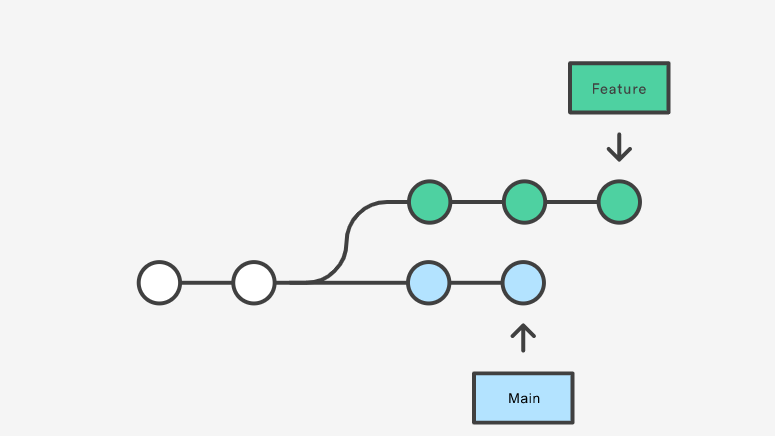
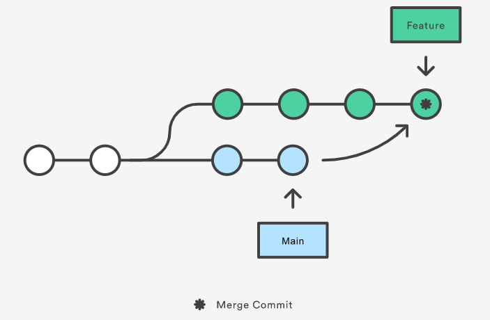
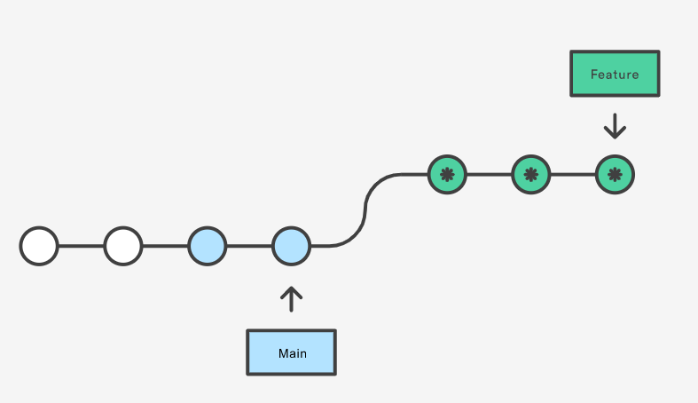

# Table of contents
- [Table of contents](#table-of-contents)
  - [add more emails](#add-more-emails)
  - [multiple ssh keys](#multiple-ssh-keys)
  - [delete file](#delete-file)
  - [diff](#diff)
  - [gitignore](#gitignore)
  - [github web editor](#github-web-editor)
  - [log](#log)
  - [merge](#merge)
  - [push](#push)
  - [rebase](#rebase)
  - [remote](#remote)
  - [rename remote branch](#rename-remote-branch)
  - [reset vs revert](#reset-vs-revert)
  - [semantic commit messages](#semantic-commit-messages)
  - [status](#status)
  - [stash](#stash)
  - [undo reset](#undo-reset)
  - [upstream](#upstream)

## add more emails
The only identity to differ from admin or guest is email address. Say you are pushing codes from company and home, your company email is your default commit account, one way to recognize it as yourself is to add emails to git account.

## multiple ssh keys
```
Host 10.173.248.175
HostName 10.173.248.175
Port 222
PreferredAuthentications publickey
IdentityFile ~/.ssh/id_ed25519_platform

Host bosch.com
HostName bosch.com
PreferredAuthentications publickey
IdentityFile ~/.ssh/id_ed25519
```

## delete file
```sh
# If you want to delete a file from remote and locally
git rm 'file name'
git commit -m'message'
git push -u origin branch

# If you want to delete a file from remote only
git rm --cached 'file name'
git commit -m'message'
git push -u origin branch
```

## diff
```sh
# lists out the changes between your current working directory and your staging area
git diff

# check diff between two branches
git diff master my-branch  # same as 'git diff master..my-branch'

# show difference for a specific file or directory
git diff file_name

# lists out the changes between the staged area and last commit
git diff --staged
```

## fast-forward rule
> When pushing to the remote repository, git will reject the push if the remote one is not an ancestor of the local one. That is called the "fast-forward rule".
All of the following cases break the fast-forward rule and are therefore rejected by an ordinary push:

- You rebased your branch onto master.
- You reordered the commits.
- You changed the commit messages.
- You squashed the commits into one.

## force-with-lease
[reference](https://blog.developer.atlassian.com/force-with-lease/)

--force overwrites a remote branch with your local branch.

--force-with-lease effectively only allows you to force-push if no-one else has pushed changes up to the remote in the interim.

## gitignore
```sh
bin
# without a trailing slash, the rule will match a file and a directory
bin/
# ignore all
bin/*
# ingore all files and folders
/bin
# match folder in root directory

Bin/*
Ignore all files and directories inside the directory
```

## github web editor
Go to your repo that contains the folder.

Then, press the "." key.

A web editor will show up. Navigate to the folder, click on it, and press enter.

commit your change in "source control" wedget

## log
```sh
git log
git log show <commit number>
git log --stat
git log --oneline
git reflog
```

## merge
`Feature branch can merge master branch.Master branch can also merge feature branch`


```sh
# Start a new feature
git checkout -b new-feature main
# Edit some files
git add <file>
git commit -m "Start a feature"
# Merge in the new-feature branch
git checkout main
git merge new-feature

## in oneline
git merge feature main
```

## push
```sh
git push <remote> <local_branch>:<remote_name>
```

## patch
> Before Git pull requests existed, developers created Git patches to share their code with team members and project collaborators. Git patches are text files that contain code and Git commit metadata. Creating a Git patch is, in essence, copying and packaging up your work to send to someone else. 

## rebase


`vanilla workflow of git rebase`
```sh
git checkout -b my-feature-branch
git rebase master
git checkout master
git merge my-feature-branch
```
> The major benefit of rebasing is that you get a much cleaner project history.

> While working in Git, developers often make temporary commits that may have not appropriate commit messages. Before merging those commits to the master, it is necessary to combine them into a single commit with clear and comprehensive commit message.
`combine commits`
```sh
# Running git rebase in interactive mode
git rebase -i HEAD~3 # or git rebase -i <some hash>

# Replace pick with squash
# commands: 
# pick = use commit
# reword = use commit, but eddit the commit message
# edit = use commit, but stop for amending
# squash = use commit, but meld into previous commit
# fixup = like 'sqush', but discard this commit  log message
# exec = run command(the rest of the line) using shell
# drop = remove commit

# Choose between commit messages
# one more editor window will show up to change the resulting commit message.

# Pushing changes
# you should run git push to add a new commit to the remote origin.
git push --force origin HEAD
git push --force-with-lease origin HEAD  # more safer way to push combined commits
```
`The Golden Rule of Rebasing`
> Once you understand what rebasing is, the most important thing to learn is when not to do it. The golden rule of git rebase is to never use it on public (main)branches.

## remote
```sh
git remote -vv
git remote show origin
```

## rename remote branch
```sh
Gg push origin <current branch>:refs/heads/<remote name>
```

## reset vs revert
> Git reset will overwrite previous commit, while git revert will create a new commit.
```sh
Git reset --hard HEAD~ #(discard all changes except last commits)
Git reset --soft HEAD~ #(keep all changes)
Git reset HEAD~ #(discard everything)
```

## semantic commit messages
- `chore`: add Oyster build script 
- `docs`: explain hat wobble 
- `feat`: add beta sequence 
- `fix`: remove broken confirmation message 
- `refactor`: share logic between 4d3d3d3 and flarhgunnstow 
- `style`: convert tabs to spaces 
- `test`: ensure Tayne retains clothing

## status
```sh
git status
git status -sb # clean log
```

## stash
> Git stash is a useful feature of git when the git user needs to switch from one working directory to another working directory for fixing any issue and the modified files of the current working directory are required to store before switching. Git stash stores all modified tracked, untracked, and ignored files and helps the user to retrieve the modified content when requires.
```sh
git stash -u/--include-untracked

# there are two ways to restore a git stash
# 1.git stash apply
# The git stash apply command restores the stash but doesn't delete it from the reference
git stash list
git stash apply stash@{n}

# 2.git stash pop
# The git stash pop command restores the stashed changes and schedules the stash for deletion from the reference
git stash list
git stash pop stash@{n}
```

## undo reset
```sh
# To keep the changes from the commit you want to undo
git reset --soft HEAD^

# To destroy the changes from the commit you want to undo
git reset --hard HEAD^

# You can also say
git reset --soft HEAD~2
# to go back 2 commits.

# or go to any commit hash
git reset --soft asdf

# if you are on Windows you will need to put HEAD or commit hash in quotes.
git reset --soft "HEAD^"
git reset --soft "asdf"
```

## upstream
```sh
# Set upstream when pushing to remote 
git push -u origin topic 
# Set upstream without pushing it 
# with option -u / --set-upstream-to 
git branch -u origin/topic 
git branch --set-upstream-to=origin/topic

# check upstream
git branch -vv
cat .git/config

# unset upstream
git branch --unset-upstream [<branchname>]
```

## git branch -a
```
$ git branch -a

* main
  remotes/origin/HEAD -> origin/main
  remotes/origin/main
```
The remotes/origin/HEAD is the branch currently checked out in the origin repository, which means if you clone that repository, by default that branch will be checked out first.

The origin/main is a remote branch (which is a local copy of the branch named main on the remote named origin)

The remotes/origin/main, usually referred to as origin/main, is the location of a branch called main on the remote called origin the last time you did a git command. If they're related, main will have origin/main as its upstream.

## vanilla workflow
```sh
# remote name is origin

# fetch feature branch from remote
git fetch origin feature-branch-0
# check out master branch to merge
git checkout master
# check out different between local master branch and remote master branch
git diff master..origin/master
# merge feature branch to master
git merge origin/feature-branch-0

# create new branch based on master
git checkout -b feature-branch-1
# in case someone else made changes, sync your code before pull request
git fetch origin master
git rebase origin/master
# commit changes
git add .
git commit -m ""

# After setting up the tracking branch, git push can be invoked without any parameters
# push feature branch to remote
git push -u origin feature-branch-1
```
git push -u origin feature-branch-1
```

## get back to old commits and get back to present
```sh
# Suppose your current branch is master and the old commit is a1b2c3, then you can change all the files in your working tree back to the old commit with:
git checkout a1b2c3

# and return to master with:
git checkout master
```

## how to undo git mistakes
[reference video](https://www.youtube.com/watch?v=lX9hsdsAeTk&ab_channel=freeCodeCamp.org)
1. work with uncommitted files
### discard changes in local files
```sh
git diff <filename> # see changes in a file
git restore <filesname> # discard uncommitted local changes, (be aware it cannot be undone)
```
### discard all local changes
```sh
git restore .
```
### restore deleted file
```sh
git restore <filename>
```
### discard chunks/lines in a file
```sh
git restore -p <filename> # enter interactive mode, y/n
```
2. work with committed files
### fix last commit(only the very last commit)
```sh
git commit --amend -m "new commit message" # nerver do that on a commit which has been pushed to remote repo
```
### revert a commit in the middle
```sh
# just revert this one particular commit
git revert <commit hash> # git revert creates a new commit
```
### reset to an old revision
```sh
# reset all commits after this commit
git reset --hard <commit hash> # no local changes saved
--soft: uncommit changes, changes are left staged (index).
--mixed (default): uncommit + unstage changes, changes are left in working tree.
--hard: uncommit + unstage + delete changes, nothing left.
```
### reset a file to an old revision
```sh
git restore --source <commit hash> <filename>
```
3. reflog
> a journal that logs every movement of the HEAD pointer
### recover deleted commits (after reset)/recover a deleted branch
```sh
git reflog # get commit hash which you want to recover
git branch <new branch> <commit hash> # a good practice to create a new branch when recovering
```
### move a commit to a new branch
```sh
git branch <new branch> <old branch> # create a new branch based on that old branch
git reset --hard HEAD~ # reset commit on old branch
```
### move a commit to a different branch(without creating a new branch)
```sh
git reflog # get commit hash
git checkout <target branch>
git cherry-pick <commit hash> # cherry pick that commit to a different branch
git checkout <source branch>
git reset --hard HEAD~ # reset commit on old branch
```
4. rebase
### edit old commit message(only the very last commit can use ammend)
```sh
git rebase -i HEAD~3
# then use reword option
```
### delete old commits(not used often)
```sh
# then use drop option
```
### squash multiple commits into one
direction: lower commits squashed to uppper
```sh
# then use squash option
```
### add a change to an old commit(very practical)
if you create new commit to fix up the previous one, the history is going to be long and unreadable
```sh
git add <filename>
git commit --fixup <commit hash>
# then use fixup option, fixup will not keep commit message compared to squash
# or 
# this will automatically use the fixup option
git rebase -i --autosquash HEAD~4
```
### 