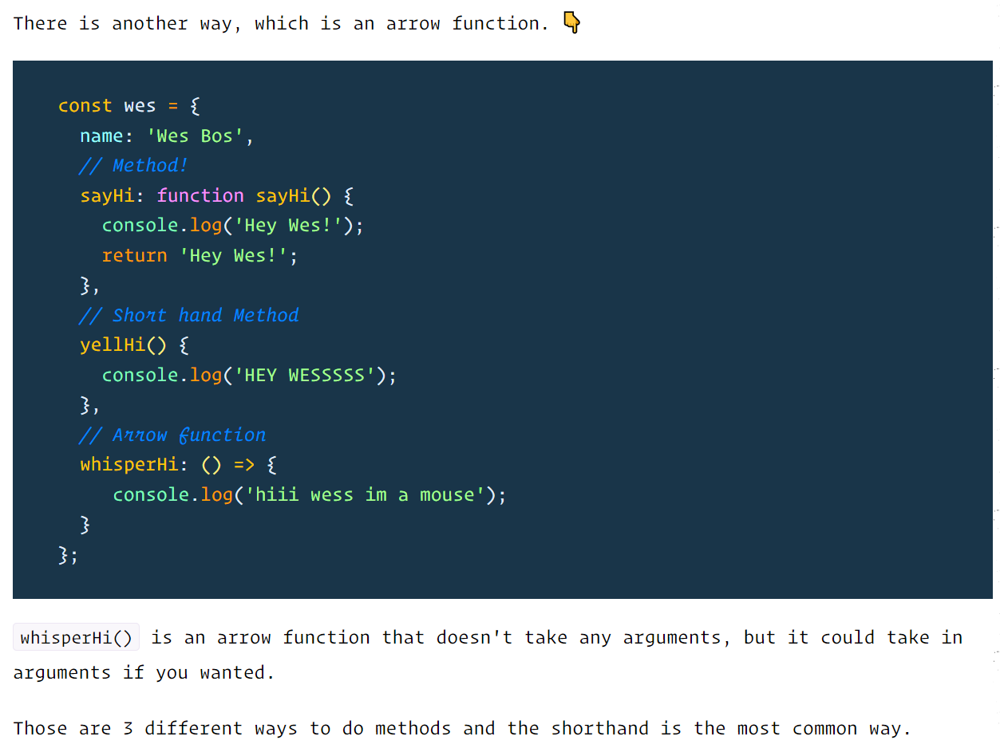
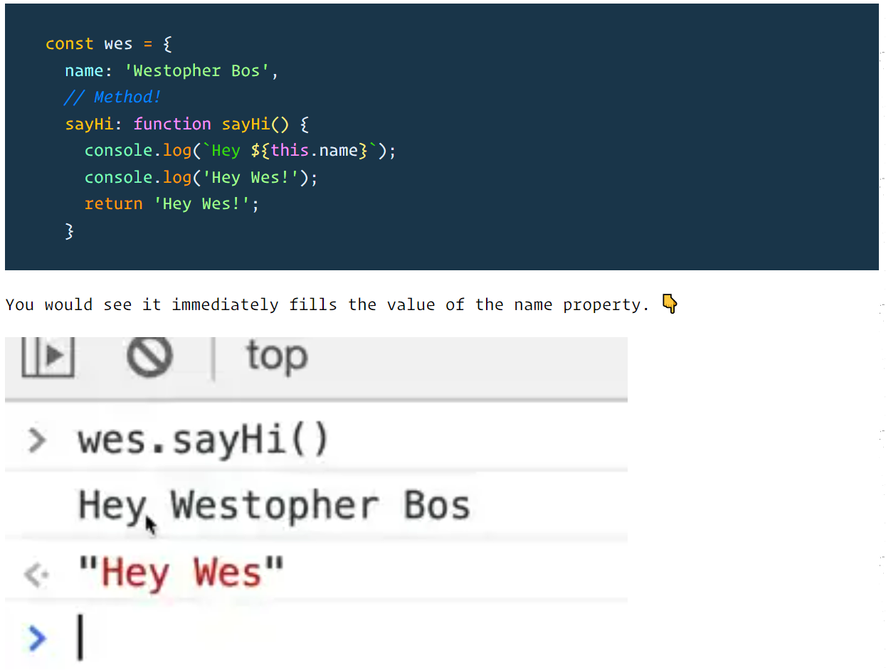

# Table of contents
- [Table of contents](#table-of-contents)
  - [colon vs equal](#colon-vs-equal)
  - [functions vs methods](#functions-vs-methods)
  - [import](#import)
  - [spread operator](#spread-operator)
  - [this](#this)


## colon vs equal
---
```javascript
// This creats an object, which is a data structure
{
    name: this.name,
    review: this.review,
    rating: this.rating
}
// Here you are assigning the object(data structure) to a value
let product = {}
```

## functions vs methods
---
`functions`: Functions that are declared with the function keyword are called hoisted.
JavaScript will take all functions with the function keyword and hoist them up, up, up and says "you're a function, you belong at the top of the file". That means anywhere you call the function, it will be available to you.

`arrow functions`: arrow functions are also anonymous functions
- They have a few benefits
  - concise syntax and tend to be shorter. allow for writing one line functions
  - do not have their own scope in reference to the this keyword (we will cover the this keyword in a future video)

`methods`: A method is simply a function that lives inside of an object.
Take console.log(), log is a method inside console object


`callback functions`: callback function is a function that gets passed into another function and then it is called by the browser at a later point in time.

## import 
---
```javascript
// import in {} means it is not a default export 
export const A = 3;
import {A} from …


// if it is a default export, then it does not matter what name you give 
export default A;
import B from …

// a module can have only one default export but multiple named exports
```

## spread operator
---
```javascript
this.tasks.push(task)
// ==
this.task = [...this.task, task]
```

## this
---
`The only reason you would do an arrow function is because you don't want to access this.`

> That will not work in an arrow function because they take the parent scope of this. 

