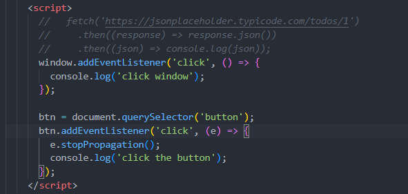

# Table of contents
- [Table of contents](#table-of-contents)
  - [cheatsheet](#cheatsheet)
  - [async and await](#async-and-await)
  - [class](#class)
  - [colon vs equal](#colon-vs-equal)
  - [create element](#create-element)
  - [constructor function](#constructor-function)
  - [destructuring](#destructuring)
  - [filter](#filter)
  - [for loop](#for-loop)
  - [functions vs methods](#functions-vs-methods)
  - [high order functions](#high-order-functions)
  - [import](#import)
  - [imutable](#imutable)
  - [if statement in oneline](#if-statement-in-oneline)
  - [let vs var vs const](#let-vs-var-vs-const)
  - [map](#map)
  - [map vs filter vs reduce](#map-vs-filter-vs-reduce)
  - [map vs foreach](#map-vs-foreach)
  - [propagation](#propagation)
  - [promise](#promise)
  - [setTimeout](#settimeout)
  - [spread operator](#spread-operator)
  - [textContent vs innerText vs innerHTML](#textcontent-vs-innertext-vs-innerhtml)
  - [this](#this)
  - [typeof](#typeof)
  - [upload a file](#upload-a-file)

## cheatsheet
```javascript
array.indexOf(newItem) === -1 ? array.push(newItem) : console.log("this item already exists")
```

## async and await
```javascript
function fetchdata() {
fetch("google.com").then(console.log(res))
}

async function fetchdata() {
const res = await fetch("google.com")
console.log(res)
}

// fetch returns a promise 
// await use before a promise
```

## class


## colon vs equal
```javascript
// This creats an object, which is a data structure
{
    name: this.name,
    review: this.review,
    rating: this.rating
}
// Here you are assigning the object(data structure) to a value
let product = {}
```

## create element


## constructor function


## destructuring
> The destructuring assignment syntax is a JavaScript expression that makes it possible to **unpack values from arrays, or properties from objects, into distinct variables.**

```javascript
(e) => { console.log(e.data) }
// works the same as
({ data }) => {console.log(data)}
```


## filter
```javascript
this.tasks = this.tasks.filter((task) => task.id !== id);
```

## for loop
> forEach is not promise-aware (you can't return values in a forEach loop). It cannot support async and await since it does not return any value. You cannot use await in forEach.

```javascript
function greet(persons) {
    persons.forEach(person => {
        console.log("hello world", person)
    });
    for (let index in persons) {
        console.log(persons[index])
    }
}
```

## functions vs methods
`functions`: Functions that are declared with the function keyword are called hoisted.
JavaScript will take all functions with the function keyword and hoist them up, up, up and says "you're a function, you belong at the top of the file". That means anywhere you call the function, it will be available to you.

`arrow functions`: arrow functions are also anonymous functions
- They have a few benefits
  - concise syntax and tend to be shorter. allow for writing one line functions
  - do not have their own scope in reference to the this keyword (we will cover the this keyword in a future video)

`methods`: A method is simply a function that lives inside of an object.
Take console.log(), log is a method inside console object


`callback functions`: callback function is a function that gets passed into another function and then it is called by the browser at a later point in time.

## high order functions


## import 
```javascript
// import in {} means it is not a default export 
export const A = 3;
import {A} from …

// if it is a default export, then it does not matter what name you give 
export default A;
import B from …

// a module can have only one default export but multiple named exports
```

## imutable
> It is better to keep data imutable in js, in which case, 'this' will not be misleaded when called back.


> However, copy takes a lot of memories and quite inefficient when projects get larger.
A good way to deal with this problem is called **persistent data structure, which takes an array as a hash tree and only changes nodes on this tree**.
JS library like *mori and immuable js* can be used to achieve this.

## if statement in oneline
```javascript
if (error) console.log(error)
```

## let vs var vs const
`Var`
```javascript
    var greeter = "hey hi";
    var times = 4;

    if (times > 3) {
        var greeter = "say Hello instead"; 
    }
    
    console.log(greeter) // "say Hello instead"
```
`let is block scoped`
> A block is a chunk of code bounded by {}. A block lives in curly braces. Anything within curly braces is a block.
So a variable declared in a block with let is only available for use within that block.
```javascript
   let greeting = "say Hi";
   let times = 4;

   if (times > 3) {
        let hello = "say Hello instead";
        console.log(hello);// "say Hello instead"
    }
   console.log(hello) // hello is not defined
```

## map
> A Map object can iterate its elements in insertion order - a for..of loop will return an array of [key, value] for each iteration.

## map vs filter vs reduce

```javascript
// reduce
const numbers = [175, 50, 25];

document.getElementById("demo").innerHTML = numbers.reduce(myFunc);

function myFunc(total, num) {
  return total - num;
}
```

## map vs foreach


## propagation


## promise


```javascript
let myPromise = new Promise(function(myResolve, myReject) {
// "Producing Code" (May take some time)

  myResolve(); // when successful
  myReject();  // when error
});

// "Consuming Code" (Must wait for a fulfilled Promise)
myPromise.then(
  function(value) { /* code if successful */ },
  function(error) { /* code if some error */ }
);
```

## setTimeout
```javascript
// setTimeout takes 3 arguments: callback, time, params
setTimeout(function, miiliseconds, param1, param2)
// the param is sent to callback function
```

## spread operator
It allows us the privilege to obtain a list of parameters from an array. Can be used to copy and concate.
```javascript
this.tasks.push(task)
// ==
this.task = [...this.task, task]
```

## textContent vs innerText vs innerHTML
- textContent ignores styles
- innerText only shows text 
- innerHTML including everything inside
```html
<!-- example -->
<h1>hello<span style="display:none">123</span></h1>
<!-- textContent: hello 123 -->
<!-- innerText: hello -->
<!-- innerHTML: hello<span style="display:none">123</span> -->
```

## this
`The only reason you would do an arrow function is because you don't want to access this.`

> That will not work in an arrow function because they take the parent scope of this. 

## typeof
```javascript
// examples
typeof "John"                 // Returns "string"
typeof 3.14                   // Returns "number"
typeof NaN                    // Returns "number"
typeof false                  // Returns "boolean"
typeof [1,2,3,4]              // Returns "object"
typeof {name:'John', age:34}  // Returns "object"
typeof new Date()             // Returns "object"
typeof function () {}         // Returns "function"
typeof myCar                  // Returns "undefined" *
typeof null                   // Returns "object"
```

## upload a file
[upload file](https://betterprogramming.pub/a-complete-guide-of-file-uploading-in-javascript-2c29c61336f5)


```javascript
// You can use html5 file type like this:

<input type="file" id="myFile">
{/* You file will be in value: */}

var myUploadedFile = document.getElementById("myFile").files[0];
```