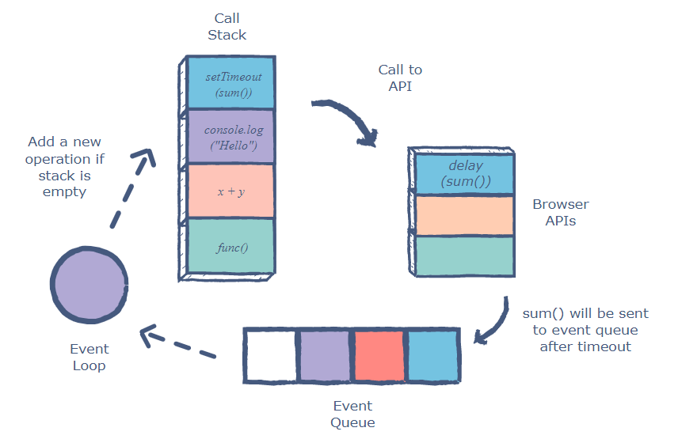

# Table of contents
- [Table of contents](#table-of-contents)
  - [bundler](#bundler)
  - [cheatsheet](#cheatsheet)
  - [async and await](#async-and-await)
  - [browser](#browser)
  - [class](#class)
  - [closure (anonymous/lambda function)](#closure-anonymouslambda-function)
  - [colon vs equal](#colon-vs-equal)
  - [create element](#create-element)
  - [constructor function](#constructor-function)
  - [deep copy](#deep-copy)
  - [destructuring](#destructuring)
  - [engine v8(google js engine)](#engine-v8google-js-engine)
  - [event loop](#event-loop)
  - [filter](#filter)
  - [download json file](#download-json-file)
  - [for loop](#for-loop)
  - [functions vs methods](#functions-vs-methods)
  - [getter and setter](#getter-and-setter)
  - [high order functions](#high-order-functions)
  - [import](#import)
  - [improve javascript performance](#improve-javascript-performance)
  - [imutable](#imutable)
  - [if statement in oneline](#if-statement-in-oneline)
  - [let vs var vs const](#let-vs-var-vs-const)
  - [map](#map)
  - [map vs filter vs reduce](#map-vs-filter-vs-reduce)
  - [map vs foreach](#map-vs-foreach)
  - [propagation](#propagation)
  - [promise](#promise)
  - [prototype](#prototype)
  - [setTimeout](#settimeout)
  - [spread operator](#spread-operator)
  - [textContent vs innerText vs innerHTML](#textcontent-vs-innertext-vs-innerhtml)
  - [third party modules](#third-party-modules)
  - [this](#this)
  - [typeof](#typeof)
  - [upload a file](#upload-a-file)
  - [virtual DOM](#virtual-dom)

## bundler
What bundlers do?
1. a bundler is able to compress all your code.
2. bundler will minify all the code. The way minification works is longer variables are replaced with shorter ones to save space. For example options would be replaced with o.
3. make your code as small as possible.
4. dead-code elimination - if you have a function that is never used, it will detect that and remove that.

Bundler options:
1. parcel
2. pika
3. webpack
4. vite

## cheatsheet
```javascript
array.indexOf(newItem) === -1 ? array.push(newItem) : console.log("this item already exists")
```

## async and await
```javascript
function fetchdata() {
fetch("google.com").then(console.log(res))
}

async function fetchdata() {
const res = await fetch("google.com")
console.log(res)
}

// fetch returns a promise 
// await use before a promise
```

## browser


## class


## closure (anonymous/lambda function)
> A closure is an inner function that has access to the outer (enclosing) function's variables.

```javascript
function foo(outer_arg) {
  
    function inner(inner_arg) {
        return outer_arg + inner_arg;
    }
    return inner;
}
var get_func_inner = foo(5);
  
console.log(get_func_inner(4));
console.log(get_func_inner(3));
```
```javascript
// closure just refer to the variable not stored
const add = (function () {
  let counter = 0;
  return function () {counter += 1; return counter}
})();

add();
add();
add();
// output: 3
// -----------------------------------------------
unction outer() 
{
    var arr = [];
    var i;
    for (i = 0; i < 4; i++) 
    {
        // storing anonymous function
        arr[i] = function () { return i; }
    }
  
    // returning the array.
    return arr;
}
  
var get_arr = outer();
  
console.log(get_arr[0]());
console.log(get_arr[1]());
console.log(get_arr[2]());
console.log(get_arr[3]());
// output:4
// output:4
// output:4
// output:4
```

## colon vs equal
```javascript
// This creats an object, which is a data structure
{
    name: this.name,
    review: this.review,
    rating: this.rating
}
// Here you are assigning the object(data structure) to a value
let product = {}
```

## create element


## constructor function


## deep copy
1. spread operator (...object)
2. object assign Object.assign({}, object)
> However, both of the two methods are only work for "top level" values. Child objects which are nested inside the original object are referenced when using the spread operator or object assign function. This means if the child object values are changing, they are changing in all copies as well.

3. json parser
```javascript
JSON.parse(JSON.stringify(animals))
```
> This method is not perfect, it may occur some unexpected errors.

4. recursive function
```javascript
var toString = Object.prototype.toString;
function deepCopy(obj) {
    var rv;

    switch (typeof obj) {
        case "object":
            if (obj === null) {
                // null => null
                rv = null;
            } else {
                switch (toString.call(obj)) {
                    case "[object Array]":
                        // It's an array, create a new array with
                        // deep copies of the entries
                        rv = obj.map(deepCopy);
                        break;
                    case "[object Date]":
                        // Clone the date
                        rv = new Date(obj);
                        break;
                    case "[object RegExp]":
                        // Clone the RegExp
                        rv = new RegExp(obj);
                        break;
                    // ...probably a few others
                    default:
                        // Some other kind of object, deep-copy its
                        // properties into a new object
                        rv = Object.keys(obj).reduce(function(prev, key) {
                            prev[key] = deepCopy(obj[key]);
                            return prev;
                        }, {});
                        break;
                }
            }
            break;
        default:
            // It's a primitive, copy via assignment
            rv = obj;
            break;
    }
    return rv;
}
var a = [1, {foo: "bar"}, ['a', 'b'], new Date()];
snippet.log(JSON.stringify(a));
var b = deepCopy(a);
snippet.log(JSON.stringify(b));
```
5. lodash
> This is the best way to deal with this problem.
```javascript
const _ = require('lodash');
// ES6
import { cloneDeep } from 'lodash'

const animals = [{ cat: '🐱', monkey: '🐒', whale: '🐋' }];

const moreAnimals = _.cloneDeep(animals);

console.log(moreAnimals);

// [{ cat: '🐱', monkey: '🐒', whale: '🐋' }]
```

## destructuring
> The destructuring assignment syntax is a JavaScript expression that makes it possible to **unpack values from arrays, or properties from objects, into distinct variables.**

## engine v8(google js engine)


```javascript
(e) => { console.log(e.data) }
// works the same as
({ data }) => {console.log(data)}
```


## event loop


## filter
```javascript
this.tasks = this.tasks.filter((task) => task.id !== id);
```

## download json file
```javascript
// new feature in HTML5
// <a href="file.pdf" download="resume.pdf">Download PDF</a> 

function download(path: string, filename: string) {
    // Create a new link
    const anchor = document.createElement('a');
    anchor.href = path;
    anchor.download = filename;

    // Append to the DOM
    document.body.appendChild(anchor);

    // Trigger `click` event
    anchor.click();

    // Remove element from DOM
    document.body.removeChild(anchor);
}; 

const handleDownload = async (filename: string) => {
    const response = await downloadFile(filename)

    // convert to readable json file
    const data = JSON.stringify(response.data, null, 4); 

    // Create a Blob object
    const blob = new Blob([data], { type: 'application/json' });

    // Create an object URL
    const url = URL.createObjectURL(blob);

    // Download file
    download(url, filename);

    // Release the object URL
    URL.revokeObjectURL(url);
}
```

## for loop
> forEach is not promise-aware (you can't return values in a forEach loop). It cannot support async and await since it does not return any value. You cannot use await in forEach.

```javascript
function greet(persons) {
    persons.forEach(person => {
        console.log("hello world", person)
    });
    for (let index in persons) {
        console.log(persons[index])
    }
}
```

## functions vs methods
`functions`: Functions that are declared with the function keyword are called hoisted.
JavaScript will take all functions with the function keyword and hoist them up, up, up and says "you're a function, you belong at the top of the file". That means anywhere you call the function, it will be available to you.

`arrow functions`: arrow functions are also anonymous functions
- They have a few benefits
  - concise syntax and tend to be shorter. allow for writing one line functions
  - do not have their own scope in reference to the this keyword (we will cover the this keyword in a future video)

`methods`: A method is simply a function that lives inside of an object.
Take console.log(), log is a method inside console object


`callback functions`: callback function is a function that gets passed into another function and then it is called by the browser at a later point in time.

## getter and setter
```javascript
class Person {
    constructor(name) {
        this.name = name;
    }
    get name() {
        return this._name;
    }
    set name(newName) {
        newName = newName.trim();
        if (newName === '') {
            throw 'The name cannot be empty';
        }
        this._name = newName;
    }
}
```

## high order functions


## import 
```javascript
// import in {} means it is not a default export 
export const A = 3;
import {A} from …

// if it is a default export, then it does not matter what name you give 
export default A;
import B from …

// a module can have only one default export but multiple named exports
```

## improve javascript performance
- reduce application size with webpack
- **use cache in the browser**
- remove unused javascript
- place javascript at the bottom of the page
- use minification
- use Gzip compression
- avoid unnecessary access to DOM

## imutable
> It is better to keep data imutable in js, in which case, 'this' will not be misleaded when called back.


> However, copy takes a lot of memories and quite inefficient when projects get larger.
A good way to deal with this problem is called **persistent data structure, which takes an array as a hash tree and only changes nodes on this tree**.
JS library like *mori and immuable js* can be used to achieve this.

## if statement in oneline
```javascript
if (error) console.log(error)
```

## let vs var vs const
`Var`
```javascript
    var greeter = "hey hi";
    var times = 4;

    if (times > 3) {
        var greeter = "say Hello instead"; 
    }
    
    console.log(greeter) // "say Hello instead"
```
`let is block scoped`
> A block is a chunk of code bounded by {}. A block lives in curly braces. Anything within curly braces is a block.
So a variable declared in a block with let is only available for use within that block.
```javascript
   let greeting = "say Hi";
   let times = 4;

   if (times > 3) {
        let hello = "say Hello instead";
        console.log(hello);// "say Hello instead"
    }
   console.log(hello) // hello is not defined
```

## map
> A Map object can iterate its elements in insertion order - a for..of loop will return an array of [key, value] for each iteration.

## map vs filter vs reduce

```javascript
// reduce
const numbers = [175, 50, 25];

document.getElementById("demo").innerHTML = numbers.reduce(myFunc);

function myFunc(total, num) {
  return total - num;
}
```

## map vs foreach


## propagation


## promise


```javascript
function makePizza(toppings, ready) {
    return new Promise(function (resolve, reject) {
        if (ready === true) {
            resolve(`Here is your pizza 🍕 with the toppings ${toppings.join(' ')}`);
            return
        }
        reject(new Error('pizza not ready'))
    })
        .finally(() => console.log("Promise ready")) // triggers first
}
```

## prototype
```javascript
// Instead of putting functions on every single instance (this.eat), we can put them on what is referred to as the prototype (Pizza.prototype.eat).
// why prototype?
// The problem comes when you have 20,000 pizzas. Then you have lots of instances of the pizza, and every time you define a new function, that takes up memory in your computer and that is what causes websites and computers to go slow in many cases.
class Pizza {
    constructor(toppings = [], customer) {
        console.log("Making a pizza");
        // save the toppings that were passed in, to this instance of pizza
        this.toppings = toppings;
        this.customer = customer;
        this.id = Math.floor(Math.random() * 16777215).toString(16);
        this.slices = 2
        // this.eat = function () {
        //     if (this.slices > 0) {
        //         console.log("CHOMP");
        //         return this.slices -= 1
        //     } else {
        //         throw new Error("No slice left!")
        //     }
        // }

        Pizza.prototype.eat = function () {
            if (this.slices > 0) {
                console.log("CHOMP");
                return this.slices -= 1
            } else {
                throw new Error("No slice left!")
            }
        }
    }
    // better way in ES6, this also works as an instance method in ES6, whereas it is a staic method is ES5
    eat() {
        if (this.slices > 0) {
            console.log("CHOMP");
            return this.slices -= 1
        } else {
            throw new Error("No slice left!")
        }
    }
}
```
```javascript
// If you set both prototype variable and class variable, the instance size will be `medium`
this.size = 'Medium'
Pizza.prototype.size = 'Large'
// It first checks for a property on the instance and if it doesn't exist, it will go to the prototype and look that up.
```

## setTimeout
```javascript
// setTimeout takes 3 arguments: callback, time, params
setTimeout(function, miiliseconds, param1, param2)
// the param is sent to callback function
```

## spread operator
It allows us the privilege to obtain a list of parameters from an array. Can be used to copy and concate.
```javascript
this.tasks.push(task)
// ==
this.task = [...this.task, task]
```

## textContent vs innerText vs innerHTML
- textContent ignores styles
- innerText only shows text 
- innerHTML including everything inside
```html
<!-- example -->
<h1>hello<span style="display:none">123</span></h1>
<!-- textContent: hello 123 -->
<!-- innerText: hello -->
<!-- innerHTML: hello<span style="display:none">123</span> -->
```

## third party modules
```javascript
// 1. waait: sleep for sometime
import wait from waait
async function greet() {
    await wait(200)
    console.log("hello world")
}

// 2. fake: generate random data
import faker from faker
const randomName = faker.name.firstName()
const randomEmail = faker.internet.email()
const randomCard = faker.helpers.createCard() // random contact card

// 3. date-nfs: includes methods that makes working and formatting dates much nicer
import { formatDistance } from "date-fns";
cost diff = formatDistance(
  new Date(1986, 3, 4, 11, 32, 0),
  new Date(1986, 3, 4, 10, 32, 0),
  { addSuffix: true }
); // "in about 1 hour"

// 4. axios
// Axios is a library that is does basically the same thing as fetch, but it includes some defaults that fetch doe not have and it does not have weird double await that our promises do because of the JSON default

// 5. lodash
// Lodash is a utility library for working with arrays, objects and a few other interesting things.
import { intersection } from "lodash";
const a = [1, 2, 3, 4, 5, 6, 7, 8, 9, 10];
const b = [5, 3, 8, 3, 7, 453, 34];

const sameValues = intersection(a, b);
console.log(sameValues);//[3, 5, 7, 8]

// 6. await-to-js: allows you to handle errors a bit differently
// the await to package will always return an array and the first thing will always be an error, and the second thing will be the resolved value.
import to from "await-to-js"
const [err, successValue] = await to(checkIfNameIsCool("snickers"));
if (err) {
  // deal with it
  console.log(err);
} else {
  console.log(successValue);
}
```

## this
`The only reason you would do an arrow function is because you don't want to access this.`

> That will not work in an arrow function because they take the parent scope of this. 

## typeof
```javascript
// examples
typeof "John"                 // Returns "string"
typeof 3.14                   // Returns "number"
typeof NaN                    // Returns "number"
typeof false                  // Returns "boolean"
typeof [1,2,3,4]              // Returns "object"
typeof {name:'John', age:34}  // Returns "object"
typeof new Date()             // Returns "object"
typeof function () {}         // Returns "function"
typeof myCar                  // Returns "undefined" *
typeof null                   // Returns "object"
```

## upload a file
[upload file](https://betterprogramming.pub/a-complete-guide-of-file-uploading-in-javascript-2c29c61336f5)


```javascript
// You can use html5 file type like this:

<input type="file" id="myFile">
{/* You file will be in value: */}

var myUploadedFile = document.getElementById("myFile").files[0];
```

## virtual DOM
What is virtual DOM?
```javascript
// *Use Javascript to describe a html element.*
<div class="a" id="b">content</div>

{
  tag:'div',
  attrs:{
    class:'a',
    id:'b'
  },
  text:'content',
  children:[]
}
```
Why virtual DOM?
1. Real DOM is very performance intense. So using Javascript compuation efficency as a workaround.