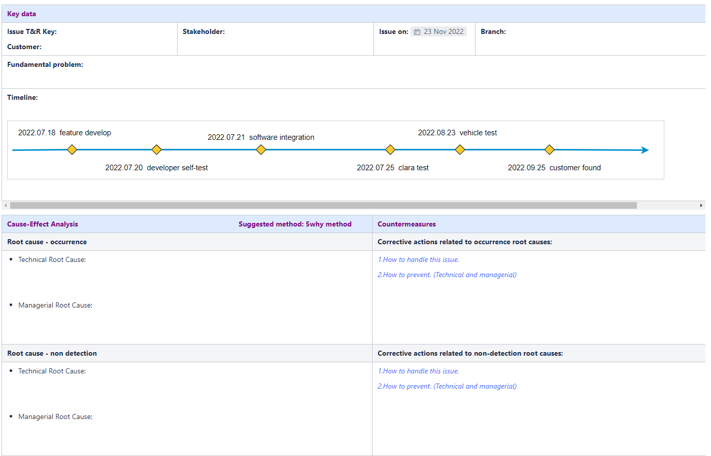

# Table of contents

- [Table of contents](#table-of-contents)
  - [template](#template)
  - [Django channel vs Kafka](#django-channel-vs-kafka)
  - [python requests vs javascript fetch](#python-requests-vs-javascript-fetch)
  - [python same module being imported in different files](#python-same-module-being-imported-in-different-files)
  - [thread with queue](#thread-with-queue)

## template



## Django channel vs Kafka

`Conclusion`: Use Redis if you want to send messages to consumers instantly, and you can live with data loss and a small amount of data to manage. Kafka can be used when you are looking for reliability, high performance, fault tolerance and large amounts of data.

Based on the capabilities of both tools, Redis processes messages in real time, the delay is the smallest, then you should try Redis. However, if the message is large and the data needs to be reused, Kafka should be considered first.

> I’d say the main difference (if you only look at the Redis pub/sub mode, which is what one might compare to Kafka) is how they store messages.

> - Kafka is at-least-once: It stores messages and replays them if it thinks the other end didn’t get them, so you get message one or more times (and have to handle duplicate messages as your failure case)

> - Redis Pub/Sub is at-most-once: It pushes messages to a client if one is around, but if not, or there’s an error, the message will vanish. You have missing messages as your failure case.

> Any queue is going to be one of these two patterns - it just depends how you want it to fail. Generally, Kafka is a much better queue, as Ken says - however, Kafka takes quite a bit of work to set up well, so tutorials are probably using Redis as it’s very easy to get going.

> (one note that is Django Channels does use Redis as well, but when it does it uses Redis lists to achieve an at-least-once type queue)
---
> The biggest difference between Kafka and Redis PUB/SUB is that Kafka is a complete system, while Redis PUB/SUB is just a utility, it doesn’t mean to offend Redis. In essence, this is a data integration problem. No single system can solve everything, so business data is stored in different systems for different purposes, such as archiving, analysis, search, and caching. There is no problem with data redundancy, but data synchronization as complicated as spaghetti between different systems is a challenge.

`Redis`: It is an in-memory database, the PUB/SUB function stores messages in memory (based on the channel). Therefore, if the persistence requirements of your messages are not high and the consumption capacity of back-end applications is not high enough, Redis PUB/SUB is more suitable. For example, an example of an online chat room such as IRC, because the channel is the server in the IRC. The user initiates a connection, publishes a message to the channel, and receives messages from other users. These requirements for durability are not high, so using Redis PUB/SUB is sufficient.

`Kafka`: Kafka is a complete system, It provides a high-throughput, distributed commit log (due to Kafka Connect and Kafka Streams, Kafka’s official website has revised itself to a distributed streaming platform. Kafka’s main purpose is data integration, or stream data integration, provided in the form of a message bus and in the Pub/Sub model and more than a traditional message bus.

In addition to the p2p message queue, it certainly provides a PUB/SUB message model. Moreover, Kafka provides message persistence by default to ensure that the message is not lost (at least in most cases). In addition, since the consumption metadata is stored on the consumer side, the consumer is given a great degree of freedom for consumption. Consumers can consume messages sequentially, or they can re-consume previously processed messages. These are things that Redis PUB/SUB cannot do.

## python requests vs javascript fetch

Although python and javascript are both syncronous programming language by default, python requests module is blocking and javascript fetch/axios module is not.

This means after sending a request, python waits for response, while javascript continues running following codes.

Both have some problems, for python, no further codes proceed until get response back, it is gonna take lots of time waiting.

For javascript, response may be lost.

Asyncronous is most widely used in such situation. However, multiple threads can also solve the above problem for python since it does not lose data, it is just a matter of time.

## python same module being imported in different files

The imported module is set as a global variable, and only will be imported **once**

```python
# middleware.py
from task import TaskManager
print(TaskManager.queue)
def func():
    from task import TaskManager # not imported again
    print(TaskManager.queue)

# task.py
class TaskManager:
    queue = None

# main.py
from middleware import func
from task import TaskManager # not imported again
TaskManager.queue = 'hello' # assign value to global variable
func()

# output
# >> None
# >> hello
```

## thread with queue

```python
from queue import Queue
from threading import Thread

class p:
    name = None
class q:
    name = None

a = Queue()
p.name = a
q.name = a

def add_p():
    for i in range(20):
        p.name.put(i)
        print(f"add {i}")

def add_q():
    for i in range(10):
        q.name.put(i*10)
        print(f"---add {i*10}")

t1 = Thread(target=add_p)
t2 = Thread(target=add_q)
t1.start()
t2.start()
t1.join()
t2.join()
print("Pullout queue")
for i in a.queue:
    print(i)

# output: p and q share the same queue, the will write into the queue one by one(depending one running situation)
# at the end of day, there will be 30 values in the queue
```
