# Table of contents
- [Table of contents](#table-of-contents)
  - [Reference](#reference)
  - [Interviews](#interviews)
    - [1. What is deep learning?](#1-what-is-deep-learning)
    - [2. What is neural network?](#2-what-is-neural-network)
    - [3. What is a multi-layer perceptron(MLP)?](#3-what-is-a-multi-layer-perceptronmlp)
    - [4. What is activation function?](#4-what-is-activation-function)
    - [5. What is cost/loss function?](#5-what-is-costloss-function)
    - [6. What is backpropagation and computing gradients?](#6-what-is-backpropagation-and-computing-gradients)
    - [7. What is Data Normilization, and why do we need it?](#7-what-is-data-normilization-and-why-do-we-need-it)
    - [8. What is the role of activation functions in a neural network?](#8-what-is-the-role-of-activation-functions-in-a-neural-network)
    - [9. What is gradient descent?](#9-what-is-gradient-descent)
    - [10. What do you understand by backpropagation?](#10-what-do-you-understand-by-backpropagation)
    - [11. What is the difference between a feedforward neural network and recurrent neural network?](#11-what-is-the-difference-between-a-feedforward-neural-network-and-recurrent-neural-network)
    - [12. What are the applications of a recurrent neural network?](#12-what-are-the-applications-of-a-recurrent-neural-network)
    - [13. What are hyperparemeters?](#13-what-are-hyperparemeters)
    - [14. What will happen if the learning rate is set too low or too high?](#14-what-will-happen-if-the-learning-rate-is-set-too-low-or-too-high)
    - [15. What is dropout and batch normalization?](#15-what-is-dropout-and-batch-normalization)
    - [16. What is overfitting and underfitting, and how to combat them?](#16-what-is-overfitting-and-underfitting-and-how-to-combat-them)
    - [17. How are weights initialized in a network?](#17-how-are-weights-initialized-in-a-network)
    - [18. What are the different layers on CNN?](#18-what-are-the-different-layers-on-cnn)
    - [19. What is pooling on CNN, and how does it work?](#19-what-is-pooling-on-cnn-and-how-does-it-work)
    - [20. What is bagging and boosting?](#20-what-is-bagging-and-boosting)
    - [21. What is the significance of using the Fourier transform in deep learning tasks?](#21-what-is-the-significance-of-using-the-fourier-transform-in-deep-learning-tasks)
    - [22. What do you understand by transfer learning? Name a few commonly used transfer learning models.](#22-what-do-you-understand-by-transfer-learning-name-a-few-commonly-used-transfer-learning-models)
    - [23. What is the difference between SAME and VALID padding in Tensorflow?](#23-what-is-the-difference-between-same-and-valid-padding-in-tensorflow)
    - [24. What are some of the uses of Autoencoders in deep learning?](#24-what-are-some-of-the-uses-of-autoencoders-in-deep-learning)
    - [25. What is the Swish Function?](#25-what-is-the-swish-function)
    - [26. What are the reasons for mini-batch being so useful?](#26-what-are-the-reasons-for-mini-batch-being-so-useful)
    - [27. What do you understand by Leaky ReLU activation function?](#27-what-do-you-understand-by-leaky-relu-activation-function)
    - [28. What is Data Augmentation in deep learning?](#28-what-is-data-augmentation-in-deep-learning)
    - [29. Explain the Adam optimization algorithm.](#29-explain-the-adam-optimization-algorithm)
    - [30. Why is convolutional neural network preferred over a dense neural network for an image classification task?](#30-why-is-convolutional-neural-network-preferred-over-a-dense-neural-network-for-an-image-classification-task)
    - [31. Strategies used to prevent a model from over-fitting.](#31-strategies-used-to-prevent-a-model-from-over-fitting)
    - [32. Explain two ways to deal with the vanishing gradient problem in a deep neural network.](#32-explain-two-ways-to-deal-with-the-vanishing-gradient-problem-in-a-deep-neural-network)
    - [33. Why is a deep neural network better than a shallow neural network?](#33-why-is-a-deep-neural-network-better-than-a-shallow-neural-network)
    - [34. What is the need to add randomness in the weight initialization process?](#34-what-is-the-need-to-add-randomness-in-the-weight-initialization-process)
    - [35. How can you train hyperparameters in a neural network?](#35-how-can-you-train-hyperparameters-in-a-neural-network)
  - [epoch vs training step](#epoch-vs-training-step)

## Reference
[Understanding Backpropagation Algorithm](https://towardsdatascience.com/understanding-backpropagation-algorithm-7bb3aa2f95fd)

[Understanding Activation Functions in Neural Networks](https://medium.com/the-theory-of-everything/understanding-activation-functions-in-neural-networks-9491262884e0)

[Common Loss Functions](https://www.geeksforgeeks.org/ml-common-loss-functions/)

## Interviews
### 1. What is deep learning?
> If you are going for a deep learning interview, you definitely know what exactly deep learning is. However, with this question the interviewee expects you to give an in-detail answer, with an example. Deep Learning involves taking large volumes of structured or unstructured data and using complex algorithms to train neural networks. It performs complex operations to extract hidden patterns and features (for instance, distinguishing the image of a cat from that of a dog).
> 
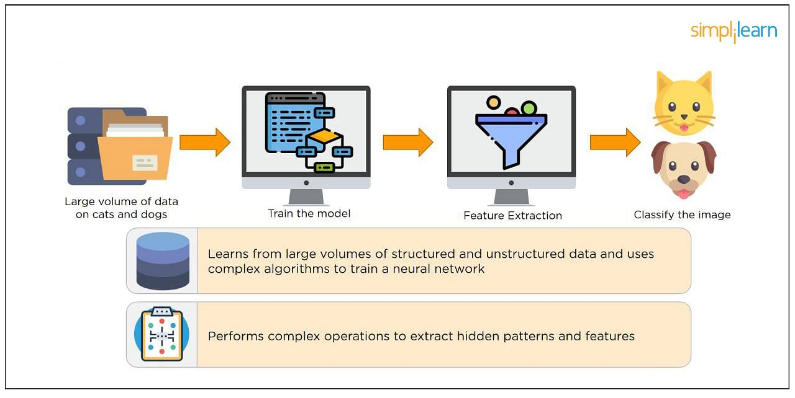

### 2. What is neural network?
The most common neural networks consist of three network layers:
1. an input layer 
2. a hiden layer (which is the most important layer where feature extraction takes place, and adjustments are made to train faster and function better)
3. an output layer
Each contains neurons called 'nodes', performing various operations. Neural networks are used in deep learning algorithms like CNN, RNN, GAN, etc.

### 3. What is a multi-layer perceptron(MLP)?
> As in Neural Networks, MLPs have an input layer, a hidden layer, and an output layer. It has the same structure as a single layer perceptron with one or more hidden layers.

> A single layer perceptron has just two layers of input layers and output layers.

### 4. What is activation function?
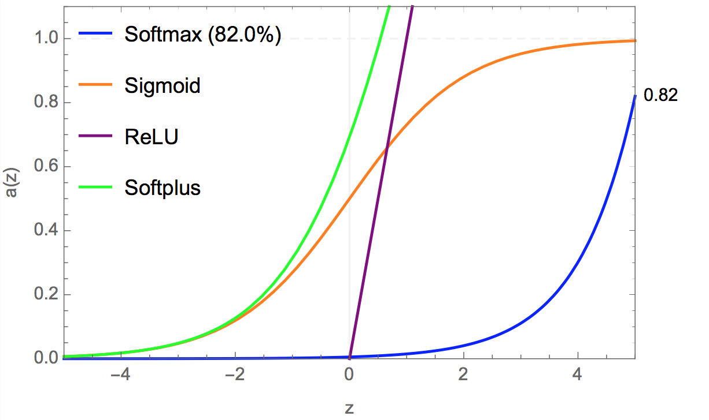
which one do we use?
> Now, which activation functions to use. Does that mean we just use ReLu for everything we do? Or sigmoid or tanh? Well, yes and no. When you know the function you are trying to approximate has certain characteristics, you can choose an activation function which will approximate the function faster leading to faster training process. For example, a sigmoid works well for a classifier ( see the graph of sigmoid, doesn’t it show the properties of an ideal classifier? ) because approximating a classifier function as combinations of sigmoid is easier than maybe ReLu, for example. Which will lead to faster training process and convergence. You can use your own custom functions too!. If you don’t know the nature of the function you are trying to learn, then maybe i would suggest start with ReLu, and then work backwards. ReLu works most of the time as a general approximator!

### 5. What is cost/loss function?
> The loss function estimates how well a particular algorithm models the provided data. Loss functions are classified into two classes based on the type of learning task

- Regression Models: predict continuous values.
- Classification Models: predict the output from a set of finite categorical values.

> The cost function also referred to as “loss” or “error,” cost function is a measure to evaluate how good your model’s performance is. It’s used to compute the error of the output layer during backpropagation. We push that error backward through the neural network and use that during the different training functions.

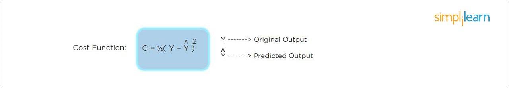

### 6. What is backpropagation and computing gradients?
`BACKPROPAGATION`: the algorithm that is used to calculate the gradient of the loss function with respect to parameters of the neural network.

`GRADIENT DESCENT`: the optimisation algorithm that is used to find parameters that minimise the loss function.

According to the paper from 1989, backpropagation:
> repeatedly adjusts the weights of the connections in the network so as to minimize a measure of the difference between the actual output vector of the net and the desired output vector.

and 

> the ability to create useful new features distinguishes back-propagation from earlier, simpler methods…

In other words, backpropagation aims to minimize the cost function by adjusting network’s weights and biases. The level of adjustment is determined by the gradients of the cost function with respect to those parameters.

### 7. What is Data Normilization, and why do we need it?
> The process of standardizing and reforming data is called “Data Normalization.” It’s a pre-processing step to eliminate data redundancy. Often, data comes in, and you get the same information in different formats. In these cases, you should rescale values to fit into a particular range, achieving better convergence.

### 8. What is the role of activation functions in a neural network?
> At the most basic level, an activation function decides whether a neuron should be fired or not. It accepts the weighted sum of the inputs and bias as input to any activation function. Step function, Sigmoid, ReLU, Tanh, and Softmax are examples of activation functions.

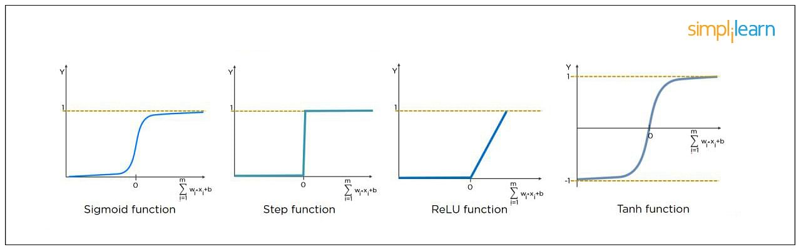

### 9. What is gradient descent?
> Gradient Descent is an optimal algorithm to minimize the cost function or to minimize an error. The aim is to find the local-global minima of a function. This determines the direction the model should take to reduce the error.

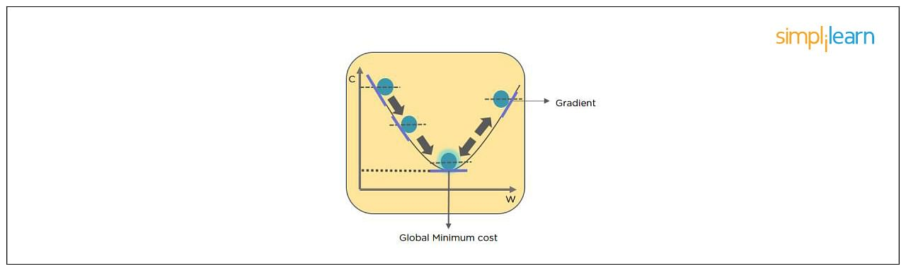

### 10. What do you understand by backpropagation?
> This is one of the most frequently asked deep learning interview questions. Backpropagation is a technique to improve the performance of the network. It backpropagates the error and updates the weights to reduce the error.

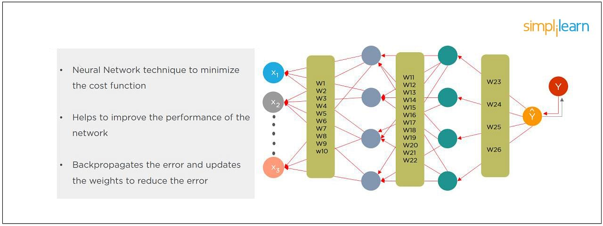

### 11. What is the difference between a feedforward neural network and recurrent neural network?
> A Feedforward Neural Network signals travel in one direction from input to output. There are no feedback loops; the network considers only the current input. It cannot memorize previous inputs (e.g., CNN).

> A Recurrent Neural Network’s signals travel in both directions, creating a looped network. It considers the current input with the previously received inputs for generating the output of a layer and can memorize past data due to its internal memory.

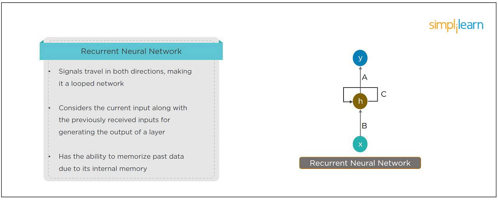

### 12. What are the applications of a recurrent neural network?
> The RNN can be used for sentiment analysis, text mining, and image captioning. Recurrent Neural Networks can also address time series problems such as predicting the prices of stocks in a month or quarter.

### 13. What are hyperparemeters?
> With neural networks, you’re usually working with hyperparameters once the data is formatted correctly. A hyperparameter is a parameter whose value is set before the learning process begins. It determines how a network is trained and the structure of the network (such as the number of hidden units, the learning rate, epochs, etc.).

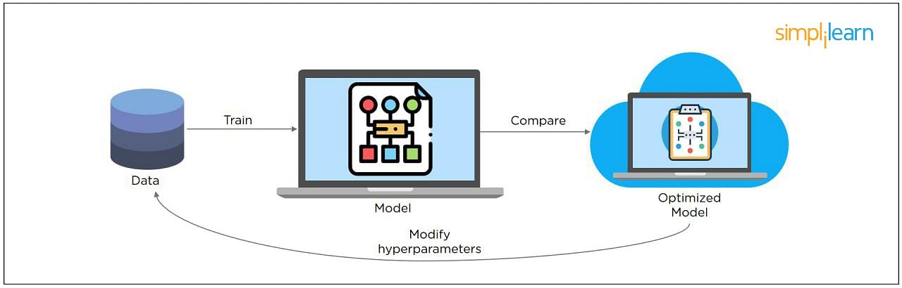

### 14. What will happen if the learning rate is set too low or too high?
> When your learning rate is too low, training of the model will progress very slowly as we are making minimal updates to the weights. It will take many updates before reaching the minimum point.
If the learning rate is set too high, this causes undesirable divergent behavior to the loss function due to drastic updates in weights. It may fail to converge (model can give a good output) or even diverge (data is too chaotic for the network to train).

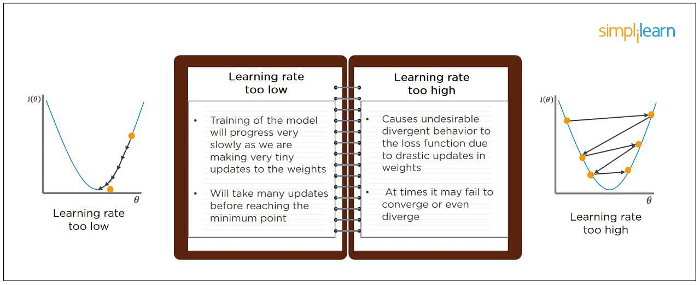

### 15. What is dropout and batch normalization?
> Dropout is a technique of dropping out hidden and visible units of a network randomly to prevent overfitting of data (typically dropping 20 percent of the nodes). It doubles the number of iterations needed to converge the network.

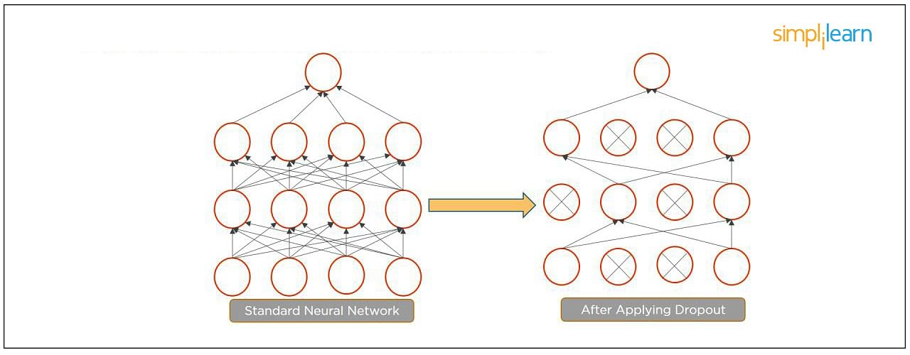

> Batch normalization is the technique to improve the performance and stability of neural networks by normalizing the inputs in every layer so that they have mean output activation of zero and standard deviation of one.

### 16. What is overfitting and underfitting, and how to combat them?
> Overfitting occurs when the model learns the **details and noise** in the training data to the degree that it adversely impacts the execution of the model on new information. It is more likely to occur with nonlinear models that have more flexibility when learning a target function. An example would be if a model is looking at cars and trucks, but only recognizes trucks that have a specific box shape. It might not be able to notice a flatbed truck because there's only a particular kind of truck it saw in training. The model performs well on training data, but not in the real world.

> Underfitting alludes to a model that is neither well-trained on data nor can generalize to new information. This usually happens when there is less and incorrect data to train a model. Underfitting has both poor performance and accuracy.

> To combat overfitting and underfitting, you can resample the data to estimate the model accuracy (k-fold cross-validation) and by having a validation dataset to evaluate the model.

### 17. How are weights initialized in a network?
> There are two methods here: we can either initialize the weights to zero or assign them randomly.

> Initializing all weights to 0: This makes your model similar to a linear model. All the neurons and every layer perform the same operation, giving the same output and making the deep net useless.

> Initializing all weights randomly: Here, the weights are assigned randomly by initializing them very close to 0. It gives better accuracy to the model since every neuron performs different computations. This is the most commonly used method.

### 18. What are the different layers on CNN?
- Convolutional Layer -  the layer that performs a convolutional operation, creating several smaller picture windows to go over the data.
- ReLU Layer - it brings non-linearity to the network and converts all the negative pixels to zero. The output is a rectified feature map.
- Pooling Layer - pooling is a down-sampling operation that reduces the dimensionality of the feature map.
- Fully Connected Layer - this layer recognizes and classifies the objects in the image.

### 19. What is pooling on CNN, and how does it work?
> Pooling is used to reduce the spatial dimensions of a CNN. It performs down-sampling operations to reduce the dimensionality and creates a pooled feature map by sliding a filter matrix over the input matrix.

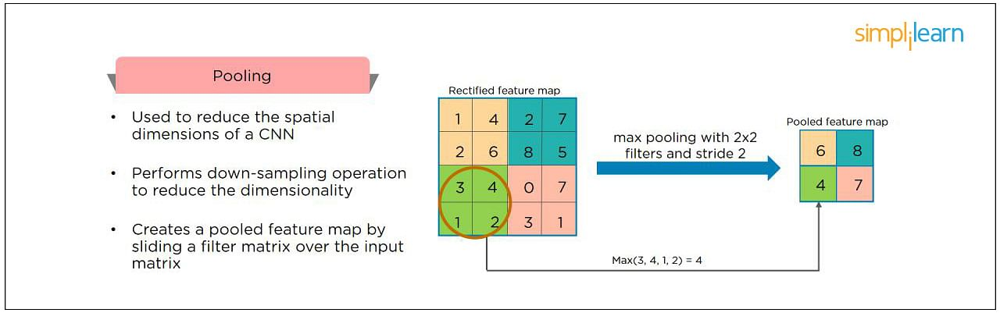

### 20. What is bagging and boosting?
> Bagging and Boosting are ensemble techniques to train multiple models using the same learning algorithm and then taking a call.

> With Bagging, we take a dataset and split it into training data and test data. Then we randomly select data to place into the bags and train the model separately.

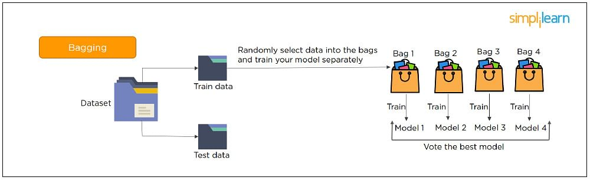

> With Boosting, the emphasis is on selecting data points which give wrong output to improve the accuracy.

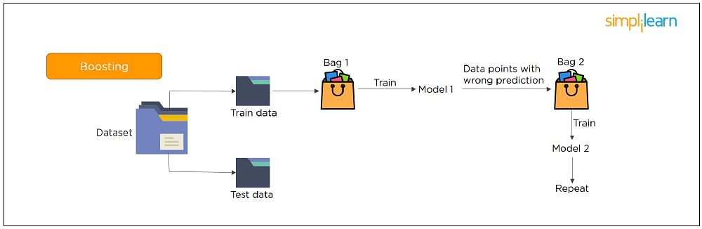

### 21. What is the significance of using the Fourier transform in deep learning tasks?
> The Fourier transform function efficiently analyzes, maintains, and manages large datasets. You can use it to generate real-time array data that is helpful for processing multiple signals.

### 22. What do you understand by transfer learning? Name a few commonly used transfer learning models.
> Transfer learning is the process of transferring the learning from a model to another model without having to train it from scratch. It takes critical parts of a pre-trained model and applies them to solve new but similar machine learning problems.
Some of the popular transfer learning models are:
- VGG-16
- BERT
- GTP-3
- Inception V3
- XCeption

### 23. What is the difference between SAME and VALID padding in Tensorflow?
> Using the Tensorflow library, tf.nn.max_pool performs the max-pooling operation. Tf.nn.max_pool has a padding argument that takes 2 values - SAME or VALID.

> **With padding == “SAME” ensures that the filter is applied to all the elements of the input.**
The input image gets fully covered by the filter and specified stride. The padding type is named SAME as the output size is the same as the input size (when stride=1).

> **With padding == “VALID” implies there is no padding in the input image.** The filter window always stays inside the input image. It assumes that all the dimensions are valid so that the input image gets fully covered by a filter and the stride defined by you.

### 24. What are some of the uses of Autoencoders in deep learning?
- Autoencoders are used to convert black and white images into colored images.
- Autoencoder helps to extract features and hidden patterns in the data.
- It is also used to reduce the dimensionality of data.
- It can also be used to remove noises from images.

### 25. What is the Swish Function?
> Swish is an activation function proposed by Google which is an alternative to the ReLU activation function. 

> It is represented as: f(x) = x * sigmoid(x).

> The Swish function works better than ReLU for a variety of deeper models. 

> The derivative of Swist can be written as: y’ = y + sigmoid(x) * (1 - y).

### 26. What are the reasons for mini-batch being so useful?
Typically, there are three types of Gradient Descent:  

- Batch Gradient Descent: Parameters are updated after computing the gradient of the error with respect to the entire training set.
> Since the entire training data is considered before taking a step in the direction of gradient, therefore it takes a lot of time for making a single update.

- Stochastic Gradient Descent: Parameters are updated after computing the gradient of the error with respect to a single training example.
> Since only a single training example is considered before taking a step in the direction of gradient, we are forced to loop over the training set and thus cannot exploit the speed associated with vectorizing the code.

- Mini-Batch Gradient Descent: Parameters are updated after computing the gradient of  the error with respect to a subset of the training set
> Since a subset of training examples is considered, it can make quick updates in the model parameters and can also exploit the speed associated with vectorizing the code.

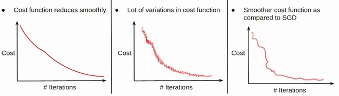

### 27. What do you understand by Leaky ReLU activation function?
> Leaky ReLU is an advanced version of the ReLU activation function. In general, the ReLU function defines the gradient to be 0 when all the values of inputs are less than zero. This deactivates the neurons. To overcome this problem, Leaky ReLU activation functions are used. It has a very small slope for negative values instead of a flat slope.

### 28. What is Data Augmentation in deep learning?
> Data Augmentation is the process of creating new data by enhancing the size and quality of training datasets to ensure better models can be built using them. There are different techniques to augment data such as numerical data augmentation, image augmentation, GAN-based augmentation, and text augmentation.

### 29. Explain the Adam optimization algorithm.
> Adaptive Moment Estimation or Adam optimization is an extension to the stochastic gradient descent. This algorithm is useful when working with complex problems involving vast amounts of data or parameters. It needs less memory and is efficient. 
Adam optimization algorithm is a combination of two gradient descent methodologies - Momentum and Root Mean Square Propagation.

### 30. Why is convolutional neural network preferred over a dense neural network for an image classification task?
> The number of parameters in a convolutional neural network is much more diminutive than that of a Dense Neural Network. Hence, a CNN is less likely to overfit.

> CNN allows you to look at the weights of a filter and visualize what the network learned. So, this gives a better understanding of the model.

> CNN trains models in a hierarchical way, i.e., it learns the patterns by explaining complex patterns using simpler ones.

### 31. Strategies used to prevent a model from over-fitting.
- Dropout
- Data augmentation
- Early stopping

### 32. Explain two ways to deal with the vanishing gradient problem in a deep neural network.
- Use the ReLU activation function instead of the sigmoid function. (Gradient of sigmoid turns to 0 with large X)
- Initialize neural networks using Xavier initialization that works with tanh activation.

### 33. Why is a deep neural network better than a shallow neural network?
> Both deep and shallow neural networks can approximate the values of a function. But the deep neural network is more efficient as it learns something new in every layer. 

> A shallow neural network has only one hidden layer. But a deep neural network has several hidden layers that create a deeper representation and computation capability.

### 34. What is the need to add randomness in the weight initialization process?
> If you set the weights to zero, then every neuron at each layer will produce the same result and the same gradient value during backpropagation. So, the neural network won’t be able to learn the function as there is no asymmetry between the neurons. Hence, randomness to the weight initialization process is crucial.

### 35. How can you train hyperparameters in a neural network?
Hyperparameters in a neural network can be trained using four components:
- Batch size: Indicates the size of the input data.
- Epochs: Denotes the number of times the training data is visible to the neural network to train. 
- Momentum: Used to get an idea of the next steps that occur with the data being executed.
- Learning rate: Represents the time required for the network to update the parameters and learn.

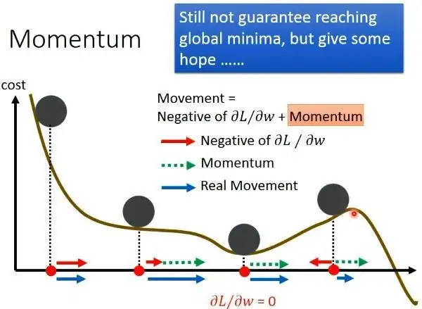

## epoch vs training step
> A training step is one gradient update. In one step batch_size examples are processed.
An epoch consists of one full cycle through the training data. This is usually many steps. As an example, if you have 2,000 images and use a batch size of 10 an epoch consists of:
2,000images / (10images / step) = 200steps.
If you choose your training image randomly (and independently) in each step, you normally do not call it epoch.