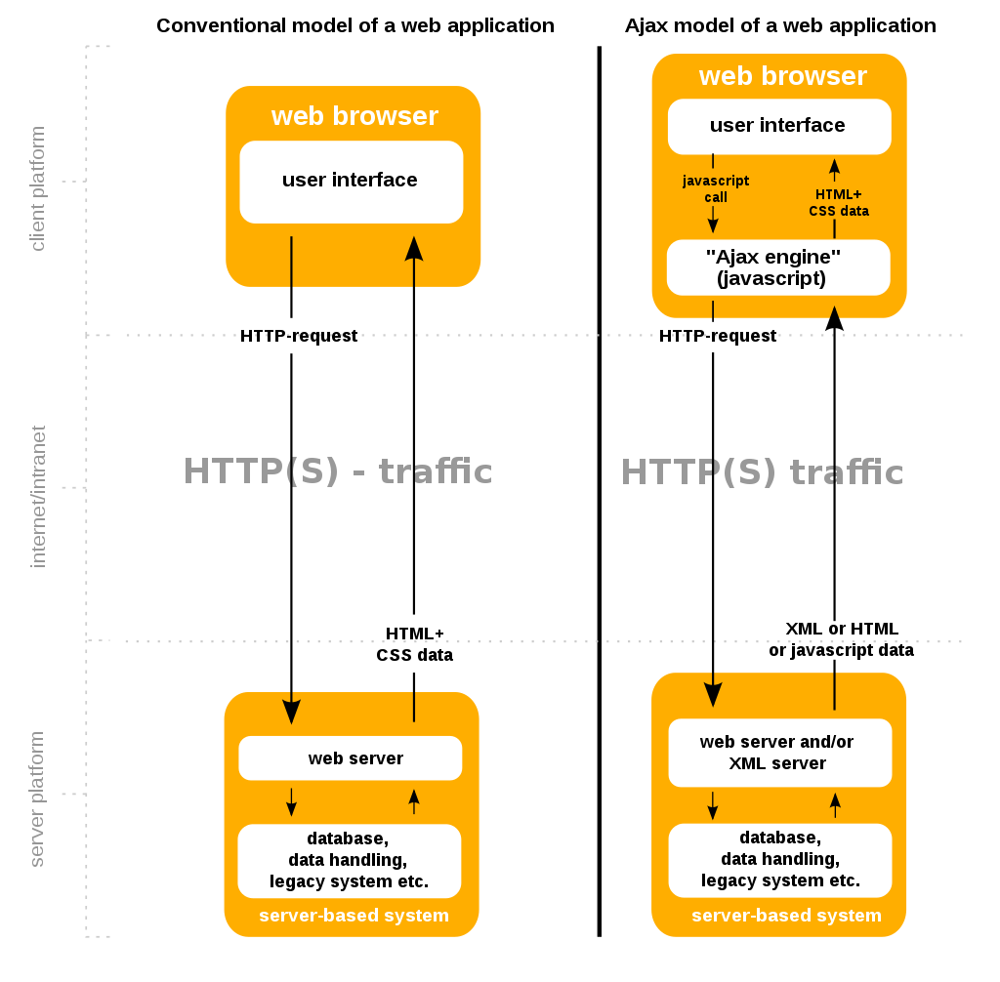
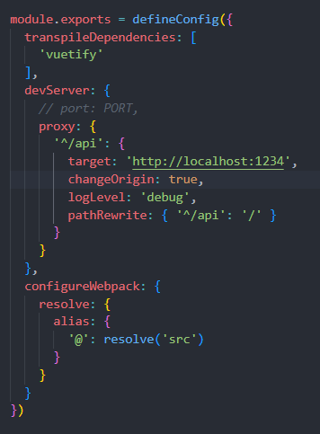
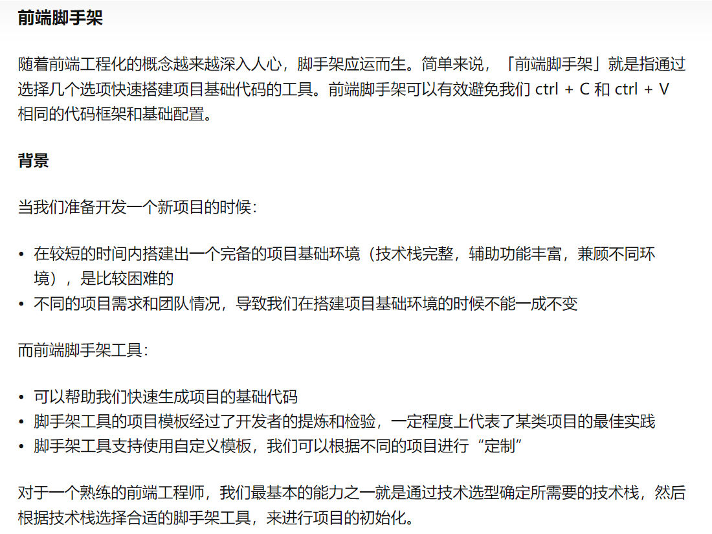

# Table of contents
- [Table of contents](#table-of-contents)
  - [reference](#reference)
  - [AJAX](#ajax)
  - [axios](#axios)
    - [use axios](#use-axios)
    - [fetch vs axios](#fetch-vs-axios)
    - [simultaneous requests](#simultaneous-requests)
    - [intercepting requests and responses](#intercepting-requests-and-responses)
  - [bearer token](#bearer-token)
  - [blob](#blob)
  - [bundling](#bundling)
  - [camel case](#camel-case)
  - [commonJS vs ES module](#commonjs-vs-es-module)
  - [CORS](#cors)
  - [CDN](#cdn)
  - [CRUD](#crud)
  - [cookie vs localstorage](#cookie-vs-localstorage)
  - [ctrl+c in command line](#ctrlc-in-command-line)
  - [curl](#curl)
  - [docker daemon](#docker-daemon)
  - [favicon](#favicon)
  - [hash](#hash)
  - [heartbeat](#heartbeat)
  - [httpOnly cookie](#httponly-cookie)
  - [IPC](#ipc)
  - [HMR(hot module replacement)](#hmrhot-module-replacement)
  - [JSX](#jsx)
  - [vite](#vite)
  - [stores in frontend](#stores-in-frontend)
  - [JWT](#jwt)
  - [JQuery](#jquery)
  - [network basic](#network-basic)
  - [TCP/IP vs OSI model](#tcpip-vs-osi-model)
  - [TCP vs UDP](#tcp-vs-udp)
  - [parameters vs arguments](#parameters-vs-arguments)
  - [pipeline](#pipeline)
  - [port number](#port-number)
  - [plop](#plop)
  - [proxy](#proxy)
    - [what is a proxy server?](#what-is-a-proxy-server)
    - [what is a reverse proxy?](#what-is-a-reverse-proxy)
    - [跨域问题](#跨域问题)
    - [webpack devserver](#webpack-devserver)
  - [webkitformboundary](#webkitformboundary)
  - [port in use](#port-in-use)
  - [public](#public)
  - [project structure](#project-structure)
  - [relational vs non-relational database](#relational-vs-non-relational-database)
  - [rest client](#rest-client)
  - [scss/sass](#scsssass)
  - [socket vs websocket](#socket-vs-websocket)
  - [SPA vs SPC](#spa-vs-spc)
  - [static vs dynamic website](#static-vs-dynamic-website)
  - [status codes](#status-codes)
  - [SSG vs SSR](#ssg-vs-ssr)
  - [use strict](#use-strict)
  - [XHR](#xhr)
  - [yarn](#yarn)
  - [80port](#80port)
  - [脚手架(scaffold)](#脚手架scaffold)

## reference
[ultimate guide to enabling cross origin resouce sharing](https://blog.logrocket.com/the-ultimate-guide-to-enabling-cross-origin-resource-sharing-cors/)
[difference between a JWT and a bearer token](https://www.eddymens.com/blog/the-difference-between-a-jwt-and-a-bearer-token)

## AJAX
> Ajax is short for "Asynchronous JavaScript and XML". AJAX is not a programming language. AJAX allows web pages to be updated asynchronously by exchanging data with a web server behind the scenes. This means that it is possible to update parts of a web page without reloading the whole page.

> Ajax is a set of web development techniques using many web technologies on the client side to create asynchronous web applications. With Ajax, web applications can send and retrieve data from a server asynchronously (in the background) without interfering with the display and behaviour of the existing page. By decoupling the data interchange layer from the presentation layer, Ajax allows web pages and, by extension, web applications, to change content dynamically without the need to reload the entire page. In practice, modern implementations commonly utilize JSON instead of XML.

> Ajax is not a single technology, but rather a group of technologies. HTML and CSS can be used in combination to mark up and style information. The webpage can then be modified by JavaScript to dynamically display — and allow the user to interact with — the new information. The built-in XMLHttpRequest object, or since 2017 the new 'fetch()' function within JavaScript, is commonly used to execute Ajax on webpages, allowing websites to load content onto the screen without refreshing the page. Ajax is not a new technology, or different language, just existing technologies used in new ways.
- Asynchronous JavaScript And XML
- Making background HTTP requests using JavaScript
- Handling the response of those HTTP requests with JavaScript
- No page refresh necessary

> AJAX allows us to build Single Page Applications. (An SPA is a web application or web site that interacts with the user by dynamically rewriting the current page rather than loading entire new pages from a server.) SPAs mean no reload or 'refresh' within the user interface.



## axios
> Axios is a popular, **promise-based HTTP client** that sports an easy-to-use API and can be used in both the browser and Node.js. Making HTTP requests to fetch or save data is one of the most common tasks a client-side JavaScript application will need to do.

### use axios
```sh
npm install axios
```
> Making an HTTP request is as easy as passing a config object to the Axios function. In its simplest form, the object must have a URL property; if no method is provided, GET will be used as the default value.

> Once an HTTP request is made, Axios returns a promise that is either fulfilled or rejected, depending on the response from the backend service. To handle the result, you can use the then() method, handle error use catch().

### fetch vs axios
- Fetch API is built into the window object and therefore doesn't need to be installed as a dependency or imported in client-side code.
- Axios needs to be installed as a dependency. However, it automatically transforms JSON data for you, thereby avoiding the two-step process of making a .fetch() request and then a second call to the .json() method on the response.

### simultaneous requests
> One of Axios' more interesting features is its ability to make multiple requests in parallel by passing an array of arguments to the axios.all() method. This method returns a single promise object that resolves only when all arguments passed as an array has resolved. 

### intercepting requests and responses
> You can examine and change HTTP requests from your program to the server and vice versa, which is useful for a variety of implicit tasks, such as logging and authentication. Interceptors receive the entire response object or request config.

```javascript
service.interceptors.request.use(
  config => {
    // do something before request is sent

    if (store.getters.token) {
      // let each request carry token
      // ['X-Token'] is a custom headers key
      // please modify it according to the actual situation
      config.headers['Authorization'] = getToken()
    }
    return config
  },
  error => {
    // do something with request error
    console.log(error) // for debug
    return Promise.reject(error)
  }
)
```

## bearer token
> Bearer authentication (also called token authentication) is an HTTP authentication scheme that involves security tokens called bearer tokens. The name 'Bearer authentication' can be understood as 'give access to the bearer of this token.' The bearer token is a cryptic string, usually generated by the server in response to a login request. The client must send this token in the Authorization header when making requests to protected resources:

Authorization: Bearer

> The actual token within a Bearer Token can be any series of characters that the server can decode. This means a JWT string can be passed as Bearer Token.

## blob
> The Blob object represents a blob, which is a file-like object of immutable, raw data; they can be read as text or binary data, or converted into a ReadableStream so its methods can be used for processing the data.

> Blobs can represent data that isn't necessarily in a JavaScript-native format. The File interface is based on Blob, inheriting blob functionality and expanding it to support files on the user's system.

## bundling
> Before ES modules were available in browsers, developers had no native mechanism for authoring JavaScript in a modularized fashion. This is why we are all familiar with the concept of "bundling": using tools that crawl, process and concatenate our source modules into files that can run in the browser.

## camel case
```
addBlog
changeTitle
```

## commonJS vs ES module
> In modern software development, modules organize software code into self-contained chunks that together make up a larger, more complex application.
In the browser JavaScript ecosystem, **the use of JavaScript modules depends on the import and export statements; these statements load and export EMCAScript modules (or ES modules), respectively.**

> The ES module format is the official standard format to package JavaScript code for reuse and most modern web browsers natively support the modules.
**Node.js, however, supports the CommonJS module format by default. CommonJS modules load using require(), and variables and functions export from a CommonJS module with module.exports.**

> The ES module format was introduced in Node.js v8.5.0 as the JavaScript module system was standardized. Being an experimental module, the --experimental-modules flag was required to successfully run an ES module in a Node.js environment.

> However, starting with version 13.2.0, Node.js has stable support of ES modules.

## CORS
> CORS (Cross-Origin Resource Sharing) is a system, consisting of transmitting HTTP headers, that determines whether browsers block frontend JavaScript code from accessing responses for cross-origin requests.

## CDN


## CRUD
- c: create
- r: read
- u: update
- d: delete

## cookie vs localstorage
对前端来说作为临时存储,存储在cookie里或者localstorage都可以。


## ctrl+c in command line
```
\x03
```

## curl
> cURL, which stands for client URL, is a command line tool that developers use to transfer data to and from a server. 


```sh
curl -H 'Accept: application/json; indent=4' -u admin:password123 http://127.0.0.1:8000/users/

curl \
  -X POST \
  -H "Content-Type: application/json" \
  -d '{"username": "davidattenborough", "password": "boatymcboatface"}' \
  http://localhost:8000/api/token/

X: method
H: headers
d: data
```

## docker daemon
- The Docker daemon is a service that runs on your host operating system.
- It currently only runs on Linux because it depends on a number of Linux kernel features, but there are a few ways to run Docker on MacOS and Windows too.

## favicon
> A favicon is a small image displayed next to the page title in the browser tab.


```html
<!DOCTYPE html>
<html>
<head>
  <title>My Page Title</title>
  <link rel="icon" type="image/x-icon" href="/images/favicon.ico">
</head>
<body>

<h1>This is a Heading</h1>
<p>This is a paragraph.</p>

</body>
</html>
```

## hash
data structure: same as dictionary, map

## heartbeat
It's common practice to send a small message (heartbeat) for every given time passed to keep the connection active.

## httpOnly cookie
当你在cookie上设置HttpOnly标识后，浏览器就会知会到这是特殊的cookie,只能由服务器检索到，所有来自客户端脚本的访问都会被禁止。

HttpOnly is a flag the website can specify about a cookie. In other words, the webserver tells your browser 'Hey, here is a cookie, and you should treat is as HttpOnly'.

**An HttpOnly Cookie is not accessible by the JavaScript. Only the browser knows about it, and it doesn't give it to the JavaScript code in the page**. At first, it might sound like a limitation, and it is. However, the goal of that is that we cannot trust the JavaScript code. An attacker may use JavaScript to steal our authentication token stored in a cookie, and then access the website with our account. With HttpOnly cookies, this is not possible. This makes XSS(cross-site scripting) attacks (the one we just described) harder to perform.

It is a recognized best practice to share any authentication data only with HttpOnly cookies. Using a standard cookie for authentication is a known vulnerability we should avoid in any case.

## IPC
IPC stands for inter process communication.

six ways in general to do IPC:


[python code](https://zhuanlan.zhihu.com/p/446374478)

## HMR(hot module replacement)
> HMR is a way of exchanging modules in a running application (and adding/removing modules). You basically can update changed modules without a full page reload.

## JSX
> ReactJS relies on **JavaScript Expressions**, popularly known as JSX. In simple terms, JSX is a means of adding HTML code within the JavaScript code.

## vite
> As we build more and more ambitious applications, the amount of JavaScript we are dealing with is also increasing dramatically. It is not uncommon for large scale projects to contain thousands of modules. We are starting to hit a performance bottleneck for JavaScript based tooling: **it can often take an unreasonably long wait (sometimes up to minutes!) to spin up a dev server, and even with Hot Module Replacement (HMR), file edits can take a couple of seconds to be reflected in the browser**. The slow feedback loop can greatly affect developers' productivity and happiness.

vite basically solves two problems:
- slow server start: Vite improves the dev server start time by first dividing the modules in an application into two categories: dependencies and source code.
- slow updates: In Vite, HMR is performed over native ESM. When a file is edited, Vite only needs to precisely invalidate the chain between the edited module and its closest HMR boundary (most of the time only the module itself), making HMR updates consistently fast regardless of the size of your application.
  
## stores in frontend
Isn't Redux just glorified global state?

> Of course it is. But the same holds for every database you have ever used. It is better to treat Redux as an in-memory database - which **your components can reactively depend upon.** Same as Vuex and pinia.

## JWT
JWT stands for JSON Web Tokens.

## JQuery
jQuery is a JavaScript library designed to simplify HTML DOM tree traversal and manipulation, as well as event handling, CSS animation, and Ajax.

## network basic


## TCP/IP vs OSI model
Physical layer transfer data(which are binaries, eg.01100) into signals(electrical, light or radio signals), and transmit thought cables.


The Open Systems Interconnection (OSI) model describes seven layers that computer systems use to communicate over a network. It was the first standard model for network communications, adopted by all major computer and telecommunication companies in the early 1980s.

The modern Internet is not based on OSI, but on the simpler TCP/IP model.


## TCP vs UDP
`TCP`: you have to create a connection first, and then send messages.  => connection oriented

`UDP`: no connection needed. => less secure

## parameters vs arguments
> People incorrectly use those terms interchangeably. One way to remember is that parameters are placeholders. The actual values that you pass in when calling a function are what are called arguments.

## pipeline
> In computing, pipeline refers to the logical queue that is filled with all the instructions for the computer processor to process in parallel. It is the process of storing and queuing tasks and instructions that are executed simultaneously by the processor in an organized way.

## port number
When you have multiple service on a machine, port number is used to identify them.

range: 0~65535

## plop
used to generate codes from templates


this code generate a log post from template/post.hbs into example/index.md. (hbs stands for handlebars)

## proxy
### what is a proxy server?
> A forward proxy, often called a proxy, proxy server, or web proxy, is a server that **sits in front of a group of client machines**. When those computers make requests to sites and services on the Internet, the proxy server intercepts those requests and then communicates with web servers on behalf of those clients, like a middleman.


Why would anyone add this extra middleman to their Internet activity? There are a few reasons one might want to use a forward proxy:
- To avoid state or institutional browsing restrictions
- To block access to certain content
- To protect their identity online

### what is a reverse proxy?
> A reverse proxy is a server that **sits in front of one or more web servers**, intercepting requests from clients. This is different from a forward proxy, where the proxy sits in front of the clients. With a reverse proxy, when clients send requests to the origin server of a website, those requests are intercepted at the network edge by the reverse proxy server. The reverse proxy server will then send requests to and receive responses from the origin server.


The difference between a forward and reverse proxy is subtle but important. A simplified way to sum it up would be to say that **a forward proxy sits in front of a client and ensures that no origin server ever communicates directly with that specific client. On the other hand, a reverse proxy sits in front of an origin server and ensures that no client ever communicates directly with that origin server**.

### 跨域问题
> 跨域,指的是浏览器不能执行其他网站的脚本。它是由浏览器的同源策略造成的,是浏览器对JavaScript施加的安全限制。所谓同源是指,域名,协议,端口均相同。请注意：localhost和127.0.0.1虽然都指向本机,但也属于跨域。

首先前后端交互不可避免的就会遇到跨域问题,一般有几种解决方式：
- cors来解决的,
- dev环境也可以通过 webpack-dev-server的proxy来解决 (前端正向代理)
- 开发环境用nginx反代理

### webpack devserver



frontend url: `http://localhost:8080`

backend url: `http://localhost:1234`

If you request `/api/projects` in frontend, the origin url is `http://localhost:8080/api/projects`, the real url would be `http://localhost:1234/projects`.

## webkitformboundary
```python
# in django
parser_classes = (MultiPartParser)
```

## port in use
```sh
# it needs few seconds to get all
netstat -ab
```

## public
假如要从8080向5000发送请求, 当vue配置了代理服务器的时候, 代理服务器8080并不是把所有的请求都转发给5000,当请求的资源8080就有,这个时候就不会把请求转发给5000（人之常情,很好理解）。这个public文件夹就相当于我们服务器的根路径,public中有的就相当于我们现在8080有。

## project structure


## relational vs non-relational database
[relational vs non-relational database](https://www.mongodb.com/databases/non-relational)

> if you are looking for an easier to use solution and speed is one of your major concern, MySQL is more suitable for you. On the other end, you should look at PostgreSQL if you have complex queries or need additional features are not included in MySQL.

Relational database:
- PostgreSQL
- MariaDB
- MySQL
- Oracle
- SQLite

Non-relational database:
- MongoDB
- Redius


## rest client
```sh
GET http://localhost:8000/api/v1/auth/user HTTP/1.1
Authorization: Basic root:adminadmin
```

## scss/sass
SCSS, also known as Sassy CSS is one of the two syntax available to write Sass. Sass is a popular CSS preprossing language to generate CSS files.

With Sass, you can reduce the number of times you repeat yourself and ensure you're writing clean, maintainable code for the future. It also allows us to do math using operators. We can perform simple calculations inside our code for better output.

## socket vs websocket
> Even though they achieve (in general) similar things, yes, they are really different. WebSockets typically run from browsers connecting to Application Server over a protocol similar to HTTP that runs over TCP/IP. So they are primarily for Web Applications that require a permanent connection to its server. On the other hand, plain sockets are more powerful and generic. They run over TCP/IP but they are not restricted to browsers or HTTP protocol. They could be used to implement any kind of communication.

websocket needs http protocol to make a first connection.

## SPA vs SPC
SPA stands for single page applications.

SFC stands for single file component, specially for vuejs components.

## static vs dynamic website
`Static websites` are the websites that **doesn't change the content or layout dynamically with every request to the web server**. Static websites display exactly the same information whenever anyone visits it. User sees the updated content of Static Website only when a web author manually updates them with a text editor or any web editing tool used for creating websites. Static webpages do not have to be simple plain text. They can feature multiple design and even videos.

Static Website: In Static Websites, **Web pages are returned by the server which are prebuilt source code files built using simple languages such as HTML, CSS, or JavaScript**. There is no processing of content on the server (according to the user) in Static Websites. Web pages are returned by the server with no change therefore, static Websites are fast. There is no interaction with databases. Also, they are less costly as the host does not need to support server-side processing with different languages. 


`Dynamic Website`: In Dynamic Websites, Web pages are returned by the server which are processed during runtime means they are not prebuilt web pages but they are built during runtime according to the user's demand with the help of server-side scripting languages such as PHP, Node.js, ASP.NET and many more supported by the server. So, they are slower than static websites but updates and interaction with databases are possible.

Dynamic Websites are used over Static Websites as updates can be done very easily as compared to static websites (Where altering in every page is required) but in Dynamic Websites, it is possible to do a common change once and it will reflect in all the web pages. 


## status codes
```
| Code range | Category             |
| ---------- | -------------------- |
| 2xx        | Successful operation |
| 3xx        | Redirection          |
| 4xx        | Client error         |
| 5xx        | Server error         |
```

## SSG vs SSR
`Static Site Generation (SSG)`, also referred to as pre-rendering, is another popular technique for building fast websites. If the data needed to server-render a page is the same for every user, then instead of rendering the page every time a request comes in, we can render it only once, ahead of time, during the build process. Pre-rendered pages are generated and served as static HTML files.

SSG retains the same performance characteristics of SSR apps: it provides great time-to-content performance. At the same time, it is cheaper and easier to deploy than SSR apps because the output is static HTML and assets. The keyword here is static: SSG can only be applied to pages consuming static data, i.e. data that is known at build time and does not change between deploys. Every time the data changes, a new deployment is needed.

If you're only investigating SSR to improve the SEO of a handful of marketing pages (e.g. /, /about, /contact, etc.), then you probably want SSG instead of SSR. SSG is also great for content-based websites such as documentation sites or blogs. In fact, this website you are reading right now is statically generated using VitePress, a Vue-powered static site generator.

## use strict
> With strict mode, you can not, for example, use undeclared variables.

## XHR
XHR stands for XMLHttpRequest.

## yarn
yarn 是 Facebook 出品的另一个包管理工具, 同样可以管理 npm 中的包, 安装已缓存的包时速度更快, 你也可以使用它来替代 npm.

## 80port
```sh
netstat -tulpn
```
`80端口和8080端口`:
一般80作为网页服务器的访问端口,比如一个网站的ip地址是123.123.123.123,我们访问的是123.123.123.123:80 只是80是默认端口可以省略。但是如果一个服务器上有不同的站点,那可以用另外的端口,比如123.123.123.123:8080 来访问,选择8080是因为两个80好记。

`区别与联系`:
80是http协议的默认端口,是在输入网站的时候其实浏览器（非IE）已经帮你输入协议了,所以你输入http://baidu.com,其实是访问http://baidu.com:80。而8080,一般用与webcahe,完全不一样的两个,比如linux服务器里apache默认跑80端口,而apache-tomcat默认跑8080端口,其实端口没有实际意义只是一个接口,主要是看服务的监听端口。

## 脚手架(scaffold)
