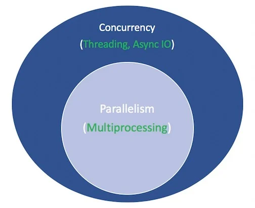
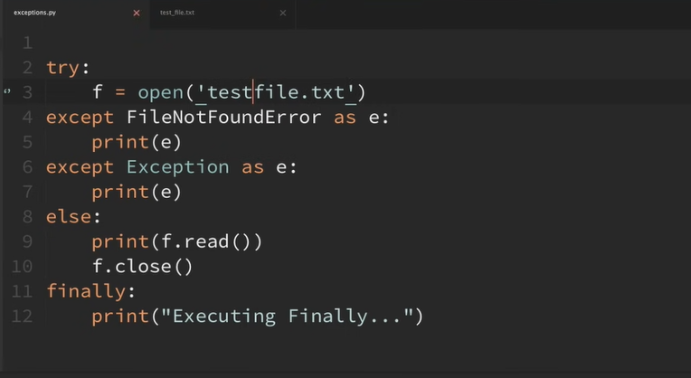
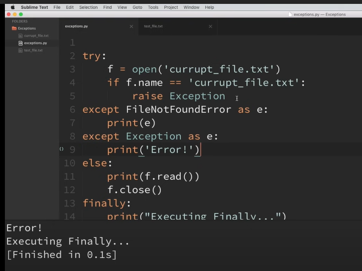
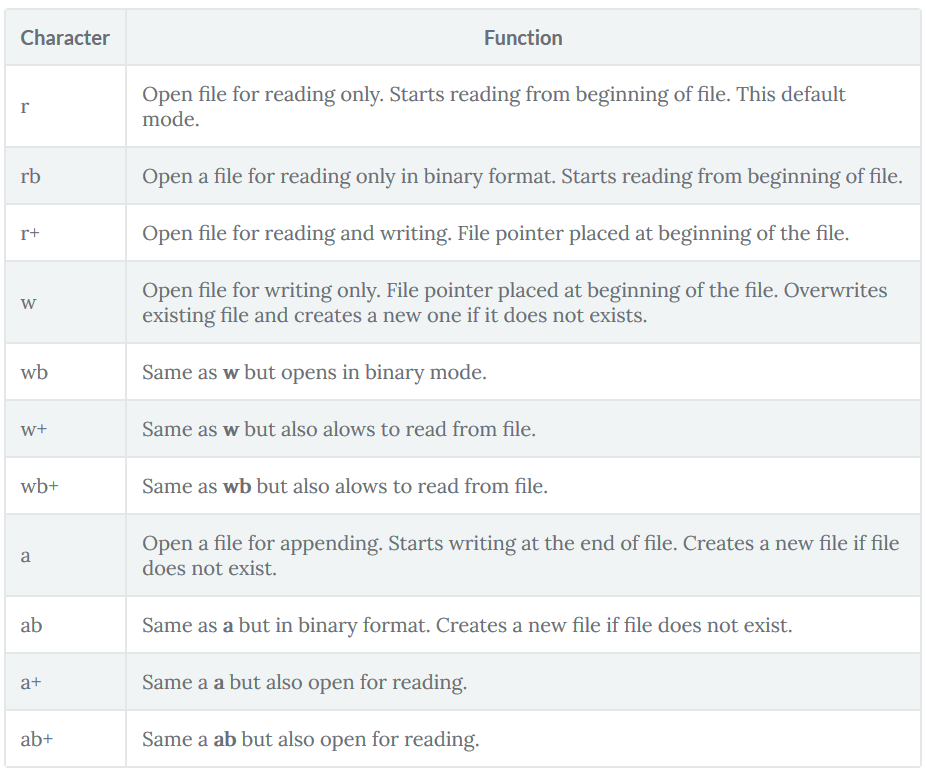
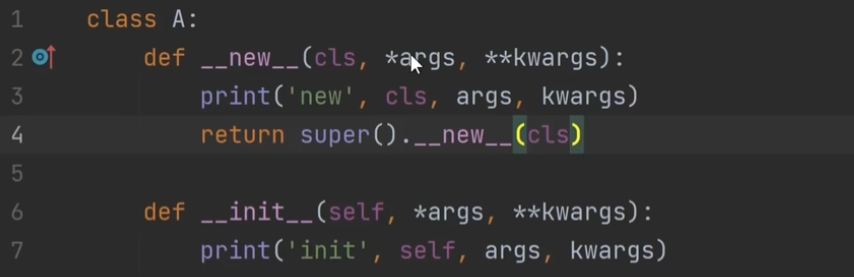
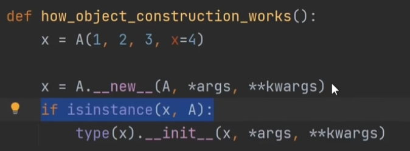
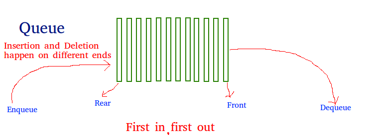
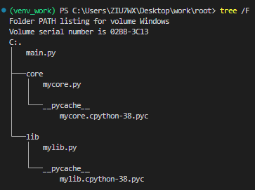

# Table of contents

- [Table of contents](#table-of-contents)
  - [Reference](#reference)
  - [compiled vs interpreted](#compiled-vs-interpreted)
  - [argparse](#argparse)
  - [array vs list](#array-vs-list)
  - [assert](#assert)
  - [asyncrounous](#asyncrounous)
  - [automating windows application using COM](#automating-windows-application-using-com)
  - [call](#call)
  - [call method by name](#call-method-by-name)
  - [classmethod \& staticmethod](#classmethod--staticmethod)
  - [class variable scope](#class-variable-scope)
  - [cli](#cli)
  - [compile pyd](#compile-pyd)
  - [complexity](#complexity)
  - [copy](#copy)
  - [cython](#cython)
  - [deque](#deque)
  - [decorator](#decorator)
  - [dictionary](#dictionary)
  - [dlls](#dlls)
  - [exceptions](#exceptions)
  - [function parameter](#function-parameter)
  - [file locking](#file-locking)
  - [for loop in square brackets](#for-loop-in-square-brackets)
  - [get hostname](#get-hostname)
  - [GIL](#gil)
  - [inserted function](#inserted-function)
  - [kwargs](#kwargs)
  - [logging](#logging)
  - [loguru](#loguru)
  - [I/O](#io)
  - [inheritance](#inheritance)
  - [json dumps/loads](#json-dumpsloads)
  - [lambda function](#lambda-function)
  - [map](#map)
  - [module info](#module-info)
  - [multithreading vs multiprocess](#multithreading-vs-multiprocess)
  - [news vs init](#news-vs-init)
  - [python location](#python-location)
  - [property vs instance method](#property-vs-instance-method)
  - [version check](#version-check)
  - [pip](#pip)
  - [path](#path)
  - [python flag -m](#python-flag--m)
  - [process](#process)
  - [pyinstaller](#pyinstaller)
  - [py2exe](#py2exe)
  - [queue](#queue)
  - [regrex](#regrex)
  - [relative import](#relative-import)
  - [requests](#requests)
  - [serial](#serial)
  - [singleton class](#singleton-class)
  - [socket](#socket)
  - [subprocess](#subprocess)
  - [thread](#thread)
  - [tkinter](#tkinter)
  - [try/except/finally](#tryexceptfinally)
  - [type hint](#type-hint)
  - [tuple vs list](#tuple-vs-list)
  - [underscore](#underscore)
  - [virtual environment](#virtual-environment)
  - [yield](#yield)

## Reference
[complexity](https://iq.opengenus.org/why-o1-time-does-not-exist/)

## compiled vs interpreted
> Compiled programming languages are more performant but are harder to port to different CPU architectures and operating systems. Interpreted programming languages are more portable, but their performance is much worse than that of compiled languages. These are the two extremes of the spectrum.

> Then there are programming languages such as Python that do **a mix of both compilation and interpretation**. *Specifically, Python is first compiled into an intermediate bytecode, which is then interpreted by CPython. This makes the code perform better than code written in a purely interpreted programming language, and it maintains the portability advantage.*

## argparse
```python
import argparse
parser = argparse.ArgumentParser()
parser.add_argument("square", type=int,
                    help="display a square of a given number")
parser.add_argument("-v", "--verbose", action="store_true",
                    help="increase output verbosity")
args = parser.parse_args()
answer = args.square**2
if args.verbose:
    print(f"the square of {args.square} equals {answer}")
else:
    print(answer)
# Note that we now specify a new keyword, action, and give it the value "store_true". This means that, if the option is specified, assign the value True to args.verbose. Not specifying it implies False.
import argparse
parser = argparse.ArgumentParser()
parser.add_argument("square", type=int,
                    help="display a square of a given number")
parser.add_argument("-v", "--verbosity", type=int,
                    help="increase output verbosity")
args = parser.parse_args()
answer = args.square**2
if args.verbosity == 2:
    print(f"the square of {args.square} equals {answer}")
elif args.verbosity == 1:
    print(f"{args.square}^2 == {answer}")
else:
    print(answer)
```

## array vs list
`Arrays` are great for **numerical operations**

`lists` cannot directly handle math operations. For example, you can divide each element of an array by the same number with just one line of code. If you try the same with a list, you'll get an error.
```python
array = np.array([3, 6, 9, 12])
division = array/3
```

## assert
> The assert statement exists in almost every programming language. It helps detect problems early in your program, where the cause is clear, rather than later when some other operation fails.

> In Python, the assert statement is used to continue the execute if the given condition evaluates to True. If the assert condition evaluates to False, then it raises the AssertionError exception with the specified error message.

```python
assert False
# Traceback (most recent call last):
#   File "<stdin>", line 1, in <module>
# AssertionError

# You can also send an message like this:
assert False, "Oh no! This assertion failed!"
# Traceback (most recent call last):
#   File "c:/Users/ZIU7WX/Desktop/work/rubbish_bin/4.py", line 2, in <module>
#     assert False, "Oh no! This assertion failed!"
# AssertionError: Oh no! This assertion failed!

assert 2 + 2 == 5, "Houston we've got a problem"
# Traceback (most recent call last):
#   File "c:/Users/ZIU7WX/Desktop/work/rubbish_bin/4.py", line 2, in <module>
#     assert 2 + 2 == 5, "Houston we've got a problem"
# AssertionError: Houston we've got a problem

# Generally, it is roughly equivalent to 
if not condition:
    raise AssertionError()
# But is better described.
```

## asyncrounous

```python
import asyncio
from time import sleep

async def fetch_data():
    print("start fetching")
    await asyncio.sleep(2)
    print("done fetching")
    return {'data': 1}

async def print_numbers():
    for i in range(10):
        print(i)
        await asyncio.sleep(0.25)

async def main():
    asyncio.create_task(fetch_data())
    asyncio.create_task(print_numbers())
    
asyncio.run(main())
```
By contrast, asyncio event loops uses only a single thread, and it is guaranteed that unless you await, nothing else will get in your way when you are executing.
```python
async def main():
    ac.go(count('counter a:'))
    await count('counter b:')
# counter b: 1
# counter a: 1
# counter b: 2
# counter a: 2
# a appears until b finished
```

## automating windows application using COM
[COM](https://pbpython.com/windows-com.html)
1. win32com.client.Dispatch()
2. win32com.client.gencache.EnsureDispatch()

## call
```python
class Product:
    def __init__(self):
        print("Instance Created")
  
    # Defining __call__ method
    def __call__(self, a, b):
        print(a * b)
  
# Instance created
ans = Product()  
# __call__ method will be called
ans(10, 20)

class Test:
    
    def __init__(self) -> None:
        pass
    
    def __call__(self):
        print("hello")
        
a = Test()
a()
```

## call method by name
```python
class Foo:
    name = 'maple'
    def bar1(self):
        print(1)
    def bar2(self):
        print(2)

def call_method(o, name):
    return getattr(o, name)()

def call_property(o, name):
    return getattr(o, name)

f = Foo()
call_method(f, "bar1")  # prints 1
print(call_property(f, 'name')) # prints maple
```

## classmethod & staticmethod
```python
class BookCase:

    def __init__(self, books=None):
        self.books = books

    @classmethod
    def create_bookcase(cls, books):
        list_of_books = []

        for t, a in books:
            list_of_books.append(Book(t, a))

        return cls(list_of_books)
```
> When you need a utility function that doesn’t access any properties of a class, but makes sense that it belongs to the class, we use static functions.

> Class methods are for when you need to have methods that aren't specific to any particular instance, but still involve the class in some way. 

> You can use class methods for any methods that are not bound to a specific instance but the class. In practice, you often use class methods for methods that **create an instance of the class.**

1. factory method (create an instance)
```python
class Supermarket:    
    def __init__(self, product, best_before):
        self.best_before = "2022-05-18"
        self.product = "Milk"
    
    @classmethod    
    def add_product(cls):
        return cls("Bread", "2022-05-29")
>>> obj = Supermarket.add_product()
>>> obj.product
'Milk'
>>> obj.best_before
'2022-05-18'
```
2. Correct instance creation in inheritance (can be inheritance)
```python
class Supermarket:
    product_price = {"Milk": 1}
    def __init__(self, product, best_before):
        self.best_before = "2022-05-18"
        self.product = "Milk"
    @staticmethod
    def add_import_product(product, best_before):
        return Supermarket(product, best_before)
    @classmethod    
    def add_product(cls, product, best_before):
        return cls(product, best_before)

class GroceryStore(Supermarket):
    product_price = {"Milk": 2}
grocery1 = GroceryStore.add_import_product("Bread", "2022-06-05")
isinstance(grocery1, GroceryStore)
>>> False
grocery2 = GroceryStore.add_product("Apple", "2022-06-10")
isinstance(grocery2, GroceryStore)
>>> True
```

## class variable scope
```python
class TestB:
    varNum = 0

    def __init__(self):
        self.varNum = 3

b = TestB()
print(b.varNum)  # print 3
print(TestB.varNum)  # print 0
```

## cli
```sh
python.exe -c "from <pythonscript> import <function>; function()"

# specify python version
py -3.7
```

## compile pyd
```python
# Method 1:
#!/usr/bin/env pythonfromsetuptools importsetup,Extension
try:
    from Cython.Build import cythonize
    ext_modules =cythonize([
        Extension("amortization.amount",["amortization/amount.py"]),
        Extension("amortization.schedule",["amortization/schedule.py"]),
        Extension("amortization.amortize",["amortization/amortize.py"]),])
except ImportError:
    ext_modules =Nonesetup(ext_modules=ext_modules
)
```
```sh
python setup.py build_ext --inplace
```
```sh
# Method 2
Cython logger.py
Combatlink.bat logger
```
```bat
"C:\Program Files\Microsoft Visual Studio\2022\Professional\VC\Tools\MSVC\14.31.31103\bin\HostX86\x64\cl.exe" /c /nologo /Ox /W3 /GL /DNDEBUG /MD -IC:\Users\ZIU7WX\Desktop\work\venv_work\include -IC:\software\python\python3.8.10\include -IC:\software\python\python3.8.10\include "-IC:\Program Files\Microsoft Visual Studio\2022\Professional\VC\Tools\MSVC\14.31.31103\include" "-IC:\Program Files (x86)\Windows Kits\NETFXSDK\4.8\include\um" "-IC:\Program Files (x86)\Windows Kits\10\include\10.0.19041.0\ucrt" "-IC:\Program Files (x86)\Windows Kits\10\\include\10.0.19041.0\\shared" "-IC:\Program Files (x86)\Windows Kits\10\\include\10.0.19041.0\\um" "-IC:\Program Files (x86)\Windows Kits\10\\include\10.0.19041.0\\winrt" "-IC:\Program Files (x86)\Windows Kits\10\\include\10.0.19041.0\\cppwinrt" /TcC:\Users\ZIU7WX\Desktop\work\tools\RQM\%1.c /FoC:\Users\ZIU7WX\Desktop\work\tools\RQM\%1.obj

"C:\Program Files\Microsoft Visual Studio\2022\Professional\VC\Tools\MSVC\14.31.31103\bin\HostX86\x64\link.exe" /nologo /INCREMENTAL:NO /LTCG /DLL /MANIFEST:EMBED,ID=2 /MANIFESTUAC:NO /LIBPATH:C:\Users\ZIU7WX\Desktop\work\venv_work\libs /LIBPATH:C:\software\python\python3.8.10\libs /LIBPATH:C:\software\python\python3.8.10 /LIBPATH:C:\Users\ZIU7WX\Desktop\work\venv_work\PCbuild\amd64 "/LIBPATH:C:\Program Files\Microsoft Visual Studio\2022\Professional\VC\Tools\MSVC\14.31.31103\lib\x64" "/LIBPATH:C:\Program Files (x86)\Windows Kits\NETFXSDK\4.8\lib\um\x64" "/LIBPATH:C:\Program Files (x86)\Windows Kits\10\lib\10.0.19041.0\ucrt\x64" "/LIBPATH:C:\Program Files (x86)\Windows Kits\10\\lib\10.0.19041.0\\um\x64" /EXPORT:PyInit_%1 C:\Users\ZIU7WX\Desktop\work\tools\RQM\%1.obj /OUT:C:\Users\ZIU7WX\Desktop\work\tools\RQM\%1.pyd /IMPLIB:C:\Users\ZIU7WX\Desktop\work\tools\RQM\%1.lib
```

## complexity
[complexity](#reference)

## copy
```python
class p:
    name = None

class q:
    name = None

a = []
p.name = a
p.name.append("maple")
q.name = a
print(q.name)
# output
# >> ['maple']
# in this senario, copy module is needed
```

## cython
> The Python language specification is used in a number of implementations such as CPython (written in C), Jython (written in Java), IronPython (written for .NET), and PyPy (written in Python).

> CPython is the original implementation of Python and is by far the most popular and most maintained. When people refer to Python, they more often than not mean CPython. You’re probably using CPython right now!

> `The python.exe binary is the compilation binary of Cpython.`

## deque
> Deque (Doubly Ended Queue) in Python is implemented using the module “collections“. Deque is preferred over a list in the cases where we need quicker append and pop operations from both the ends of the container, as deque provides an O(1) time complexity for append and pop operations as compared to list which provides O(n) time complexity.
```python
# Python code to demonstrate working of 
# append(), appendleft(), pop(), and popleft()
  
# importing "collections" for deque operations
import collections
  
# initializing deque
de = collections.deque([1,2,3])
  
# using append() to insert element at right end 
# inserts 4 at the end of deque
de.append(4)
  
# printing modified deque
print ("The deque after appending at right is : ")
print (de)
  
# using appendleft() to insert element at left end 
# inserts 6 at the beginning of deque
de.appendleft(6)
  
# printing modified deque
print ("The deque after appending at left is : ")
print (de)
  
# using pop() to delete element from right end 
# deletes 4 from the right end of deque
de.pop()
  
# printing modified deque
print ("The deque after deleting from right is : ")
print (de)
  
# using popleft() to delete element from left end 
# deletes 6 from the left end of deque
de.popleft()
  
# printing modified deque
print ("The deque after deleting from left is : ")
print (de)
```

## decorator
[decorator](https://www.freecodecamp.org/news/python-property-decorator/)
> The main objective of any decorator is to modify your class methods or attributes in such a way so that the user of your class no need to make any change in their code.

```python
def announce(f):
	def wrapper():
		print("Start function…")
		f()
		print("End function…")
    return wrapper

def hello(func):
	def inner():
		print("Hello ")
		func()
	return inner

def name():
	print("Alice")

obj = hello(name)
obj()

@hello
def name():
    print("Alice") 
```

## dictionary
`setdefault()`:returns the value of a key (if the key is in dictionary). Else, it inserts a key with the default value to the dictionary.

`get()`:returns the value of a key (if the key and value exist)> Else, it gets a default value. 

## dlls
```sh
# commands to check dependent dlls
dumpbin /dependents MyLibrary.cp37-win_amd64.pyd
```

## exceptions


```python
# customized exceptions
class WriteCoordinateError(Exception):
    pass
```

## function parameter
```python
# 1.positional argument
def vehicle(name, model):
  print(f"I Own {name.title()}")
  print(f"{name.title()}'s Model is {model}")
vehicle('Swift', 'VXI')

# 2.keyword argument
def vehicle(model, name):
  print(f"I Own {name.title()}")
  print(f"{name.title()}'s Model is {model}")
vehicle(name='Swift', model='VXI')

# 3.default values
def vehicle(model, name='car'):
  print(f"I Own a {name.title()}")
  print(f"{name.title()}'s Model is {model}\n")
vehicle(model='VXI')    #uses default name value
vehicle(name='Swift', model='eco')

# 4.optional argument
def name(first, last, middle=''):
  full_name = f"{first} {middle} {last}"
  return full_name
data = name('Adam', 'Grook')
data1 = name('Saik', 'Ali', 'Grook')

# 5.return a dictionary
def name(first, last, middle=''):
  full_name = {'first_name': first, 'middle_name': middle, 'last_name': last}
  return full_name
data = name('Adam', 'Grook')
data1 = name('Saik', 'Grook', 'Ali')
print(data,"\n",data1)

# 6.return a list
def name(first, last, middle=''):
  full_name = [first, middle, last]
  return full_name
data = name('Adam', 'Grook')
data1 = name('Saik', 'Grook', 'Ali')
print(data, "\n", data1)

# 7.arbitrary number of arguments(not sure the number of data)
def ingredients(*items):
    for i in items:
        print(i)
ingredients('Water', 'Sugar', 'Lemon')
ingredients('Fish', 'meat')

# 8.arbitrary keyword argument(keyword)
def employee(name, id, **employee_info):
  employee_info['name'] = name
  employee_info['id'] = id
  return employee_info
profile = employee('Adam', '1652', Role='DevOps Lead', CTC='Confidential')
print(profile)
# Output: {'Role': 'DevOps Lead', 'CTC': 'Confidential', 'name': 'Adam', 'id': '1652'} 
```

## file locking
> File locking is a mechanism that restricts access to a computer file, or to a region of a file, by allowing only one user or process to modify or delete it at a specific time and to prevent reading of the file while it's being modified or deleted.

> Systems implement locking to prevent the classic interceding update scenario, which is a typical example of a race condition, by enforcing the serialization of update processes to any given file. The following example illustrates the interceding update problem:

- Process A reads a customer record from a file containing account information, including the customer's account balance and phone number.
- Process B now reads the same record from the same file, so it has its own copy.
- Process A changes the account balance in its copy of the customer record and writes the record back to the file.
- Process B, which still has the original stale value for the account balance in its copy of the customer record, updates the account balance and writes the customer record back to the file.
- Process B has now written its stale account-balance value to the file, causing the changes made by process A to be lost.
```python
class Starter:
    def __init__(self):
        self._get_lock()

    def _get_lock(self):
        file_name = os.path.basename(__file__).split('.')[0]
        if os.name == "posix":
            lock_file_name = f"/var/run/{file_name}.pid"
        else:
            lock_file_name = f"{os.path.expanduser('~')}\\{file_name}.pid"
        self.fd = open(lock_file_name, "w")
        try:
            portalocker.lock(self.fd, portalocker.LOCK_EX | portalocker.LOCK_NB)
            self.fd.writelines(str(os.getpid()))
            self.fd.flush()
            logger.info(f"Single instance. lockfile: {lock_file_name}.")
        except:
            logger.error(f"{lock_file_name} have another instance running.")
            exit(1)

    def __del__(self):
        portalocker.unlock(self.fd)
```

## for loop in square brackets
```python
new_list = [ NEW_VALUE for item in YOUR_LIST ]
```

## get hostname
```python
import socket
hostname, _, ips = socket.gethostbyname_ex(socket.gethostname())
```

## GIL
[GIL](https://realpython.com/python-gil/)

> The Python Global Interpreter Lock or GIL, in simple words, is a mutex (or a lock) that allows only one thread to hold the control of the Python interpreter.

CPU-bound programs are those that are pushing the CPU to its limit. This includes programs that do mathematical computations like matrix multiplications, searching, image processing, etc.

I/O-bound programs are the ones that spend time waiting for Input/Output which can come from a user, file, database, network, etc. I/O-bound programs sometimes have to wait for a significant amount of time till they get what they need from the source due to the fact that the source may need to do its own processing before the input/output is ready, for example, a user thinking about what to enter into an input prompt or a database query running in its own process.

To recap the above, concurrency encompasses both multiprocessing (ideal for CPU-bound tasks) and threading (suited for IO-bound tasks). Multiprocessing is a form of parallelism, with parallelism being a specific type (subset) of concurrency. The Python standard library has offered longstanding support for both of these through its multiprocessing, threading, and concurrent.futures packages.

## inserted function
```python
# 1. dir()
# returns all properties and methods of the specified object, without the values

# 2. join()
text = ['Python', 'is', 'a', 'fun', 'programming', 'language']
# join elements of text with space
print(' '.join(text))
# Output: Python is a fun programming language

# 3. title()
Name = 'zhu'
Print(Name.title())
# Output: Zhu
```

## kwargs
```python
shoppinglist = {'icecream':5, 'apple':1}
def func(*args, **kwargs):
    # deployment_id = params.pop("deployment_id", None)
    for key, value in kwargs.items():
        print(key, value)

func(**shoppinglist)
# or
func(icream=5, apple=1)
```

## logging
```python
logging.basicConfig(level=logging.DEBUG, filename=os.path.join(self.dstfolder, 'multithread_dl_2.log'), format='%(asctime)s - %(message)s',datefmt='%d-%b-%y %H:%M:%S', filemode='a')
```

## loguru
```python
from loguru import logger

container = []
def func(msg):
    container.append(msg)


logger.info("start test2")
# add log message into a file
logger.add('log.log')
# add log message into a function
logger.add(func)
logger.debug("hello")

print(container)
# output
# >> 2022-12-09 14:40:35.972 | INFO     | __main__:<module>:9 - start test2
# >> 2022-12-09 14:40:35.976 | DEBUG    | __main__:<module>:14 - hello
# >> ['2022-12-09 14:40:35.976 | DEBUG    | __main__:<module>:14 - hello\n']
```

## I/O


## inheritance
```python
# Python code to demonstrate how parent constructors
# are called.
 
# parent class
class Person( object ):   
    # __init__ is known as the constructor        
    def __init__(self, name, idnumber):  
            self.name = name
            self.idnumber = idnumber
    def display(self):
            print(self.name)
            print(self.idnumber)
# child class
class Employee( Person ):          
    def __init__(self, name, idnumber, salary, post):
        self.salary = salary
        self.post = post
        # invoking the __init__ of the parent class
        Person.__init__(self, name, idnumber)
```
`If you forget to invoke the __init__() of the parent class then its instance variables would not be available to the child class. `

`super().__init__(firstname, lastname) in the init method of the student class call's the base class person's init method and pass parameters. `

`In the same way, super().fullname() calls person.fullname() method.` 

`The super().fullname() can be called as super(student, self).fullname()`

## json dumps/loads
> json.dumps() function will convert a subset of Python objects into a json string. Not all objects are convertible and you may need to create a dictionary of data you wish to expose before serializing to JSON.

> json.loads() method can be used to parse a valid JSON string and convert it into a Python Dictionary. It is mainly used for deserializing native string, byte, or byte array which consists of JSON data into Python Dictionary.

## lambda function
`multiple inputs, single output`
```python
# Simple function can be explained in one line, multiples input only one output
Y = lambda a,b: a+b

Y(1,2) = 3

# Same as :
def f(a, b):
    return a+b
```

## map
```python
def square(number):
    return number ** 2

numbers = [1, 2, 3, 4, 5]
squared = map(square, numbers)
list(squared)
# [1, 4, 9, 16, 25]

# Map with lambda function:
numbers = [1, 2, 3, 4, 5]
square_numbers = list(map(lambda x: x*x, numbers))
print(square_numbers)
```

## module info
```python
import pandas as pd

# return module location
pd.__file__
# return module documentation
pd.__doc__
```

## multithreading vs multiprocess
> Threading allows parallelism of code and Python language has two ways to achieve its 1st is via multiprocessing module and 2nd is via multithreading module. Multithreading is well suited to **speed up I/O bound tasks like making a web request, or database operations, or reading/writing to a file**. 

> In contrast to this **CPU intensive tasks like mathematical computational tasks** are benefited the most using multiprocessing. This happens due to GIL (Global Interpreter Lock).

## news vs init
`New actually creates something (an object), while init just initialize.
Because new returns an object while init does not return anything.`




## python location
```sh
where python
where pip
```

## property vs instance method
```python
import math

class Circle:
    def __init__(self, radius):
        # call radius setter function first to enable initial value is float
        self.radius = radius

    @property
    def radius(self):
        return self._radius

    @radius.setter
    def radius(self, value):
        self._radius = float(value)

    @property
    def diameter(self):
        return self.radius * 2

    @diameter.setter
    def diameter(self, value):
        self.radius = value / 2
```
```python
class Product(models.Model):
    title = models.CharField(max_length=120)
    content = models.TextField(blank=True, null=True)
    price = models.DecimalField(max_digits=15, decimal_places=2, default=99.99)
    
    @property
    def sale_price(self):
        return "%.2f" %(float(self.price)*0.8)
    
    def get_discount(self):
        return "122"

# property method transfer function into class property attribute, eg. retrieve product.sale_price instead product.sale_price()
# instance method is django specific
```

## version check
```sh
python --version
```
```python
import sys
sys.version
```

## pip
```sh
pip list (--version)
pip freeze > requirement.txt
pip install
pip show pandas
```

## path
```python
# use pathlib or os.path to specify the file relative to the location of __file__
import pathlib
pathlib.Path(__file__).parent.absolute()

import os 
# get current path
path = os.getcwd()
# get upside directory name
parent = os.path.dirname(path)
os.path.abspath(path)
filepath = os.path.join(os.path.dirname(os.path.abspath(__file__)), 'test.txt')
```

## python flag -m
> The m flag is, at its simplest, a means to execute python scripts from the command line by using modulenames rather than filenames

## process
```python
# Shutdown the current process and its children process
def kill(proc_pid):
    process = psutil.Process(proc_pid)
    for proc in process.children(recursive=True):
        proc.kill()
    process.kill()

try:
    proc.wait(timeout=0)
except subprocess.TimeoutExpired:
    kill(proc.pid)
```

## pyinstaller
```sh
# convert python script to executable file
pyinstaller --onefile -w 'filename.py'

curl https://bootstrap.pypa.io/get-pip.py -o get-pip.py
python get-pip.py
```

## py2exe
```sh
python setup.py py2exe
```
```python
# setup.py
from distutils.core import setup
import py2exe

includes = []
excludes = ['_gtkagg', '_tkagg', 'bsddb', 'curses', 'pywin.debugger',
            'pywin.debugger.dbgcon', 'pywin.dialogs']
packages = ['pytz']
dll_excludes = ['libgdk-win32-2.0-0.dll', 'libgobject-2.0-0.dll']

setup(
    options = {"py2exe": {"compressed": 2,
                          "optimize": 2,
                          "includes": includes,
                          "excludes": excludes,
                          "packages": packages,
                          "dll_excludes": dll_excludes,
                          "bundle_files": 3,
                          "dist_dir": "dist",
                          "xref": False,
                          "skip_archive": False,
                          "ascii": False,
                          "custom_boot_script": '',
                         }
              },
    console=['guitemplate.py']
    )
```

## queue
> Like stack, queue is a linear data structure that stores items in First In First Out (FIFO) manner. With a queue the least recently added item is removed first. A good example of queue is any queue of consumers for a resource where the consumer that came first is served first.



Queue in Python can be implemented by the following ways:
- list
- collections.deque
- queue.Queue

## regrex
```sh
# Pattern	Description
^	    Begin at the start of the line.
(\w+)	Match one or more word characters. This is the first capturing group.
\s	    Match a white-space character.
(\d+)	Match one or more decimal digits. This is the second capturing group.
\r?	    Match zero or one carriage return character.
$	    End at the end of the line.

st = '04 Start LBA      2312 End LBA      4103 Size        7168 KB Name       hyp_a Type 89a6a6e1-8d0c-c64c-b4e8-55a4320fbd8a\r\n'
pattern = '(\d+) Size.*_a'
```

## relative import 
```python
from pathlib import Path
FILE=Path(__file__).resolve()
ROOT=FILE.parents[0]  # YOLOv5 root directory
if str(ROOT) not in sys.path:
    sys.path.append(str(ROOT))  # add ROOT to PATH
ROOT=Path(os.path.relpath(ROOT, Path.cwd()))  
```
**把main函数放在根目录，内部的函数relative import是支持的。**



## requests
> 阻塞：程序会等待一个结果出现（不出现就一直等待）然后才执行其他的代码, requests模块是阻塞的

## serial
```sh
python -m serial.tools.list_ports
```
```python
# get a list of available serial ports to use
from serial.tools import list_ports
list_ports.comports()
```

## singleton class
> In object-oriented programming, a singleton class is a class that can have only one object (an instance of the class) at a time.

> The primary purpose of a Singleton class is to restrict the limit of the number of object creation to only one. 

> This often ensures that there is access control to resources, for example, socket or database connection.

```python
def Singleton(cls):
    _instance = {}
    def _singleton(*args, **kwagrs):
        if cls not in _instance:
            _instance[cls] = cls(*args, **kwagrs)
        return _instance[cls]
    return _singleton

# Classic Singleton creates an instance only if there is no instance created so far; otherwise, it will return the instance that is already created. Let’s take a look at the below code.
@Singleton
class person:
    def __init__(self, name) -> None:
        self.name = name
        
    
p1 = person('maple')
p2 = person('john')
print(p1.name)
print(p2.name)

# output
# >> maple
# >> maple
```

## socket
```python
# aim: communicate between applications/machines, not for IPC
import socket
s = socket.socket('ipv4', 'tcp')
# ipv4 and ipv6 are optional, ipv4 by default
# tcp and udp are optional, tcp by default

s.send(byte("hello world", "utf-8"))
# message should be bytes
print(c.recv(1024).decode())
# the received message should have length limit and decode into string
```

## subprocess
```python
# To run a process and read all of its output, set the stdout value to PIPE and call communicate().
import subprocess
process = subprocess.Popen(['echo', '"Hello stdout"'], stdout=subprocess.PIPE)

# wait for the process to complete and then it will display the output
stdout = process.communicate()[0]

# This will read a line from the stdout.
output = process.stdout.readline()

# The poll() method will return exit code if completed, or None if the process is still running
process.poll()
```

## thread
[Python Threading: The Complete Guide](https://superfastpython.com/threading-in-python/#Run_a_Function_in_a_Thread)
1. run a function in thread
```python
import threading 

T1 = threading.thread(target=fun, args=(,))
T1.start()
T1.join() #other threads wait until t1 finishes

def fun(args, event):
	if event.set():
print("start thread")
```
2. extend the thread class
```python
# two ways to rewrite a thread class
# 1. send default target function 
class WebSocketClient(threading.Thread):
    def __init__(self, server, queue: Queue= None):
        super().__init__(target=self.connect)
    
    def connect(self):
        pass

# 2. rewrite run function
class Counter(threading.Thread):
    def run(self) -> None:
        for i in range(10):
            print("counting")
            time.sleep(10)
        # return super().run()
```

> Daemon threads are those threads which are killed when the main program exits.

> Because daemon is set True, all threads terminate when the program ends.

[How to kill a thread](https://www.geeksforgeeks.org/python-different-ways-to-kill-a-thread/)

```sh
A somewhat clumsy ascii-art to demonstrate the mechanism: The join() is presumably called by the main-thread. It could also be called by another thread, but would needlessly complicate the diagram.
join-calling should be placed in the track of the main-thread, but to express thread-relation and keep it as simple as possible, I choose to place it in the child-thread instead.
without join:
+---+---+------------------                     main-thread
    |   |
    |   +...........                            child-thread(short)
    +..................................         child-thread(long)
with join
+---+---+------------------***********+###      main-thread
    |   |                             |
    |   +...........join()            |         child-thread(short)
    +......................join()......         child-thread(long)
with join and daemon thread
+-+--+---+------------------***********+###     parent-thread
  |  |   |                             |
  |  |   +...........join()            |        child-thread(short)
  |  +......................join()......        child-thread(long)
  +,,,,,,,,,,,,,,,,,,,,,,,,,,,,,,,,,,,,,,,,     child-thread(long + daemonized)
'-' main-thread/parent-thread/main-program execution
'.' child-thread execution
'#' optional parent-thread execution after join()-blocked parent-thread could 
    continue
'*' main-thread 'sleeping' in join-method, waiting for child-thread to finish
',' daemonized thread - 'ignores' lifetime of other threads;
    terminates when main-programs exits; is normally meant for 
    join-independent tasks
So the reason you don't see any changes is because your main-thread does nothing after your join. You could say join is (only) relevant for the execution-flow of the main-thread.
If, for example, you want to concurrently download a bunch of pages to concatenate them into a single large page, you may start concurrent downloads using threads, but need to wait until the last page/thread is finished before you start assembling a single page out of many. That's when you use join().
```

## tkinter
```python
# Object-oriented frames:
import tkinter as tk
from tkinter import ttk
from tkinter.constants import LEFT, RIGHT
from tkinter.messagebox import showinfo
from typing import Optional

class MainFrame(tk.Frame):
    def __init__(self, container):
        super().__init__(container) #container is window
        options = {'padx' : 5, 'pady': 5, 'side': RIGHT}
        
        #label
        self.label = ttk.Label(self, text='Hello, Tkinter!')
        self.label.pack(**options)
        
        #button
        self.button = ttk.Button(self, text='Click Me', command=self.button_click)
        self.button.pack(**options)
        #*****show the frame on the container*****
        self.pack(**options)
    def button_click(self):
        showinfo(title='Information',message='Hello Tkinter!')

class SecondaryFrame(tk.Frame):
    def __init__(self, container):
        super().__init__(container)
        options = {'padx': 10, 'pady': 10, 'side': LEFT}
        self.label = ttk.Label(self, text='Hello world')
        self.label.pack(**options)
        self.pack(**options)

class App(tk.Tk):
    def __init__(self):
        super().__init__()
        self.title('My awesome app')
        self.geometry('300x100')

if __name__ == '__main__':
    app = App() #create a new instance of the app class
    frame_1 = MainFrame(app) #create a new instance of the mainframe class and set its container to the app instance
    frame_2 = SecondaryFrame(app)
    app.mainloop()


# Object-oriented windows:
import tkinter as tk
from tkinter import ttk
from tkinter.messagebox import showinfo

class App(tk.Tk):
    def __init__(self):
        super().__init__()
        self.title('My awesome App')
        self.geometry('300x100')
        self.label = ttk.Label(self, text='Hello tkinter')
        self.label.pack()

if __name__ == '__main__':
    app = App()
    app.mainloop()
```

## try/except/finally
> Python provides a keyword finally, which is always executed after try and except blocks. The finally block always executes after normal termination of try block or after try block terminates due to some exception. **Even if you return in the except block still the finally block will execute**.

## type hint
```python
def first(l: Sequence[T]) -> T:   # Generic function
    return l[0]
```

## tuple vs list
> A list has a variable size while a tuple has a fixed size. 

> So, we use a list when we want to contain similar items, but use a tuple when we know what information goes into it.

## underscore
[property](https://realpython.com/python-property/)
> Note: Python doesn’t have the notion of access modifiers, such as private, protected, and public, to restrict access to attributes and methods. In Python, the distinction is between public and non-public class members.

If you want to signal that a given attribute or method is non-public, then you have to use the well-known Python convention of prefixing the name with an underscore (_). That’s the reason behind the naming of the attributes ._x and ._y.

Note that this is just a convention. It doesn’t stop you and other programmers from accessing the attributes using dot notation, as in obj._attr. However, it’s bad practice to violate this convention.
```python
# 1.use in interpreter
# Store the results of above expression

# 2.ignore values
a,_,b=(1,2,3)
Print(a,b)
#a=1,b=3

# 3.use in the loop
# As a variable
for _ in range(5):
	print(_)
# 0 1 2 3 4

# 4.sperate digits of numbers
million = 1_000_000
print(million)
#1000000

# 5.naming
# _name:for internal use
# cannot be imported if importing *
# __name: mangling(avoid overriding)
# __name__:dunder method

class Sample():
    def __init__(self):
        self.a = 1
        self._b = 2
        self.__c = 3
obj1 = Sample()
print(dir(obj1))
class SecondClass(Sample):
    def __init__(self):
        super().__init__()
        self.a = "overridden"
        self._b = "overridden"
        self.__c = "overridden"
obj2 = SecondClass()
print(dir(obj2))
print(obj1.a)
print(obj1._b)
print(obj1._Sample__c)
print(obj2.a)
print(obj2._b)
print(obj1._Sample__c)
print(obj2._SecondClass__c)
```

## virtual environment
```sh
python -m venv tutorial-env
Bash:Tutorial-env/scripts/activate
Powershell（python terminal:Tutorial-env/scripts/Activate.ps1
deactivate
Cmd:Tutorial-env/scripts/activate.bat
# Note: put project folder wherever make sense to you, just do not put it inside env directory tree 
```

## yield
[what does the yield keyword do?](https://stackoverflow.com/questions/231767/what-does-the-yield-keyword-do-in-python?rq=1)
> Why Use Generators?
Usually, you can write code that doesn't use generators but implements the same logic. One option is to use the temporary list 'trick' I mentioned before. That will not work in all cases, for e.g. if you have infinite loops, or it may make inefficient use of memory when you have a really long list. The other approach is to implement a new iterable class SomethingIter that keeps the state in instance members and performs the next logical step in it's next() (or __next__() in Python 3) method. Depending on the logic, the code inside the next() method may end up looking very complex and be prone to bugs. Here generators provide a clean and easy solution.
```python
A list can be used multiple times, while a generator can only be used once.

mylist = [x*x for x in range(3)]
for i in mylist:
    print(i)
    
for i in mylist:
    print("this is ", i)
print(mylist)

# =====================================================
mygenerator = (x*x for x in range(3))
for i in mygenerator:
    print(i)
    
for i in mygenerator:
    print("this is ", i)
print(mygenerator)

# For more insight as to what's happening behind the scenes, the for loop can be rewritten to this:
iterator = some_func()
try:
    while 1:
        print(iterator.__next__())
except StopIteration:
    pass
```