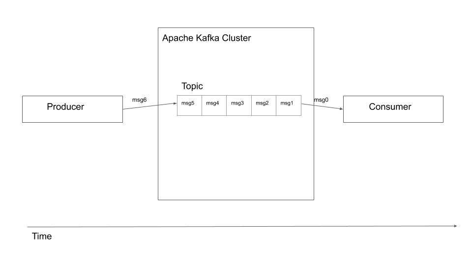

# Understanding

假如不使用kafka就是直接分发任务到代理端，那么假设代理端目前有任务没执行完，这时任务分发就要等待了。
有kafka的话任务就可以等代理端自己去取，前端/后端只负责把任务布置下去存在kafka内，也就是producer，等代理端自行consumer。

另外，kafka相比于django channel的区别是，kafka是会存储数据到本地的，因此通讯的时效性相比于redis会差一些，但是好处是如果连接断开，数据不会丢失。
因此选择kafka还是redis取决于数据的可靠性还是时效性。

## Reference

[Architectural messaging patterns: an illustrated guide](https://www.redhat.com/architect/architectural-messaging-patterns)

[Kafka vs Redis – What’s the Difference ?](https://cloudinfrastructureservices.co.uk/kafka-vs-redis-whats-the-difference/)

[Kafka Python client](https://github.com/dpkp/kafka-python)

[Apache Kafka](https://www.startdataengineering.com/post/what-why-and-how-apache-kafka/)

[Confluent REST APIs](https://docs.confluent.io/platform/current/kafka-rest/index.html#confluent-rest-apis)

## Introduction

> Python client for the Apache Kafka distributed stream processing system. kafka-python is designed to function much like the official java client, with a sprinkling of pythonic interfaces (e.g., consumer iterators).

## What is Apache Kafka

> According to the official definition, it is a distributed streaming platform. This means that you have a cluster of connected machines (Kafka Cluster) which can.

### Features

`1. Receive data from multiple applications, the applications producing data(aka messages) are called **producers**.`

`2. Reliably store the received data(aka message).`

`3. Allow applications to read the stored data, these applications are called **consumers** since they are consuming the data(aka message). Consumers usually read one message at a time.`

`4. Guarantee **order of data**. That is, if a message, say m1, is received by the cluster at time t1 and another message, say m2, is received by the cluster at later time t1 + 5 sec, then a consumer reading the messages will read m1 before m2.`

`5. Provide **at-least once** delivery of data. This means every message sent to the Apache Kafka cluster is guaranteed to be received by a consumer at least once. This means that at the consumer there may be duplication of data. The most common reason for this is that the message sent by producer getting lost due to network failures.`

`6. Has support for running apps on the Kafka cluster using connector and framework to process messages called Streams API.`

`7. In Apache Kafka cluster you have **Topics** which are ordered queues of messages.`

### Common use cases

Let’s assume our application has 10Million users and we want to record user actions(hover, move, idle, etc) every 5 seconds. This will create 120Million user action events per minute. In this case we don’t have to make the user aware that we have successfully processed their action information. To respond to 120Million requests per minute, we will need multiple servers running copies of your application. How will you solve this?

Let’s say one of our applications need to send a message to 3 other applications. In this case assume the application that sends the message does not need to know if the message was processed. How will you solve this?

### Glossary

1. offset

`denotes the position of a message within the topic. This helps the consumers decide from which message to start reading.`

2. auto_offset_reset

`The possible values are earliest and latest which tells the consumer to read from the earliest available message or the latest message the consumer has yet to read in the topic respectively.`

3. group_id

`denotes the group the consumer application is a part of. Usually multiple consumers are run in a group and group id enables consumers to keep track of which messages have been read and which have not.`

4. partitions

`As with most distributed systems, Apache Kafka distributes its data across multiple nodes within the cluster. A topic in Apache Kafka is chunked up into partitions which are duplicated(into 3 copies by default) and stored in multiple nodes within the cluster. This prevents data loss in case of node failures.`
