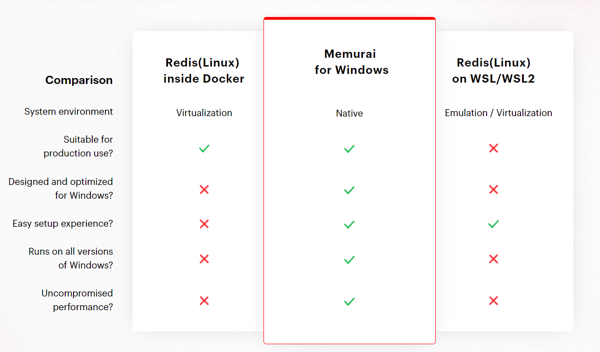
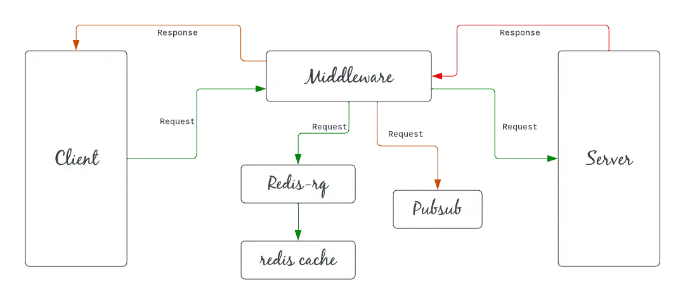

# Table of contents
- [Table of contents](#table-of-contents)
  - [what is redis](#what-is-redis)
  - [redis on windows](#redis-on-windows)
  - [redis on docker](#redis-on-docker)
  - [workflow](#workflow)
  - [commands](#commands)
  - [example](#example)

## what is redis
> Redis is an in memory data structure store used as a database, cache and message broker.

> It is a simple key value database store with faster execution time, along with a ttl- (Time to live) functionality.

> Redis supports data structures such as strings, hashes, lists, sets, sorted sets with range queries, bitmaps, hyperloglogs and geospatial indexes with radius queries.

> It stores everything in primary memory.

Database, everything stored in key/value pair rather sql table.
Runs in RAM, super quick, but if your system crashes, data are gone. So it is more used as caching(eg. in front of your sql database).

## redis on windows
`memurai`: Redis™* for Windows alternative, In-Memory Datastore


## redis on docker
```sh
docker run -d redis
docker exec it <redis container name> redis-cli
```

## workflow

> According to the diagram, the client will hit a request to the middleware. The middleware will first add the request in the queue i.e increase the count by 1 of the “request method” key in Redis cache memory. Then middleware will hit the server with the request and complete the tasks. The server sends a response to the middleware. It sends messages to all subscribers(pubsub) about the request and a response to the client.

## commands
```sh
# in windows wsl
redis-cli

# clear terminal
clear

# exit terminal
quit

# set key/value pair, string by default
SET name kyle
SET age 26

# get value of key
GET name

# delete 
DEL age

# exist, return boolean
EXIST name

# get all keys
KEYS *

# get rid of everything in database
flushall

# expiration, ttl stands for time to live
ttl name # -1: no expiration, -2: gone
expire name 10 # 10 seconds
setex name 10 kyle # delete after expires

# array/list
lpush friends john # push john to array whose key is friends
lrange friends 0 -1 # get all values in array
rpush friends mike # push to the end of array
lpop friends # pop out first item of array
rpop friends # pop out last item of array

# sets
SADD hobbies "weight lifting" # only have one, no duplicated
SMEMBERS hobbies
SREM hobbies "weight lifting"

# hashes, key/value pair inside key
HSET person name kyle
HGET person name
HGETALL person # get all keys and values in person
HEXIST person name
```

## example
```javascript
import express from 'express'
import axios from "axios"
import cors from 'cors'
import Redis from 'redis'

const redisClient = Redis.createClient()
const DEFAULT_EXPIRATION = 3600
const app = express()
app.use(cors())

app.get("/photos", async (req, res) => {
    const albumId = req.query.albumId
    redisClient.get(`photos?albumId=${albumId}`, async (error, photos) => {
        if (error) console.log(error);
        if (photos != null) {
            return res.json(JSON.stringify(photos))
        } else {
            const { data } = await axios.get("http://photo", { params: { albumId } })
            redisClient.setex(`photos?albumId=${albumId}`, DEFAULT_EXPIRATION, JSON.stringify(data))
            res.json(data)
        }
    })
})

app.get("/photos/:id", async (req, res) => {
    const { data } = await axios.get(`http://photo/${req.params.id}`)
    res.json(data)
})

app.listen(3000)
```