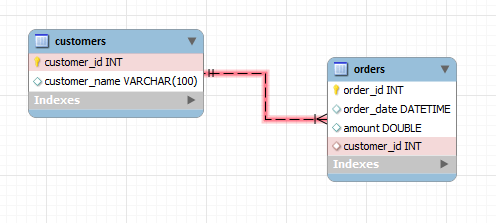

# Table of contents

- [Table of contents](#table-of-contents)
 	- [usage](#usage)
 	- [setup mysql](#setup-mysql)
  		- [linux docker](#linux-docker)
  		- [docker-compose](#docker-compose)
  		- [load sample data(migrate)](#load-sample-datamigrate)
 	- [new user](#new-user)
 	- [foreign key](#foreign-key)

## usage

```sh
SHOW DATABASES;
USE TEST;
SHOW TABLES;
```

## setup mysql

### linux docker

```sh
# download mysql docker image
sudo docker pull mysql:latest
# launch docker container
sudo docker run --name mysql -p 3306:3306 -v mysql_volume:/var/lib/mysql/ -d -e "MYSQL_ROOT_PASSWORD=temp123" mysql
# mysql stored data in /var/lib/mysql inside docker container
# it maps to local direcotry in /var/lib/docker/volumes/mysql_volume/_data
# check container status
netstat -tlnup | grep -i 3306
sudo docker ps
# connect to mysql database
docker exec -it mysql bash
mysql -u root -p
# show all databases
SHOW DATABASES;
```

### docker-compose

```yaml
version: '3'
services:
 database: 
  image: mysql:latest
  container_name: mysql
  environment:
   MYSQL_ROOT_PASSWORD: temp1234
  ports:
   - "3306:3306"
  volumes:
   - mysql_volume: /var/lib/mysql
volumes:
 mysql_compose_volume: 
```

### load sample data(migrate)

```sh
# mariaDB/bin
# backup database
mysqldump -u root -p gmw_v3.5 > ../migrate/gwm_backup.sql
# copy data to docker container
docker cp gwm_backup.sql mysql:/tmp/gwm_backup.sql
# connect to database
mysql -u root -p
# create new database and migrate
CREATE database gwm;
mysql -u root -p gwm < gwm_backup.sql
```

## new user

```sh
# create user for all hostnames
CREATE USER 'username'@'%' IDENTIFIED BY 'password';
# grant privilige
GRANT INSERT, UPDATE, DELETE, SELECT, REFERENCES, RELOAD ON *.* TO 'username'@'%';
# change password if needed
ALTER USER 'username'@'hostname' IDENTIFIED BY 'newpassword';
# delete user
DROP USER 'usernmae'@'hostname';
```

## foreign key

```sql
-- create a simple customers table
CREATE TABLE customers (
 customer_id INT AUTO_INCREMENT PRIMARY KEY,
 customer_name VARCHAR(100)
);

-- create orders table which will contain a foreign key
CREATE TABLE orders (
 order_id INT AUTO_INCREMENT PRIMARY KEY,
 customer_id INT,
 amount DOUBLE,
 FOREIGN KEY (customer_id) REFERENCES customers(customer_id)
);

-- insert data into tables
INSERT INTO `customers` (`customer_id`, `customer_name`) VALUES
(1, 'Adam'),
(2, 'Andy'),
(3, 'Joe'),
(4, 'Sandy');

INSERT INTO `orders` (`order_id`, `customer_id`, `amount`) VALUES
(1, 1, 19.99),
(2, 1, 35.15),
(3, 3, 17.56),
(4, 4, 12.34);

-- retrieving data with a JOIN query
SELECT * FROM orders
JOIN customers USING(customer_id)
```


