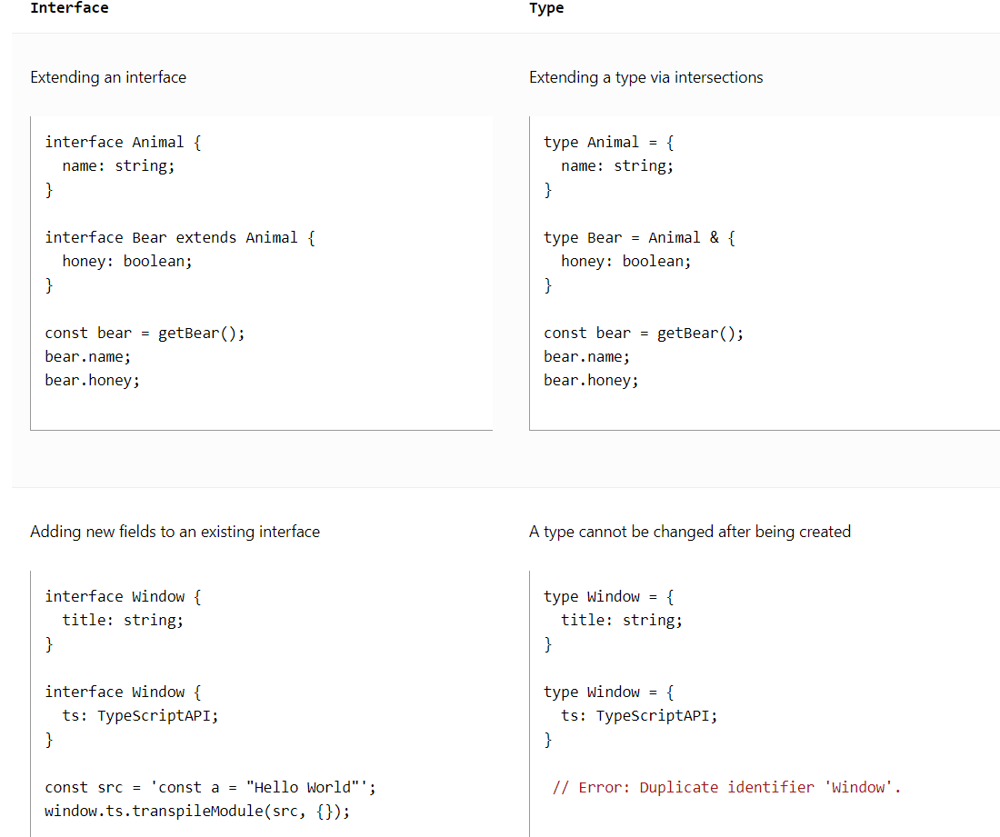
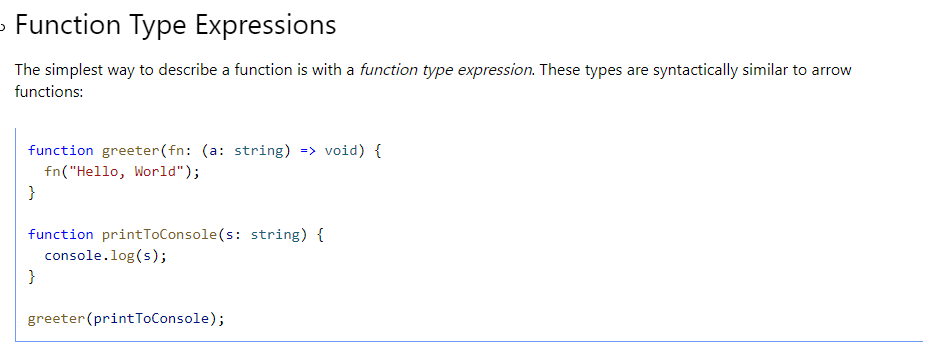

## Reference
[Typescript](https://www.typescriptlang.org/docs/handbook/2/everyday-types.html)

## cheat sheet


## export {}
If you do not include the export {} statement in a TypeScript declaration file (.d.ts), it will be treated as a global script file rather than an external module.

By default, TypeScript treats .ts files as modules, even if they don't have any explicit exports. However, declaration files (.d.ts) have slightly different behavior. If a declaration file doesn't contain any exports or export {}, it is considered a global script file.

When a file is treated as a global script file, its contents are assumed to extend the global scope directly. This means that any declarations made within the file will be available in the global namespace without the need for explicit import/export statements.

```javascript
// global-script.d.ts
declare const myGlobalVariable: string;

declare function myGlobalFunction(): void;
```
In this case, myGlobalVariable and myGlobalFunction are declared at the global level. This means you can reference and use them directly throughout your TypeScript code without importing them or using any module system.

By omitting export {} in the declaration file, you indicate that the declarations within it should be treated as part of the global script environment.

It's important to note that using global variables and functions can lead to potential naming conflicts and make your code less modular. It's generally recommended to encapsulate your code within modules or namespaces to avoid polluting the global scope. However, there may be scenarios where working with global script files is necessary, and in those cases, omitting export {} allows you to extend the global scope directly.

```javascript
// global.d.ts
export {}; // Empty export to indicate ambient module declaration

declare global {
  interface Window {
    myGlobalVariable: string;
  }
}
```
To summarize, the export {} statement in a declaration file is used to indicate an ambient module declaration, signaling that the file doesn't introduce any new exports but provides type information for existing modules or global variables.

## declare
When using external JavaScript libraries or modules that don't have TypeScript declarations, you can use the declare keyword to create declarations for the symbols provided by those libraries. These declarations inform the TypeScript compiler about the types and structure of the external code, enabling type checking and IntelliSense support.

Here's an example of declaring an external function using declare:
```javascript
declare function myExternalFunction(arg: string): void;

// Usage of the declared function
myExternalFunction("Hello, TypeScript!");
```
In this example, we use the declare keyword to inform TypeScript about the existence of the myExternalFunction function. We don't provide an implementation for it because it's an external function defined elsewhere. This allows us to use the function in our TypeScript code without compilation errors.

## declare vs export
```javascript
// i.something.d.ts
export default interface ISomething {
    myValue: string;
}

// something.ts
import ISomething from 'i.something';
export class Something implements ISomething {...}
```
```javascript
// i.something.d.ts
declare interface ISomething {
    myValue: string;
}

// something.ts
export class Something implements ISomething {...}
```
**However, even declare doesn't work ambiently if it has to import another type of its own.**
```javascript
// i.something-else.d.ts
import SomeBiggerThing from '...';
import SomeKindOfType from '...';
declare interface ISomethingElse extends SomeBiggerThing {
    myValue: SomeKindOfType;
} 

// something-else.ts
// ISomethingElse isn't available unless I import it, because it imports its own stuff.
import ISomethingElse from 'i.something-else';
export class Something implements ISomethingElse {...}
```

## question mark
[question mark](https://www.becomebetterprogrammer.com/typescript-question-mark/)

## undefined error
You can either use ! (non-nullable assertion operator) to tell TypeScript that a property is not undefined or null (assuming you are 100% SURE), or check it and assign it if it's undefined.
```
<!-- Example 1: -->
<!-- if cannot be undefined -->
config.headers!.Authorization = `Bearer ${accessToken}`;

<!-- Example 2: -->
<!-- default it with an empty object -->
config.headers = config.headers ?? {};

<!-- Example 3: -->
if(!config.headers) config.headers =  {};
```

## difference between type aliases and interface


## function type expression


## call signatures
```javascript
type DescribableFunction = {
    description: string;
    (someArg: number): boolean;
    isAcceptable(s: string): boolean;
}

function doNothing(fn: DescribableFunction) {
    console.log(fn.description + " returned " + fn(6) + " length " + fn.isAcceptable("1234567"));
}

function myFunc(someArg: number) {
    return someArg > 3;
}
myFunc.description = "default description";
myFunc.isAcceptable = (s: string) => {
    return s.length > 6 ? true : false
}

doNothing(myFunc);
```

## namespace
```javascript
namespace Validation {
  export interface StringValidator {
    isAcceptable(s: string): boolean;
  }
  const lettersRegexp = /^[A-Za-z]+$/;
  const numberRegexp = /^[0-9]+$/;
  export class LettersOnlyValidator implements StringValidator {
    isAcceptable(s: string) {
      return lettersRegexp.test(s);
    }
  }
  export class ZipCodeValidator implements StringValidator {
    isAcceptable(s: string) {
      return s.length === 5 && numberRegexp.test(s);
    }
  }
}
// Some samples to try
let strings = ["Hello", "98052", "101"];
// Validators to use
let validators: { [s: string]: Validation.StringValidator } = {};
validators["ZIP code"] = new Validation.ZipCodeValidator();
validators["Letters only"] = new Validation.LettersOnlyValidator();
// Show whether each string passed each validator
for (let s of strings) {
  for (let name in validators) {
    console.log(
      `"${s}" - ${
        validators[name].isAcceptable(s) ? "matches" : "does not match"
      } ${name}`
    );
  }
}
```

## multi-file namespace
split our Validation namespace across many files
```javascript
// @filename: Validation.ts
namespace Validation {
  export interface StringValidator {
    isAcceptable(s: string): boolean;
  }
}

// @filename: LettersOnlyValidator.ts
/// <reference path="Validation.ts" />
namespace Validation {
  const lettersRegexp = /^[A-Za-z]+$/;
  export class LettersOnlyValidator implements StringValidator {
    isAcceptable(s: string) {
      return lettersRegexp.test(s);
    }
  }
}
```

## generics
```javascript
function identity<Type>(arg: Type): Type {
  return arg;
}

// explicitly set Type to be string
let output = identity<string>("myString");

// use type argument inference, the compiler sets the value of Type for us automatically based on the type of the argument we pass in
let output = identity("myString");

let myIdentity: <Type>(arg: Type) => Type = identity;

interface GenericIdentityFn {
  <Type>(arg: Type): Type;
}

let myIdentity: GenericIdentityFn = identity;
```
```javascript
// function in javascript is also an object
function foo() { return 'foo' }

// vs

const foo = Object.assign(
  function () { return 'foo' },
  {}
)
```

## declaration
To describe the shape of libraries not written in TypeScript, we need to declare the API that the library exposes. Because most JavaScript libraries expose only a few top-level objects, namespaces are a good way to represent them.

We call declarations that don’t define an implementation 'ambient'. Typically these are defined in .d.ts files. If you’re familiar with C/C++, you can think of these as .h files. 

However, it is a good practice to name the .d.ts file similarly to the .ts file it corresponds to, as it helps maintain clarity and organization in your codebase. Additionally, if you're publishing a library or module, there are conventions for naming the .d.ts files to ensure they are properly associated with the JavaScript files they provide typings for.
```javascript
// code
let result = myLib.makeGreeting("hello, world");
console.log("The computed greeting is:" + result);
let count = myLib.numberOfGreetings;

// declaration
declare namespace myLib {
  function makeGreeting(s: string): string;
  let numberOfGreetings: number;
}

// overloaded function
function greet(setting) {
  console.log(setting.greeting)
}
interface GreetingSettings {
  greeting: string;
  duration?: number;
  color?: string;
}
declare function greet(setting: GreetingSettings): void;
```

## array
```javascript
// The two functions work the same while the inputs are slightly different
function myarr(...items: Array<number>) {
    return items
}
const ma = myarr(1, 2, 3)

function myarr1(items: Array<number>) {
    return items
}
const mb = myarr1([1, 2, 3])
```

## Tutorial
```javascript
// static coding
// mapout what your variable, function should look like, make your code more robost
/*
======================================================================================
*/
// basic types
let id: number = 5;
let company: string = 'maple';
let isPublished: boolean = true;
let x: any = 'hello';

// array
let ids: number[] = [1, 2, 3, 4, 5];
let arr: any[] = [1, 2, true, 'hello'];

// tuple
let person: [number, string, boolean] = [1, 'maple', true];

// tuple array
let employee: [number, string][] = [
  [1, 'maple'],
  [2, 'john'],
];

// union (or)
let pid: string | number;
pid = 23;

// enum
enum direction {
  up,
  down,
  left,
  right,
}
console.log(direction.up);

// objects
type User = {
  id: number;
  name: string;
};
const user: User = {
  id: 1,
  name: 'maple',
};
/*
======================================================================================
*/
// type assertion
let cid: any = 1;
// assign cid to customerId and specified the type
let customerId = <number>cid; // let customerId = cid as number
/*
======================================================================================
*/
// functions
function addNum(x: number, y: number): number {
  return x + y;
}

function log(msg: string | number): void {
  console.log(msg);
}
/*
======================================================================================
*/
// interfaces (define customer type)
interface UserInterface {
  readonly id: number; // a readonly property
  name: string;
  age?: number; // option
}
const user1: UserInterface = {
  id: 1,
  name: 'maple',
};
user1.age = 10;
/*
======================================================================================
*/
// interface for a function
interface mathFunc {
  (x: number, y: number): number;
}
const add: mathFunc = (x: number, y: number): number => {
  return x + y;
};
/*
======================================================================================
*/
// classes (available since es6)
interface PersonInterface {
  readonly id: number; // a readonly property
  name: string;
  age?: number; // option
  register(): string;
}

class Person implements PersonInterface {
  id: number; // only accessible within class
  name: string;

  // constructor will run when the class is initiated
  constructor(id: number, name: string) {
    this.id = id;
    this.name = name;
  }

  // define a method
  register() {
    return `${this.name} is now registered`;
  }
}
const p1 = new Person(1, 'maple');
console.log(p1.name);
console.log(p1.register());
/*
======================================================================================
*/
// extend a class
class Employee extends Person {
  postion: string;

  constructor(id: number, name: string, position: string) {
    super(id, name);
    this.postion = position;
  }
}

const p2 = new Employee(2, 'john', 'manager');
console.log(p2);
console.log(p2.register());
/*
======================================================================================
*/
// generic
// it is like setting type as a variable in a function
function getArray<Type>(items: Type[]): Type[] {
  // Type here is a placeholder/variable
  return new Array().concat(items);
}

let numArray = getArray([1, 2, 3, 4]);
let strArray = getArray(['a', 'b', 'c', 'd']);

```