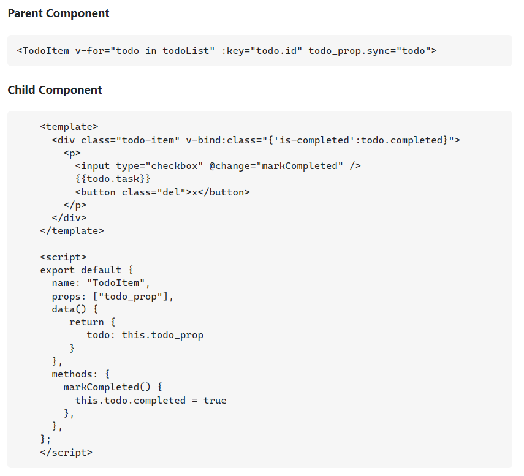

# Table of contents
- [Table of contents](#table-of-contents)
  - [Reference](#reference)
  - [alias\&proxy](#aliasproxy)
  - [computed vs methods](#computed-vs-methods)
  - [computed vs watcher](#computed-vs-watcher)
  - [emit](#emit)
  - [environment variables](#environment-variables)
  - [errors](#errors)
    - [Failed to mount component: template or render function not defined](#failed-to-mount-component-template-or-render-function-not-defined)
    - ['v-slot' directive doesn't support any modifier vue/valid-v-slot](#v-slot-directive-doesnt-support-any-modifier-vuevalid-v-slot)
    - [Uncaught TypeError: route.children.forEach is not a function](#uncaught-typeerror-routechildrenforeach-is-not-a-function)
    - [Browser clients must use the native WebSocket object](#browser-clients-must-use-the-native-websocket-object)
    - [Unexpected mutation of prop vue/no-mutating-props](#unexpected-mutation-of-prop-vueno-mutating-props)
  - [high order array functions](#high-order-array-functions)
  - [icons](#icons)
  - [object vs function](#object-vs-function)
  - [props](#props)
  - [prevent](#prevent)
  - [query](#query)
  - [$ref(vue2)](#refvue2)
  - [ref vs reactivity(vue3 composition api)](#ref-vs-reactivityvue3-composition-api)
  - [slots](#slots)
  - [Store(Vuex\&Pinia)](#storevuexpinia)
    - [intro](#intro)
    - [why store](#why-store)
    - [getters](#getters)
    - [mapGetters](#mapgetters)
    - [mutation](#mutation)
    - [mapMutation](#mapmutation)
    - [actions](#actions)
    - [dispatch actions](#dispatch-actions)
    - [commit vs dispatch](#commit-vs-dispatch)
  - [unshift push pop shift](#unshift-push-pop-shift)
  - [Vue router](#vue-router)
    - [route and router](#route-and-router)
    - [dynamic routing with params](#dynamic-routing-with-params)
    - [named route](#named-route)
    - [named views](#named-views)
    - [navigate](#navigate)
    - [replace](#replace)
    - [go](#go)
    - [redirect](#redirect)
    - [navigation guard](#navigation-guard)
    - [alias](#alias)
    - [different router same component](#different-router-same-component)
    - [exact router link](#exact-router-link)
  - [vue2 vs vue3](#vue2-vs-vue3)
  - [vuetify](#vuetify)
  - [vue.config.js](#vueconfigjs)
  - [application components](#application-components)
  - [watcher](#watcher)
  - [$](#)
  

## Reference
---
[javascript](https://wesbos.com/javascript/01-the-basics/variables-and-statements/#statements-and-semi-colons-in-javascript)

## alias&proxy
---
```javascript
// in vite.config.js file
export default defineConfig({
  plugins: [vue()],
  resolve: {
    alias: {
      '@': path.resolve(__dirname, './src'),
    },
  },
  server: {
    proxy: {
      '/api': {
        target: 'http://localhost:8000',
        changeOrigin: true,
        rewrite: (path) => path.replace(/^\/api/, ''),
      },
    },
  },
});
```

## computed vs methods
---
> A cool thing of the computed properties is that they are cached, that’s mean that the function will run only once until the values don’t change again also if it’s called many times in the same template.

`Methods`:
They are static functions usually used to react to events which happen in the DOM and they accept arguments.
They are incredibly useful for connecting functionality to events, or even just creating small parts of logic to be reused. You can call a method inside another method, they are very versatile!

`Computed properties`:
They **don’t accept arguments** and they are very handy for composing new data from existing sources, they get dynamic values based on other properties.


## computed vs watcher
---
`watcher` is usually used for **more complex logics**, **asyncronous reqeusts**.

`computed properties` are **more appropriate in most cases**, there are times when a custom watcher is necessary. That’s why Vue provides a more generic way to react to data changes through the watch option. This is most useful when you want to perform asynchronous or expensive operations in response to changing data.

## emit
---
understanding: transfer functions to upper level components
```javascript
// on subcomponent:
@submit="onSubmit"
onsubmit:() {
    this.$emit('eventname', value)
}
// on rootcomponent
eventname:(value){
    this.data.push(value)
}
```

## environment variables
---


## errors
---
### Failed to mount component: template or render function not defined
```javascript
{
  path: '/tasks',
  component: import("@/views/Task.vue")
}
// should be 
{
  path: '/tasks',
  component: () => import("@/views/Task.vue")
}
```
### 'v-slot' directive doesn't support any modifier vue/valid-v-slot
```html
// use
<template v-slot:[`item.status`]="{ item }">
{/* instead of  */}
<template v-slot:item.status="{ item }">
```
### Uncaught TypeError: route.children.forEach is not a function
`routes should be an array, including children routes`
### Browser clients must use the native WebSocket object
`don't import Websocket from 'ws', use it directly`
### Unexpected mutation of prop vue/no-mutating-props
`props can not be changed directly`

## high order array functions
---
- definition: functions take another function as parameter
- example: for each

## icons
---
[heroicons](https://heroicons.com/)


## object vs function
---

The reason for this is to ensure that for each individual instance of the reusable child component, there is a unique object containing all of the data being operated on. If, in a child component, you instead use data: { ... }, that same data object will be shared between the child components which can cause some nasty bugs.

## props
---
understanding: if props is an object or array, data binding is required; if props is a string or number, no data binding needed.

## prevent
---
```javascript
// prevent default event of click 
@click.prevent="submit"
// or
submit(e) {
  e.preventDefault();
}
```

## query
---


## $ref(vue2)
---
'$ref' can access value in html.

> The only time I've ever used ref is when integrating with a third party component. You should never use it to get the value and should always use v-model.

> so just use v-model as much as possible.
```javascript
  mounted() {
    if (this.loginForm.username === '') {
      this.$refs.username.focus()
    } else if (this.loginForm.password === '') {
      this.$refs.password.focus()
    }
  },
```

## ref vs reactivity(vue3 composition api)
---
definition: both used to create reactive properties

`ref()`: Takes an inner value and returns a **reactive value**, which has a single property. value that points to the inner value.
`reactivity()`: create a **reactive object**.

## slots
---
> Oftentimes you will need to allow your parent Vue components to **embed arbitrary content inside of child components**. Vue provides a way to accomplish this with slots.

## Store(Vuex&Pinia)
---
### intro


### why store
`do not need emits and props to share data between components,  and easier to debug.`
### getters
understanding: getters are computed properties for store
basically, it is globally function


### mapGetters

### mutation
> The only way to actually change state in a Vuex store is by committing a mutation. 
### mapMutation

### actions
understanding: mutation可以直接commit触发，但是只能是同步的，通过action（dispatch）触发可以异步，因为action本身就是一个函数动作，是更高一级的动作。
- Actions are similar to mutations, the differences being that
  - Instead of mutating the state, actions commit mutations.
  - Actions can contain arbitrary asynchronous operations.


### dispatch actions

### commit vs dispatch
'$dispatch' triggers an action, and commit triggers a mutation. Here is how you can use these concepts:

`You always use $dispatch from your methods in routes / components. $dispatch sends a message to your vuex store to do some action. The action may be done anytime after the current tick, so that your frontend performance is not affected.
You never commit from any of your components / routes. It is done only from within an action, and only when you have some data to commit. Reason: commit is synchronous and may freeze your frontend till it is done.`

## unshift push pop shift
---
The unshift() method *adds* new elements to the **beginning of an array**.

The push() method *adds* new items to the **end of an array**.

The shift() method *removes* the **first item of an array**.

The pop() method *removes* (pops) the **last element of an array**.

## Vue router
---
### route and router  

### dynamic routing with params

### named route

### named views
> Sometimes you need to display multiple views at the same time instead of nesting them, e.g. creating a layout with a sidebar view and a main view. This is where named views come in handy. Instead of having one single outlet in your view, you can have multiple and give each of them a name. A router-view without a name will be given default as its name.


### navigate

> To navigate to a different URL, use router.push. This method pushes a new entry into the history stack, so when the user clicks the browser back button they will be taken to the previous URL.


### replace

### go

### redirect
> A redirect means when the user visits /home, the URL will be replaced by /, and then matched as /


### navigation guard

### alias

### different router same component 
understanding: 这种情况下在切换url的时候lifecycle hook不会触发，为了解决这个问题：

### exact router link
- router-link-active
  
`This class is applied automatically to the <router-link> component when its target route is matched.
The way this works is by using an inclusive match behavior. For example, <router-link to="/foo"> will get this class applied as long as the current path starts with /foo/ or is /foo.
So, if we had <router-link to="/foo"> and <router-link to="/foo/bar">, both components would get the router-link-active class when the path is /foo/bar.`
- router-link-exact-active

`This class is applied automatically to the <router-link> component when its target route is an exact match. Take into consideration that both classes, router-link-active and router-link-exact-active, will be applied to the component in this case.
Using the same example, if we had <router-link to="/foo"> and <router-link to="/foo/bar">, the router-link-exact-activeclass would only be applied to <router-link to="/foo/bar"> when the path is /foo/bar.`

## vue2 vs vue3
---


## vuetify
---
vue add vuetify, this is a plugin

## vue.config.js
---


## application components


## watcher
> With the Options API, we can use the watch option to trigger a function whenever a reactive property changes:


## $
